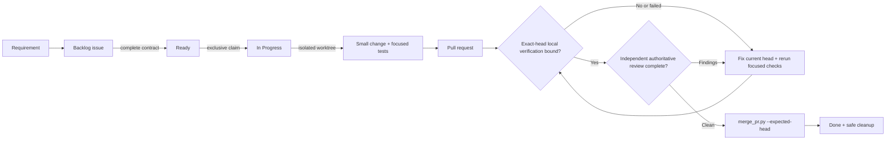
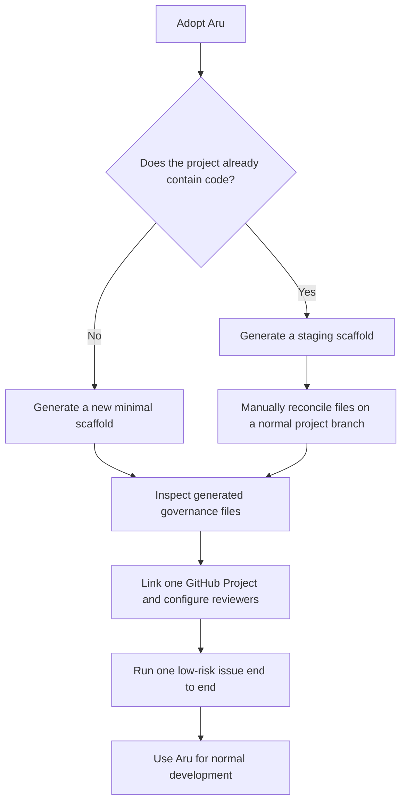

# Aru Code Factory

> A small, fail-closed rules-and-guidelines kernel that moves one approved
> GitHub issue to one safely merged pull request.

**Project status: Complete and ready for consumer adoption — v0.2.2
(2026-08-27).** Future kernel improvements should originate in evidence from
real governed consumer projects.

Aru helps a developer or coding agent answer four questions before changing a
software project:

1. **What work is approved?** — the GitHub issue and Project Board.
2. **What may this worker change?** — the exclusive claim and `touches:` paths.
3. **Is this exact revision safe enough to merge?** — exact-head focused local
   verification evidence and one authoritative reviewer distinct from the
   author.
4. **Who may merge it?** — only `scripts/merge_pr.py` with the expected head.

It is intentionally a governance layer, not an autonomous agent platform. It
does not schedule workers, run a private queue, deploy applications, manage
credentials, monitor production, or replace GitHub.

## See the whole system in one minute



The source of truth stays deliberately small:

| Concern | Authority |
| --- | --- |
| Approved work and lifecycle | GitHub issue plus linked Project Board |
| Write boundary | `touches:` declaration |
| Writer ownership | One `agent:<id>` claim |
| Isolation | One Git worktree per issue |
| Verification | Focused local verification evidence bound to the exact PR head |
| Review | Exactly one `review:<authority>` label for the current head |
| Merge | `scripts/merge_pr.py` |
| Deployment and production | The consumer repository and its operators |

## Is it usable for another project?

**Yes, with explicit prerequisites.** Version 0.2.2 can govern a new project or
be migrated into an existing project when all of these are true:

- Git, Python 3.11+, and an authenticated GitHub CLI are available.
- The repository has exactly one linked, open GitHub Project with the five
  statuses `Backlog`, `Ready`, `In Progress`, `In Review`, and `Done`.
- New governed issues are added to that Project Board.
- The repository can record exact-head focused local verification in PR bodies
  and has at least one registered external reviewer or one smoke-testable,
  distinct coding-agent reviewer.
- Developers and agents can read the canonical Aru directory through
  `ARU_SDLC_HOME`.

The bootstrap helper creates a minimal repository scaffold. It does **not**
install CodeRabbit, Sourcery, CodeAnt, or coding-agent providers, publish an
initial default branch, or merge conflicting files into an existing repository.
Those are deliberate operator-owned setup steps.

> **Important:** v0.2.x has no `aru code` loop, scheduler, or
> `run-aru-factory` router. Use the six installed skills or the commands below.

## Choose an adoption path



### 1. Install the canonical agent skills once

From this repository:

```bash
./scripts/install_agent_integration.sh
```

Then set the canonical location in the environment used by your agents:

```bash
export ARU_SDLC_HOME=/Users/aravindgillella/projects/Aru_Agentic_SDLC
```

The installer exposes exactly six skills to supported local coding agents:

- `init-agent-project`
- `create-github-issue`
- `triage-backlog`
- `implement-next-issue`
- `remediate-ci-failure`
- `address-pr-feedback`

### 2. Bootstrap a new local project

```bash
python3 "$ARU_SDLC_HOME/scripts/init_project.py" \
  --name my-project \
  --directory /path/to/my-project
```

Add `--github --private` when you also want the helper to create a private
GitHub repository, labels, and linked Project Board. The helper writes the
governance scaffold but does not commit or push it.

### 3. Migrate an existing project safely

Do not point `init_project.py` directly at an existing repository with files
that may conflict. Generate into a temporary staging directory, inspect the
output, and reconcile it on a normal project branch:

```bash
staging_dir="$(mktemp -d)"
python3 "$ARU_SDLC_HOME/scripts/init_project.py" \
  --name my-project \
  --directory "$staging_dir"
```

Review the staged `AGENTS.md`, `.github/`, `.aru/hooks/`, and `.gitignore`
before applying them. The scaffold no longer creates a repository workflow:
per-issue and per-PR verification is local-only, exact-head, and focused.
If a project wants a release-only full suite, treat it as a separate local
operator activity rather than a merge gate for ordinary issue work.

### 4. Run one governed unit of work

```bash
python3 "$ARU_SDLC_HOME/scripts/triage_backlog.py" --json
python3 "$ARU_SDLC_HOME/scripts/fetch_next_work.py" \
  --agent codex-local --claim --json
```

When an operator has already verified multiple live coding lanes, repeat
`--agent` in one JSON invocation to select and claim a bounded batch from one
open-PR snapshot and one Ready-issue snapshot:

```bash
python3 "$ARU_SDLC_HOME/scripts/fetch_next_work.py" \
  --agent codex-a --agent claude-b --claim --json
```

The result contains at most one work item per explicit lane. This is a
single-shot picker call, not a scheduler, daemon, worker handoff or presence
registry, queue, capacity store, or polling loop; a later invocation reads a
new authoritative snapshot.

An authored open PR occupies only that author's remediation lane, but its
`touches:` paths reserve globally against free-lane assignment. Other explicit
lanes may still receive independent Ready or safely recovered Backlog work in
the same invocation when `touches:` paths, dependencies, claims, and
review-authority constraints stay conflict-free.

Board Ready count is lifecycle state, not executable capacity. One activation
snapshot comprises the complete paginated open-Ready inventory and, when that
inventory contains dependency references, one capped bulk GraphQL read for all
deduplicated dependency states. The bulk read permits at most 100 references,
fails closed above that bound, and is shared by every lane; the picker never
queries dependencies per card or per lane. It deterministically classifies
each Ready card under this precedence: `human_gated`, `epics`,
`dependency_blocked`, `malformed`, then `executable_ready`. The categories
therefore partition `total_ready`, even when a card matches more than one.

When Ready cards are excluded, the activation-level `ready_classification`
object has exactly these machine-readable keys: `total_ready`,
`executable_ready`, `human_gated`, `epics`, `dependency_blocked`, and
`malformed`. A consumer can render, for example,
`7 Ready / 0 executable / 5 human-gated / 2 epics` without parsing prose.
Batch output includes the object and one aggregate `Ready classification:`
diagnostic only once, never in individual lanes. A legacy single-agent call
adds them only when exclusion leaves the result idle. Batch classification
retains its stricter issue-number and `touches:` validation; single-agent
selection retains its legacy field handling. Per-card malformed metadata
diagnostics remain ordered by issue number.

An idle result is terminal for that event-driven activation. Its diagnostics
explain why visible Ready cards may not be executable; they do not authorize
automatic triage, board repair, or another picker tick.

Work only in the worktree reported by `create_branch.py`. After focused local
verification, publish the branch and open the PR through `create_pr.py`.
Whenever the verification commands or PR head change, refresh the PR-body
evidence through `create_pr.py --refresh-verification`; that flow revalidates
the allowlisted commands, executes them locally in the current worktree, and
only then rebinds the exact head. Merge only after that exact-head local
verification and the assigned authoritative review are complete.

## Reviewer state machine

Every PR current head has exactly one authority label. Operators register an
installed external provider with `reviewer-registered:<service>`; ordinary
bootstrap `review:*` labels are not registrations. Repository label definitions
may declare one shared policy without a new state store:

```text
review-policy:primary=coderabbit
review-policy:fallback-1=claude-code
review-policy:fallback-2=openai-codex
review-policy:fallback-3=xai-cursor
review-policy:fallback-4=google-antigravity
review-policy:timeout=120
```

Fallback ranks must be contiguous, authorities must be unique and supported,
and every referenced external authority must be registered. Missing policy
labels preserve the compatible default: the first registered external service
is primary, the four coding families are ordered fallbacks, and timeout is 120
seconds. Policy declarations, external registrations, and reviewer bindings are
repository-shared; `ARU_CODING_REVIEWERS` remains machine-local.

Inspect the effective sources and inventory without mutation; add the probe flag
only when bounded local provider checks are desired:

```bash
python3 "$ARU_SDLC_HOME/scripts/create_pr.py" --reviewer-status --json
python3 "$ARU_SDLC_HOME/scripts/create_pr.py" \
  --reviewer-status --probe-reviewers \
  --agent <author-identity> --author-github-login <author-login> --json
```

External availability is observed on a PR, not guessed during status. Remove an
expired or uninstalled service's `reviewer-registered:<service>` label. An
explicit external unavailable/error response causes immediate fallback. A
pending service retains authority until the configured timeout. Because the
kernel itself has no scheduler, an external event or timer must invoke:

```bash
python3 "$ARU_SDLC_HOME/scripts/create_pr.py" \
  --refresh-reviewer <PR> --json
```

The helper evaluates the newest trusted, timestamped provider evidence. The
clock starts at the current authority's latest GitHub label-assignment event,
so a governed recovery receives its own complete configured pending window.

Coding fallback smoke-tests liveness in Claude Code, OpenAI Codex, xAI Cursor,
then Google Antigravity; it excludes the author identity and prefers another
model family. Each identity must have a `reviewer-binding:<identity>=<github-login>`
label, and that GitHub actor must differ from the PR author. Each machine
declares its local pool in `ARU_CODING_REVIEWERS`. Entries use `family:identity`;
Claude entries add the subscription argument as
`claude-code:identity@subscription`. The current MacBook identities are
`m1/m2/m3/mo/mx/mg`; the Mac mini uses `n1/n2/n3/no/nx/ng`. Adding or removing a
Claude subscription changes only this configuration and its binding label.
Missing, malformed, or duplicate configuration blocks coding fallback. Every
configured Claude subscription is probed and successful bound subscriptions
rotate deterministically. Paused reviews, cost or quota exhaustion, rate
limiting, provider outage, unsupported bot-authored PRs, and explicit
unavailable/error responses all count as unavailable. A successful check whose
detail says it performed no review does not satisfy the exact-head gate. If no
distinct coding agent has capacity, assignment does not change and the
transition fails closed. Registered coding bindings with a missing local pool
also fail visibly instead of silently degrading every assignment to
external-only selection. If an assigned coding reviewer later aborts, hits
quota, or explicitly becomes unavailable during substantive execution, recover
immediately through the same helper with `--coding-reviewer-unavailable <reason>`;
it audits and restores the first policy-listed registered external authority
without leaving coding identity metadata behind.

A coding-agent review is authoritative only when a formal GitHub Review from a
GitHub actor other than the PR author contains the strict `aru-coding-review:v1`
attestation. It must name the assigned reviewer and family, list the linked
issues, confirm acceptance-criteria/diff/surrounding-code inspection, record
focused verification and substantive findings, declare `APPROVE` or
`REQUEST_CHANGES`, and bind the full 40-character current-head SHA. A new push
invalidates it immediately. Self-review, generic approval prose, unresolved
findings or threads, `REQUEST_CHANGES`, and malformed, spoofed, missing,
duplicate, or conflicting evidence block `merge_pr.py`.

## The seven-document map

| Read this | When you need it |
| --- | --- |
| [README.md](README.md) | Orientation and fastest adoption path |
| [AGENTS.md](AGENTS.md) | Non-negotiable operating rules |
| [Kernel contract](docs/KERNEL-CONTRACT.md) | Authorities, limits, and admission rule |
| [Enforcement register](docs/ENFORCEMENT-REGISTER.md) | Which rules are mechanically enforced |
| [Operations guide](docs/OPERATIONS.md) | Complete setup, daily workflow, commands, and troubleshooting |
| [Degraded mode](docs/DEGRADED-MODE.md) | What to do when GitHub data is unavailable |
| [Changelog](CHANGELOG.md) | Version history and freeze policy |

## Where to go next

Read the **[complete developer use guide](docs/OPERATIONS.md)**. It covers:

- prerequisites and readiness checks;
- new and existing repository adoption;
- GitHub Project and reviewer setup;
- the issue contract and `touches:` examples;
- the full issue-to-merge procedure;
- every supported command;
- recovery, rollback, and troubleshooting;
- the boundary between Aru and the consumer project.

The v0.2 feature freeze lasts through **2026-09-26**. During the freeze, the
kernel accepts only security and correctness fixes.
