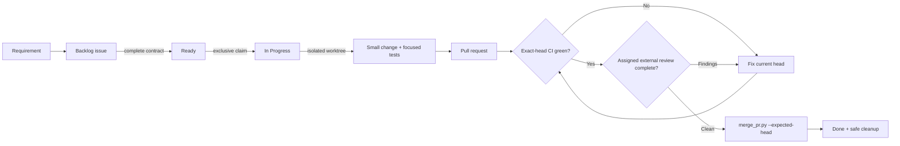
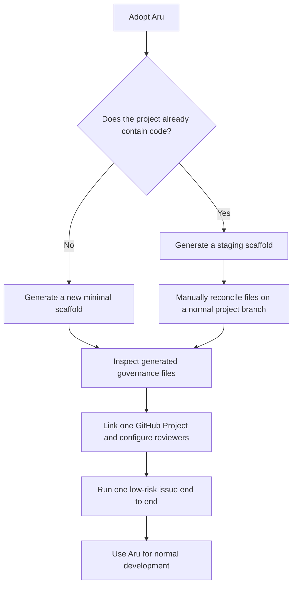

# Aru Code Factory

> A small, fail-closed rules-and-guidelines kernel that moves one approved
> GitHub issue to one safely merged pull request.

**Project status: Complete and ready for consumer adoption — v0.2.2
(2026-08-27).** Future kernel improvements should originate in evidence from
real governed consumer projects.

Aru helps a developer or coding agent answer four questions before changing a
software project:

1. **What work is approved?** — the GitHub issue and Project Board.
2. **What may this worker change?** — the exclusive claim and `touches:` paths.
3. **Is this exact revision safe enough to merge?** — current-head CI and one
   external reviewer.
4. **Who may merge it?** — only `scripts/merge_pr.py` with the expected head.

It is intentionally a governance layer, not an autonomous agent platform. It
does not schedule workers, run a private queue, deploy applications, manage
credentials, monitor production, or replace GitHub.

## See the whole system in one minute



The source of truth stays deliberately small:

| Concern | Authority |
| --- | --- |
| Approved work and lifecycle | GitHub issue plus linked Project Board |
| Write boundary | `touches:` declaration |
| Writer ownership | One `agent:<id>` claim |
| Isolation | One Git worktree per issue |
| Verification | CI result for the exact PR head |
| Review | Exactly one `review:<service>` label |
| Merge | `scripts/merge_pr.py` |
| Deployment and production | The consumer repository and its operators |

## Is it usable for another project?

**Yes, with explicit prerequisites.** Version 0.2.2 can govern a new project or
be migrated into an existing project when all of these are true:

- Git, Python 3.11+, and an authenticated GitHub CLI are available.
- The repository has exactly one linked, open GitHub Project with the five
  statuses `Backlog`, `Ready`, `In Progress`, `In Review`, and `Done`.
- New governed issues are added to that Project Board.
- The repository has CI and at least one supported external review service.
- Developers and agents can read the canonical Aru directory through
  `ARU_SDLC_HOME`.

The bootstrap helper creates a minimal repository scaffold. It does **not**
install CodeRabbit, Sourcery, or CodeAnt, publish an initial default branch, or
merge conflicting files into an existing repository. Those are deliberate
operator-owned setup steps.

> **Important:** v0.2.x has no `aru code` loop, scheduler, or
> `run-aru-factory` router. Use the six installed skills or the commands below.

## Choose an adoption path



### 1. Install the canonical agent skills once

From this repository:

```bash
./scripts/install_agent_integration.sh
```

Then set the canonical location in the environment used by your agents:

```bash
export ARU_SDLC_HOME=/Users/aravindgillella/projects/Aru_Agentic_SDLC
```

The installer exposes exactly six skills to supported local coding agents:

- `init-agent-project`
- `create-github-issue`
- `triage-backlog`
- `implement-next-issue`
- `remediate-ci-failure`
- `address-pr-feedback`

### 2. Bootstrap a new local project

```bash
python3 "$ARU_SDLC_HOME/scripts/init_project.py" \
  --name my-project \
  --directory /path/to/my-project
```

Add `--github --private` when you also want the helper to create a private
GitHub repository, labels, and linked Project Board. The helper writes the
governance scaffold but does not commit or push it.

### 3. Migrate an existing project safely

Do not point `init_project.py` directly at an existing repository with files
that may conflict. Generate into a temporary staging directory, inspect the
output, and reconcile it on a normal project branch:

```bash
staging_dir="$(mktemp -d)"
python3 "$ARU_SDLC_HOME/scripts/init_project.py" \
  --name my-project \
  --directory "$staging_dir"
```

Review the staged `AGENTS.md`, `.github/`, `.aru/hooks/`, and `.gitignore`
before applying them. Keep the consumer project's real build and test commands
in its CI; the generated CI is only a minimal Python compilation baseline.

### 4. Run one governed unit of work

```bash
python3 "$ARU_SDLC_HOME/scripts/triage_backlog.py" --json
python3 "$ARU_SDLC_HOME/scripts/fetch_next_work.py" \
  --agent codex-local --claim --json
```

Work only in the worktree reported by `create_branch.py`. After focused local
verification, publish the branch and open the PR through `create_pr.py`. Merge
only after exact-head CI and the assigned external review are complete.

## The seven-document map

| Read this | When you need it |
| --- | --- |
| [README.md](README.md) | Orientation and fastest adoption path |
| [AGENTS.md](AGENTS.md) | Non-negotiable operating rules |
| [Kernel contract](docs/KERNEL-CONTRACT.md) | Authorities, limits, and admission rule |
| [Enforcement register](docs/ENFORCEMENT-REGISTER.md) | Which rules are mechanically enforced |
| [Operations guide](docs/OPERATIONS.md) | Complete setup, daily workflow, commands, and troubleshooting |
| [Degraded mode](docs/DEGRADED-MODE.md) | What to do when GitHub data is unavailable |
| [Changelog](CHANGELOG.md) | Version history and freeze policy |

## Where to go next

Read the **[complete developer use guide](docs/OPERATIONS.md)**. It covers:

- prerequisites and readiness checks;
- new and existing repository adoption;
- GitHub Project and reviewer setup;
- the issue contract and `touches:` examples;
- the full issue-to-merge procedure;
- every supported command;
- recovery, rollback, and troubleshooting;
- the boundary between Aru and the consumer project.

The v0.2 feature freeze lasts through **2026-09-26**. During the freeze, the
kernel accepts only security and correctness fixes.
