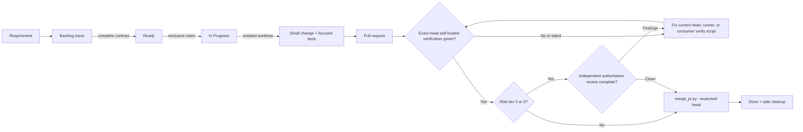
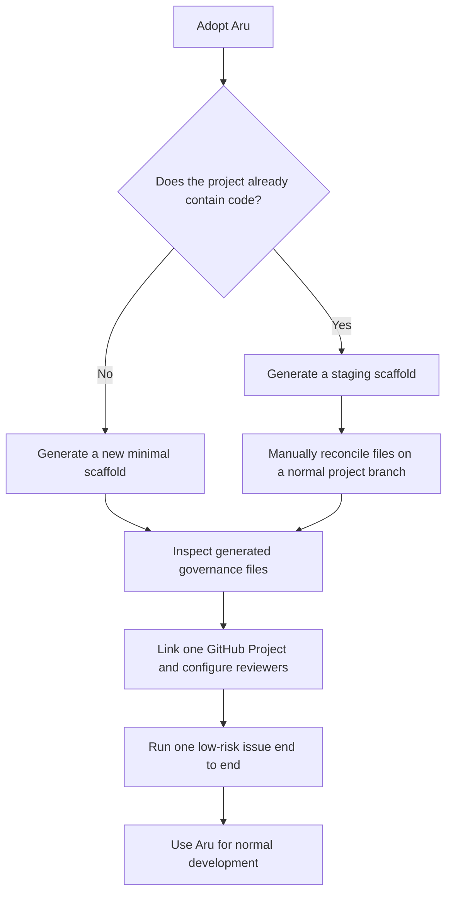

# Aru Agentic SDLC

> A small, fail-closed rules-and-guidelines kernel that moves one approved
> GitHub issue to one safely merged pull request.

**Project status: Stable and ready for consumer adoption — v1.0.0
(2026-09-01).** Future kernel improvements should originate in evidence from
real governed consumer projects.

Aru helps a developer or coding agent answer four questions before changing a
software project:

1. **What work is approved?** — the GitHub issue and Project Board.
2. **What may this worker change?** — the exclusive claim and `touches:` paths.
3. **Is this exact revision safe enough to merge?** — the exact-head
   `aru-governed-pr` check, executed on an operator-owned self-hosted Mac, plus
   for Tier 2-3 changes one authoritative reviewer distinct from the author.
4. **What is the governed merge path?** — `scripts/merge_pr.py` with the
   expected head; stronger GitHub-side exclusivity is a consumer deployment
   choice described below.

It is intentionally a governance layer, not an autonomous agent platform. It
does not schedule workers, run a private queue, deploy applications, manage
credentials, monitor production, or replace GitHub.

The [minimal kernel contract](docs/KERNEL-CONTRACT.md) is the one normative
summary. It separates the **Kernel** (issue to safe merge), an optional
**external Driver** (when to invoke the next bounded command), and
**consumer policy** (additional risk controls, broader engineering checks,
release, deploy, and production).

The optional [Hermes Project Driver integration](integrations/hermes/README.md)
is versioned here and installed separately into an operator-owned Hermes home.
It combines immediate events with a ten-minute recovery heartbeat, fills safe
free coding lanes, and coordinates typed cross-project dependencies. The kernel
and consumer bootstrap do not install or run it. Live installation and canary
acceptance remain tracked by [#557](https://github.com/gillella/Aru_Agentic_SDLC/issues/557).

## See the whole system in one minute



The source of truth stays deliberately small:

| Concern | Authority |
| --- | --- |
| Approved work and lifecycle | GitHub issue plus linked Project Board |
| Write boundary | `touches:` declaration |
| Writer ownership | One `agent:<id>` claim |
| Isolation | One Git worktree per issue |
| Verification | `aru-governed-pr` on the exact PR head, using only the `aru-ci` self-hosted runner pool |
| Review | None for Tier 0-1; one distinct current-head authority for Tier 2-3 |
| Governed merge or merge-queue submission | `scripts/merge_pr.py` |
| Deployment and production | The consumer repository and its operators |

## Is it usable for another project?

**Yes, with explicit prerequisites.** Version 1.0.0 can govern a new project or
be migrated into an existing project when all of these are true:

- Git, Python 3.11+, and an authenticated GitHub CLI are available.
- The repository has exactly one linked, open GitHub Project with the five
  statuses `Backlog`, `Ready`, `In Progress`, `In Review`, and `Done`.
- New governed issues are added to that Project Board.
- The repository has at least one online repository-level self-hosted macOS
  arm64 runner carrying the `aru-ci` label and can run the installed
  `aru-governed-pr` workflow and its consumer-owned `.aru/verify.sh`. Before
  admitting Tier 2-3 work, it also has
  at least one registered external reviewer or one smoke-testable, distinct
  coding-agent reviewer.
- Developers and agents can read the canonical Aru directory through
  `ARU_SDLC_HOME`.

The bootstrap helper creates a minimal repository scaffold. It does **not**
install CodeRabbit, Sourcery, CodeAnt, or coding-agent providers, publish an
initial default branch, or merge conflicting files into an existing repository.
Those are deliberate operator-owned setup steps.

> **Important:** v1.0.0 installs only the six skills listed below. It has no
> command router or in-kernel loop; persistent continuation belongs to an
> external Driver.

## Choose an adoption path



### 1. Install the canonical agent skills once

From this repository:

```bash
./scripts/install_agent_integration.sh
```

Then set the canonical location in the environment used by your agents:

```bash
export ARU_SDLC_HOME=/Users/aravindgillella/projects/Aru_Agentic_SDLC
```

The installer exposes exactly six skills to supported local coding agents:

- `init-agent-project`
- `create-github-issue`
- `triage-backlog`
- `implement-next-issue`
- `remediate-ci-failure`
- `address-pr-feedback`

It also maintains the delimited Aru block in `~/.codex/AGENTS.md`. Existing
non-Aru instructions are preserved. A recognized legacy all-Aru file is backed
up before replacement so stale skill and command routes do not survive an
upgrade.

### 2. Bootstrap a new local project

```bash
python3 "$ARU_SDLC_HOME/scripts/init_project.py" \
  --name my-project \
  --directory /path/to/my-project
```

Add `--github --private` when you also want the helper to create a private
GitHub repository, labels, linked Project Board, and a minimal ruleset with no
configured bypass actors that requires `aru-governed-pr` from GitHub Actions.
The generated workflow runs only on repository-level Apple-silicon macOS
runners labeled `aru-ci`; register one before admitting work. The helper writes
the governance scaffold but does not commit or push it.

That portable ruleset authenticates the required check producer, but it cannot
make the helper the only possible GitHub merge path or condition server-side
review on Aru's path-derived tier. The helper-only merge rule is therefore a
governed process rule. Organizations that need a tamper-resistant boundary can
add consumer-owned controls supported by their GitHub plan, such as a pinned
required workflow, a dedicated merge App identity, or team/file-pattern review
rules. Those controls are intentionally outside the portable Kernel.

### 3. Migrate an existing project safely

Do not point `init_project.py` directly at an existing repository with files
that may conflict. Generate into a temporary staging directory, inspect the
output, and reconcile it on a normal project branch:

```bash
staging_dir="$(mktemp -d)"
python3 "$ARU_SDLC_HOME/scripts/init_project.py" \
  --name my-project \
  --directory "$staging_dir"
```

Review the staged `AGENTS.md`, `.github/`, `.aru/`, and `.gitignore` before
applying them. Bootstrap installs the consumer-owned `aru-governed-pr` workflow,
which checks out the exact PR head on `[self-hosted, macOS, ARM64, aru-ci]`,
runs `.aru/verify.sh`, and validates the linked issue's `touches:` boundary
against the actual diff. Register the runner before requiring the check.
Customize the verification commands and branch rules for the consumer's risk
policy. The workflow deliberately has no GitHub-hosted fallback and does not
upload artifacts or use Actions caches by default.

### 4. Run one governed unit of work

```bash
python3 "$ARU_SDLC_HOME/scripts/triage_backlog.py" --json
python3 "$ARU_SDLC_HOME/scripts/fetch_next_work.py" \
  --agent codex-local --json
```

`fetch_next_work.py` is read-only and accepts exactly one agent identity. It
first returns that author's oldest open PR as feedback, verification,
conflict, wait, or merge work. Only when there is no authored PR does it return
the highest-priority complete, unblocked Ready issue. It never claims,
promotes Backlog, repairs the board, allocates a batch, or starts another
activation.

If the result is an issue, claim that exact live issue explicitly:

```bash
python3 "$ARU_SDLC_HOME/scripts/claim_issue.py" \
  --issue 42 --agent codex-local
```

The Ready snapshot is fully paginated. Dependencies are read once in a bounded
bulk query, and eligible issues are ordered by priority then issue number.
`needs-human`, consumer epic containers, unresolved dependencies, malformed
contracts, and contradictory priorities are skipped or reported. An idle
result is terminal for that activation; it does not authorize another picker
tick.

Work only in the worktree reported by `create_branch.py`. Local checks are
optional preflight or audit evidence. Publish the branch and open the PR through
`create_pr.py`; merge only after the exact-head `aru-governed-pr` check has run
on an `aru-ci` self-hosted Mac and any risk-required authoritative review is
complete. If all registered Macs are offline, the check stays queued and merge
remains blocked.

## Review continuity

Tier 0 documentation and Tier 1 ordinary code do not wait for authoritative
review. Tier 2 sensitive/contract and Tier 3 production/destructive changes
require one current-head authority distinct from the author. Unknown or
unrecognized safe paths fail upward to Tier 2; malformed or unsafe paths fail
to Tier 3. Installed external providers require
`reviewer-registered:<service>`; every registered external provider is an equal
member of the specialized-review pool. Eligible coding identities require a
binding to a distinct GitHub actor. The only optional repository policy setting
is the pending timeout:

```text
review-policy:timeout=120
```

The issue number rotates initial assignments across the registered external
pool. A service that is unavailable, rate-limited, or timed out is not retried
on the same head; after all registered external services are attempted, one
distinct available coding identity may be borrowed. Ranked primary/fallback
labels are invalid. Remove `reviewer-registered:<service>` only when access
expires or the integration is uninstalled.

Inspect the effective policy and configuration sources without mutation with
`create_pr.py --reviewer-status --json`; add `--probe-reviewers` only for
bounded local coding-provider liveness checks. Coding subscriptions remain in
machine-local `ARU_CODING_REVIEWERS`.

The Kernel never waits or polls. For each pending Tier 2-3 authority assignment,
an external Driver owns the single continuation event defined in the
[canonical contract](docs/KERNEL-CONTRACT.md).

```bash
python3 "$ARU_SDLC_HOME/scripts/create_pr.py" \
  --refresh-reviewer <PR> --json
```

The Driver rereads the current head and authority, invokes one bounded refresh,
and stops. The helper evaluates trusted provider evidence and retains or changes
authority. For Tier 2-3, a push invalidates earlier review; self-review,
unresolved findings, no-op provider results, and stale or conflicting
attestations block merge.

If the repository uses GitHub's merge queue, helper submission is not a merged
result. Keep the issue In Review until GitHub confirms that exact head merged;
only then complete Done and cleanup.

## The seven-document map

| Read this | When you need it |
| --- | --- |
| [README.md](README.md) | Orientation and fastest adoption path |
| [AGENTS.md](AGENTS.md) | Non-negotiable operating rules |
| [Kernel contract](docs/KERNEL-CONTRACT.md) | Authorities, limits, and admission rule |
| [Enforcement register](docs/ENFORCEMENT-REGISTER.md) | Which rules are mechanically enforced |
| [Operations guide](docs/OPERATIONS.md) | Complete setup, daily workflow, commands, and troubleshooting |
| [Degraded mode](docs/DEGRADED-MODE.md) | What to do when GitHub data is unavailable |
| [Changelog](CHANGELOG.md) | Version history and freeze policy |

## Where to go next

Read the **[complete developer use guide](docs/OPERATIONS.md)**. It covers:

- prerequisites and readiness checks;
- new and existing repository adoption;
- GitHub Project and reviewer setup;
- the issue contract and `touches:` examples;
- the full issue-to-merge procedure;
- every supported command;
- recovery, rollback, and troubleshooting;
- the boundary between Aru and the consumer project.

The v0.2 feature freeze remains in force through **2026-09-26**. Publishing
v1.0.0 promotes the already-accepted minimal kernel contract; it does not admit
new feature work during that interval. Compatible v1.x maintenance must retain
the public interfaces in the Kernel contract. Breaking contract changes require
a new major version.
