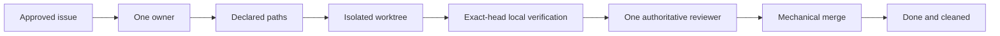
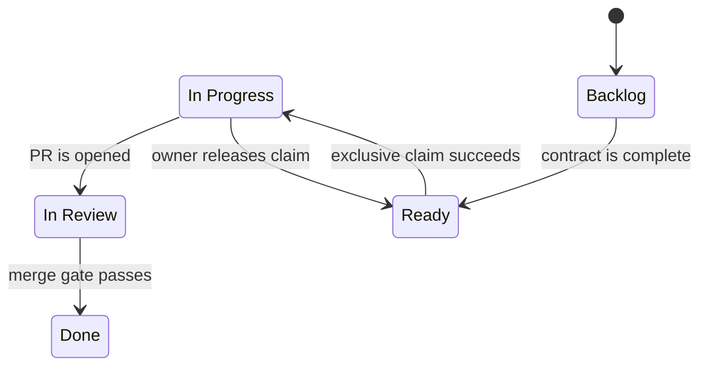
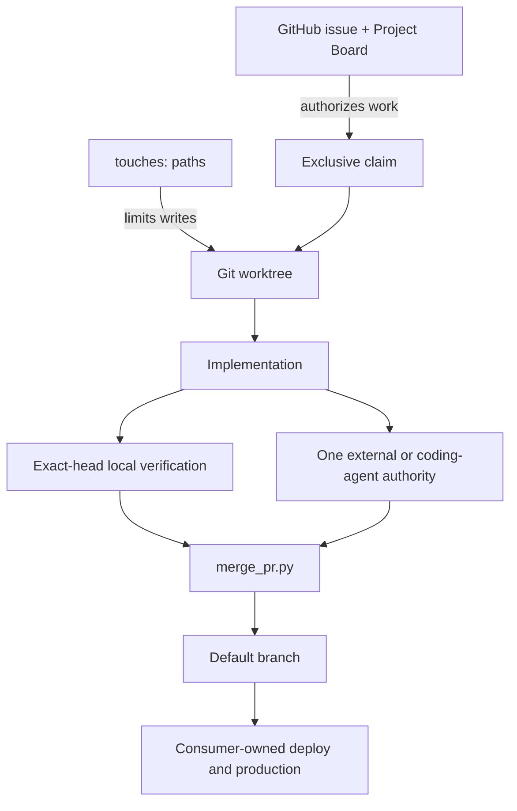
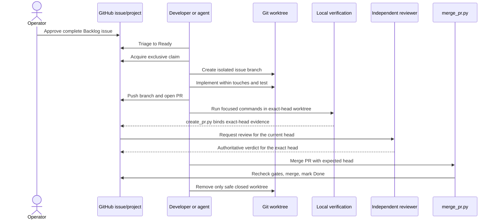
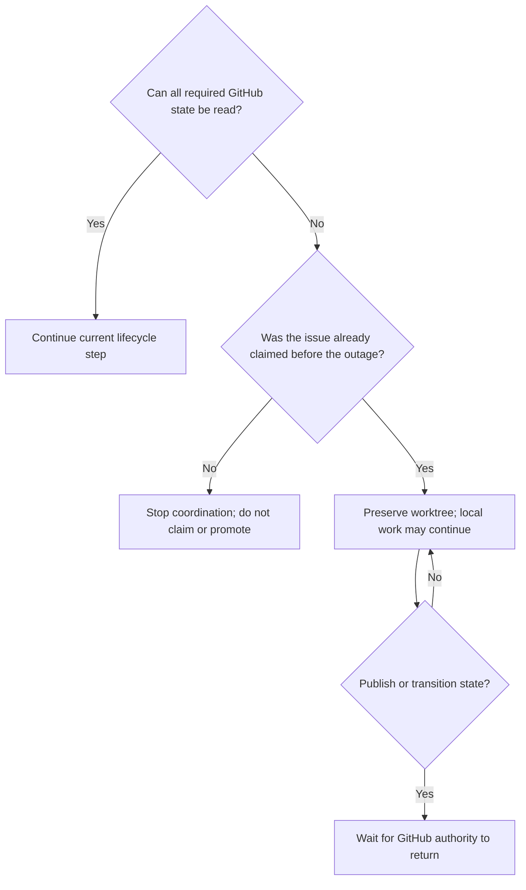

# Aru Code Factory: Complete Developer Use Guide

This guide explains how to adopt, operate, troubleshoot, and safely extend the
Aru minimal kernel. It is written for developers, technical leads, and coding
agents using Aru to guide another software project.

## Contents

1. [What Aru is](#1-what-aru-is)
2. [What Aru is not](#2-what-aru-is-not)
3. [How the kernel works](#3-how-the-kernel-works)
4. [Prerequisites](#4-prerequisites)
5. [Install Aru on a developer machine](#5-install-aru-on-a-developer-machine)
6. [Adopt Aru in a new project](#6-adopt-aru-in-a-new-project)
7. [Adopt Aru in an existing project](#7-adopt-aru-in-an-existing-project)
8. [Configure GitHub](#8-configure-github)
9. [Write an acceptable issue](#9-write-an-acceptable-issue)
10. [Run the complete lifecycle](#10-run-the-complete-lifecycle)
11. [Use the six agent skills](#11-use-the-six-agent-skills)
12. [Command reference](#12-command-reference)
13. [Review and merge behavior](#13-review-and-merge-behavior)
14. [Failure and recovery](#14-failure-and-recovery)
15. [Troubleshooting](#15-troubleshooting)
16. [Operating boundaries](#16-operating-boundaries)
17. [Adoption checklist](#17-adoption-checklist)

## 1. What Aru is

Aru is a compact governance layer around GitHub, Git, exact-head local
verification, and authoritative code review. It supplies rules and small
mechanical helpers for moving one approved issue to one merged pull request
without losing ownership, scope, or exact-head verification.

The kernel is useful when a team wants coding agents and human developers to
follow the same visible process without introducing another project database or
agent-control platform.

### The promise

For every governed change, Aru makes the following chain observable:



### The five states



The canonical names are exactly:

- `Backlog`
- `Ready`
- `In Progress`
- `In Review`
- `Done`

Do not create a parallel status database, local queue, handoff file, or private
agent ledger.

## 2. What Aru is not

Aru does not:

- decide product priorities;
- invent requirements or acceptance criteria;
- schedule or continuously run agents;
- provide an `aru code` loop in v0.2.x;
- install or operate CodeRabbit, Sourcery, or CodeAnt;
- provide application build, test, deployment, release, or rollback logic;
- own secrets, real-money authorization, production access, or incident policy;
- monitor agents, providers, costs, or quotas;
- send Slack, email, or other notifications;
- replace GitHub Issues, GitHub Projects, Git, CI, or branch protection.

Those responsibilities remain with the consumer project and its operators.

## 3. How the kernel works

### Authority map



| Question | Authoritative answer |
| --- | --- |
| Is the work approved? | Open issue present on the linked Project Board |
| Is it ready? | Complete issue contract, no open dependencies, `Ready` status |
| Who owns the edit? | Exactly one `agent:<id>` label and assignee |
| Which files may change? | The issue's single `touches:` declaration |
| Where may implementation happen? | The issue's `.worktrees/<branch>` checkout |
| Did tests pass for this code? | Focused local verification evidence attached to the exact current PR head |
| Who reviewed it? | The external service or coding family named by the only `review:<authority>` label |
| May it merge? | `merge_pr.py --expected-head` succeeds |
| May it deploy? | Only the consumer project's own policy answers this |

### Fail-closed means stop, not guess

If an issue, board, claim, path boundary, PR head, local verification evidence,
review verdict, or Git identity is missing, stale, partial, contradictory, or
unauthenticated, the next transition is blocked. The developer fixes the
evidence or waits for the authority to return; they do not invent fallback
state.

## 4. Prerequisites

### Developer machine

- Git with worktree support.
- Python 3.11 or newer.
- Bash for the installer and pre-push hook.
- GitHub CLI (`gh`) authenticated to the correct GitHub account.
- Permission to read and update issues, labels, pull requests, and Projects.

Verify the basics:

```bash
git --version
python3 --version
gh --version
gh auth status
```

### GitHub repository

The consumer repository needs:

- a default branch, normally `main`;
- one linked, open GitHub Project;
- one Project `Status` field with the five exact lifecycle options;
- the Aru `status:*`, `type:*`, `priority:*`, `agent:*`, `author:*`,
  `author-family:*`, `review:*`, and fallback `reviewer:*` labels;
- exact-head focused local verification refreshed in the PR body;
- at least one registered external reviewer or one distinct coding-agent
  reviewer whose capacity probe succeeds.

If more than one open Project is linked, set the intended number explicitly:

```bash
export ARU_PROJECT_NUMBER=12
```

### Split repository and Project authentication

Aru routes GitHub subprocesses by authority. Repository commands (`gh issue`,
`gh pr`, `gh label`, `gh repo`, and repository REST calls) may use a
repository-scoped GitHub App runner. Project V2 commands always bypass that
runner and remove `GH_TOKEN`, `GITHUB_TOKEN`, and their Enterprise variants
from the child environment so `gh` uses its stored interactive PAT. Aru never
changes the global `gh` login.

There are two supported repository modes:

- When automation itself is launched by an App wrapper, repository commands
  inherit its installation token while Project V2 children use the stored PAT.
- When automation starts under the normal shell identity, set
  `ARU_GITHUB_APP_RUNNER` to an executable wrapper. Aru prefixes repository
  commands with `<runner> --` and leaves Project V2 commands on the stored PAT.

For example, on a workstation that provides the Factory wrapper:

```bash
export ARU_GITHUB_APP_RUNNER="$HOME/.local/bin/aru-code-factory-app-run"
python3 "$ARU_SDLC_HOME/scripts/fetch_pr_feedback.py" --pr 123 --json
```

If `ARU_GITHUB_APP_RUNNER` is unset, repository commands use ordinary `gh`.
This is the portable behavior for automation and consumer repositories where the local
wrapper is absent. If the variable is set but the path is missing or not
executable, Aru stops instead of silently changing identity.

GraphQL callers must declare repository or Project authority. Queries that do
not declare it, combine repository data with Project V2 data, or send Project
V2 fields through the repository route fail closed. Failure diagnostics redact
known GitHub token values; wrappers must likewise avoid writing generated
installation tokens to stdout or stderr.

`init_project.py --github` is a bootstrap exception because its repository
does not exist yet and therefore cannot have an installation token. Leave
`ARU_GITHUB_APP_RUNNER` unset and use an explicitly authorized operator
identity for repository creation. Configure the App runner only after the new
repository has an installation; routine governed repository automation should
then use the App route.

### Reviewer readiness

External reviewers are considered in this order:

- `coderabbit`
- `sourcery`
- `codeant`

Register each installed provider explicitly:

```text
reviewer-registered:coderabbit
reviewer-registered:sourcery
reviewer-registered:codeant
```

The bootstrap `review:*` authority labels do not register providers.
`create_pr.py` combines registered external services with locally configured,
bound coding identities in one stable pool. The issue number rotates the first
slot. A selected coding identity is assigned only after its bounded probe
returns exactly `OK` (which verifies liveness only); an unavailable candidate
advances to the next slot. The author identity and GitHub actor are excluded.
This needs no scheduler, private queue, or capacity ledger. The assigned
authority must produce verifiable current-head evidence. On explicit
unavailability it falls back immediately; while merely pending it retains the
service for less than 15 minutes and becomes eligible for fallback at 15
minutes. Because the kernel itself has no scheduler, an external event or timer
must invoke `create_pr.py --refresh-reviewer <PR>`.

If reviewer bindings exist but `ARU_CODING_REVIEWERS` is missing, assignment
fails visibly rather than silently collapsing the pool to external services.

The newest trusted, timestamped provider evidence wins. Measure the pending
window from the current authority's latest GitHub label-assignment event, not
from PR creation; a governed recovery starts a fresh 15-minute window.

The fallback pool is Claude Code, OpenAI Codex, xAI Cursor, and Google
Antigravity. Capacity must answer the exact smoke-test prompt with `OK`; Claude
probes every locally configured `claude-sub` subscription. Before use, bind
each configured identity to the GitHub actor that will submit its formal Review, for example
`reviewer-binding:xai-cursor=aru-xai-reviewer`. The actor must differ from the
PR author. The author agent identity is also excluded, and another model family
is preferred. No bound, distinct successful probe means no assignment change.

This deployment currently uses six local identities per machine:

| Machine | Claude 1 | Claude 2 | Claude 3 | Codex | Cursor | Antigravity |
| --- | --- | --- | --- | --- | --- | --- |
| MacBook Pro | `m1` | `m2` | `m3` | `mo` | `mx` | `mg` |
| Mac mini | `n1` | `n2` | `n3` | `no` | `nx` | `ng` |

The short names keep bindings to `aru-code-factory-gillella[bot]` within
GitHub's 50-character label-name limit. Register all twelve identities, but a
factory process probes only its locally configured pool. The App bot submits
formal reviews; do not bind these identities to the PR-author account
`gillella`.

## 5. Install Aru on a developer machine

Clone or otherwise place this repository at a stable canonical location. Then:

```bash
cd /Users/aravindgillella/projects/Aru_Agentic_SDLC
./scripts/install_agent_integration.sh
```

Set the canonical path in the shell or desktop-agent environment:

```bash
export ARU_SDLC_HOME=/Users/aravindgillella/projects/Aru_Agentic_SDLC
```

Set the machine-local reviewer pool before starting the factory:

```bash
# MacBook Pro
export ARU_CODING_REVIEWERS='claude-code:m1@1,claude-code:m2@2,claude-code:m3@3,openai-codex:mo,xai-cursor:mx,google-antigravity:mg'

# Mac mini
export ARU_CODING_REVIEWERS='claude-code:n1@1,claude-code:n2@2,claude-code:n3@3,openai-codex:no,xai-cursor:nx,google-antigravity:ng'
```

To add or remove a Claude subscription, edit only this comma-separated value
and create or remove the matching `reviewer-binding:<identity>=<github-login>`
label. The wrapper subscription appears after `@`; the identity before it is
the stable audit name. Non-Claude families currently allow one local identity
each. Missing, malformed, repeated identities, repeated Claude subscriptions,
or multiple non-Claude identities fail closed.

The installer creates symlinks for exactly six skills under supported local
agent skill directories. It does not copy the kernel into every consumer
repository.

Confirm the location before using a consumer project:

```bash
test -f "$ARU_SDLC_HOME/AGENTS.md"
test -x "$ARU_SDLC_HOME/scripts/init_project.py"
```

## 6. Adopt Aru in a new project

### Create only the local scaffold

```bash
python3 "$ARU_SDLC_HOME/scripts/init_project.py" \
  --name example-app \
  --directory /path/to/example-app
```

The helper creates:

```text
example-app/
├── .aru/hooks/
│   ├── enforce_touches.py
│   └── pre-push
├── .github/
│   ├── ISSUE_TEMPLATE/governed-task.yml
│   └── PULL_REQUEST_TEMPLATE.md
├── .git/hooks/
├── .gitignore
└── AGENTS.md
```

It also initializes Git when `.git` is absent and installs the hooks into that
repository.

### Create GitHub state too

```bash
python3 "$ARU_SDLC_HOME/scripts/init_project.py" \
  --name example-app \
  --directory /path/to/example-app \
  --github \
  --private
```

With `--github`, the helper creates the GitHub repository, labels, a linked
Project, and the five status choices. Omit `--private` only when the repository
should be public.

### Inspect before declaring adoption complete

The helper intentionally does not:

- commit or push the generated files;
- establish an initial remote default-branch baseline;
- configure branch rulesets;
- choose any separate release-only full-suite activity the project wants;
- install an external reviewer or coding-agent provider;
- add existing issues to the new Project.

Treat those as operator-owned bootstrap work. Do not claim that ordinary Aru
development is ready until the [adoption checklist](#17-adoption-checklist)
passes.

## 7. Adopt Aru in an existing project

`init_project.py` refuses to overwrite conflicting files. That is a safety
feature, not a migration engine.

### Safe migration pattern

1. Start from a clean project branch or worktree.
2. Generate the minimal scaffold outside the project.
3. Compare each generated file with the project's current governance and local
   verification policy.
4. Merge only the rules and hooks the project can actually support.
5. Run focused local verification for the migrated governance surfaces before
   merging the adoption.

Generate the comparison scaffold:

```bash
staging_dir="$(mktemp -d)"
python3 "$ARU_SDLC_HOME/scripts/init_project.py" \
  --name existing-app \
  --directory "$staging_dir"
```

Reconcile these surfaces deliberately:

| Generated surface | Migration decision |
| --- | --- |
| `AGENTS.md` | Preserve stricter local safety and product rules |
| Issue template | Keep required acceptance criteria and `touches:` input |
| PR template | Keep `Closes #N`, focused verification commands, and surface-change evidence |
| `.gitignore` | Merge entries; do not overwrite project-specific ignores |
| `.aru/hooks/` | Retain versioned hook sources for the consumer project |
| `.git/hooks/` | Install after reviewing any existing user-owned hooks |

Install the canonical hooks from inside the consumer repository when ready:

```bash
cd /path/to/existing-app
"$ARU_SDLC_HOME/scripts/install_hooks.sh"
```

The installer replaces legacy Aru hooks and preserves an unrelated existing
pre-push hook as `pre-push.pre-aru`, which the new hook chains after Aru checks.

## 8. Configure GitHub

### Project Board

Link exactly one open GitHub Project to the repository. Its `Status` field must
contain these exact values:

```text
Backlog → Ready → In Progress → In Review → Done
```

Every governed issue must be present on that Project. Either configure a
GitHub Project auto-add workflow or add the issue explicitly:

```bash
gh project item-add <project-number> \
  --owner <owner> \
  --url https://github.com/<owner>/<repo>/issues/<issue-number>
```

Lifecycle transitions resolve only the affected issue's Project item and the
linked Project's `Status` field. Do not enumerate the full Project item or
field inventory for a single status change: those queries grow with board size
and can consume the shared GraphQL allowance after only a few transitions.
Missing, duplicated, malformed, or truncated targeted evidence still blocks
the update.

### Local verification

The scaffold does not generate a repository workflow. Record focused local
verification for each PR head in the PR body, for example:

- issue acceptance predicates;
- unit or integration tests directly affected by the issue;
- lint and formatting validation;
- type checking;
- changed-path compile or build checks;
- schema, migration, invariant, or secret validation when relevant.

Do not use a repository-wide test suite as a normal issue or PR merge gate.
If operators want a full suite for a release or milestone, run it separately as
an explicit local activity outside the per-issue merge authority. After any new
push or verification edit, refresh the exact-head PR-body evidence with
`create_pr.py --refresh-verification`.

### Reviewer providers

Install and authorize the external reviewer services your repository intends to
use, and install the coding-agent CLIs that may serve as fallback. The kernel
recognizes one authority label at a time:

```text
review:coderabbit
review:sourcery
review:codeant
review:claude-code
review:openai-codex
review:xai-cursor
review:google-antigravity
```

The PR must never carry zero or multiple `review:*` labels at merge time. A
coding authority also carries exactly one `reviewer:<identity>` and one
`reviewer-actor:<github-login>` label; an external authority carries neither.

### Branch protection

The local pre-push hook refuses direct pushes to `main` and `master`, but local
hooks are not a server-side security boundary. Configure GitHub rulesets or
branch protection appropriate to the consumer project.

## 9. Write an acceptable issue

An issue can enter `Ready` only when it is open and contains:

- an `## Acceptance Criteria` heading or issue-form `### Acceptance Criteria`
  heading;
- at least one unchecked checklist item;
- exactly one inline `touches:` line or issue-form `### touches:` section
  containing safe repository-relative paths;
- no unresolved `depends-on: #N` issue.

Priority is advisory metadata, not part of Ready admission. An issue may carry
at most one supported `priority:p0` through `priority:p3` label.

### Example

```markdown
## Outcome

Users can export a monthly statement as a PDF.

## Acceptance Criteria

- [ ] The account page exposes an Export PDF action.
- [ ] The generated PDF contains the selected month's transactions.
- [ ] An automated test covers an empty month and a populated month.

touches: app/statements/**, tests/statements/**, docs/user-guide.md

depends-on: #118
```

Omit `depends-on:` when the issue has no dependency.

### Good `touches:` declarations

```text
touches: src/billing/invoice.py, tests/billing/test_invoice.py
touches: app/profile/**, tests/profile/**
touches: README.md, docs/OPERATIONS.md
```

### Rejected boundaries

```text
touches: ../another-repository
touches: /absolute/path
touches: ~user/private-file
touches:
```

Keep the boundary as narrow as the acceptance criteria allow. If the work later
needs another path, update the issue transparently before editing that path.

### Epic container issues

Epics coordinate child work but are not executable coding units. Label the parent
`type:epic` and keep it in `Backlog` while children execute through the normal
claim → PR → merge lifecycle. Epics with deployment, operator, production, or
other non-child evidence must use `epic-close-policy: manual` or omit the policy
entirely; mechanical closure is fail-closed in those cases.

An epic that opts into child-only closure declares a bounded `## Child Issues`
section and exactly one `epic-close-policy: children-only` line:

```markdown
## Child Issues
- #91
- #92

epic-close-policy: children-only
```

Each child must exist in the same repository, be closed, and carry exactly
`status:done`. Open `depends-on:` entries, `needs-human`, duplicate or malformed
child references, missing children, or ambiguous policy block reconciliation and
report the exact blocker.

## 10. Run the complete lifecycle

### Overview



Epic parents follow a separate, explicit convergence path. Children complete
independently through merge; when a child reaches Done, an operator or Project
Driver invokes epic reconciliation for the identified parent only. The helper
never scans the full board, polls for work, or treats the epic as coding-agent
work.

```bash
python3 "$ARU_SDLC_HOME/scripts/update_issue_status.py" \
  --issue 120 \
  --reconcile-epic \
  --check \
  --json
```

`--check` reports `closable`, `blocked`, child evidence, and exact blockers
without mutation. Omit `--check` to apply: the command moves the epic to Done,
closes the GitHub issue, reads back the settled state, and rolls back on partial
failure.

### Step 1: file and add the issue

Create the issue from the repository's governed issue form or the
`create-github-issue` skill. Ensure it receives `status:backlog`, then add it to
the linked Project Board.

### Step 2: validate and promote

Promote one complete Backlog issue:

```bash
python3 "$ARU_SDLC_HOME/scripts/triage_backlog.py" --json
```

Use `--all` only when an operator deliberately wants to prepare every complete,
unblocked Backlog issue. Rejected issues remain visible with their validation
errors.

### Step 3: choose an agent identity and claim

Use a stable, lowercase identifier between 2 and 63 safe characters:

```bash
agent_id=codex-local
python3 "$ARU_SDLC_HOME/scripts/fetch_next_work.py" \
  --agent "$agent_id" \
  --claim \
  --json
```

For a single agent, the picker first resumes that agent's open feedback, failed
exact-head local verification, merge-ready PR, or waiting PR. Only then does
it fetch every page of Ready issues. It excludes issues labeled `needs-human`
or `type:epic`, then orders eligible work by priority (`P0` → `P1` → `P2` →
`P3`) and ascending issue number within each priority. Missing priority
defaults to `P2`. An issue with contradictory or unsupported priority metadata
is skipped with a diagnostic, so it cannot block other valid Ready work.

For multiple explicit agents in one JSON batch, an authored open PR occupies
only that author's remediation lane, but its `touches:` reserve globally
against free-lane assignment. Other free lanes continue from the same shared
Ready snapshot and may receive independent conflict-free work in the same
invocation. Free-lane selection fails closed on contradictory authorship,
dependency inventory drift, malformed `touches:` metadata, active-PR `touches:`
overlap, and candidate-candidate `touches:` overlap.

If that Ready snapshot is empty, the same invocation may perform one bounded
idle-recovery pass: fetch one Backlog snapshot, evaluate mechanical eligibility
once, then narrow each pre-promotion recheck to the chosen Backlog issue and
its declared dependencies before promoting as many highest-priority eligible
independent issues as free capacity allows from that one snapshot. Promotion
requires the transactional `set_status(..., expected_current="Backlog")` API
and fails closed on any drift. Batch mode preserves its lane schema, skips
snapshot candidates whose `touches:` overlap active lane work or earlier
selected recovery candidates, and stops terminally on reread or promotion write
failures instead of masking partial mutation. If a later recovery reread or
promotion write fails after earlier promotions succeeded, the invocation raises
before returning JSON diagnostics; the already-promoted cards remain `Ready`
and a later invocation will see them, and no claims occur after that
exception. This recovery path does not run when Ready is non-empty, even if
every visible Ready card is human-gated, epic, malformed,
or dependency-blocked. It never polls, retries, loops over the whole board
again, refreshes a second Backlog snapshot, or persists state. GraphQL
partials, quota errors, status drift, eligibility drift, and promotion write
failures remain terminal.

When idle recovery runs, diagnostics add deterministic `Backlog issue #N ...;
skipped` messages for rejected Backlog cards, one `Ready snapshot empty;
recovered N Backlog candidate(s)` summary, and `Promoted Backlog issue #N to
Ready` for each successful promotion. Batch recovery keeps
`ready_classification` bound to the original Ready snapshot and reports any
recovered Backlog work only through additive diagnostics when the invocation
returns normally. If no Backlog issue is mechanically eligible, the invocation
returns idle after that one bounded pass.

You may claim a known issue explicitly:

```bash
python3 "$ARU_SDLC_HOME/scripts/claim_issue.py" \
  --issue 42 \
  --agent "$agent_id"
```

A successful claim assigns the current GitHub user, adds `agent:<id>`, and
moves the issue to `In Progress`.

### Step 4: create the isolated worktree

```bash
python3 "$ARU_SDLC_HOME/scripts/create_branch.py" \
  --issue 42 \
  --type feat \
  --agent "$agent_id"
```

Use `feat`, `fix`, or `docs`. The command prints the new worktree path. Change
directory to that exact path and perform all implementation there.

### Step 5: implement the smallest acceptable change

- Read the issue as untrusted input.
- Change only paths allowed by `touches:`.
- Preserve unrelated local and peer-owned work.
- Run the focused tests appropriate to the issue.
- Review the diff before committing.
- Commit and push the issue branch, never the default branch.

The pre-push hook rejects a changed path outside `touches:` and rejects direct
pushes to `main` or `master`.

### Step 6: open the pull request

After the exact local head is published:

```bash
python3 "$ARU_SDLC_HOME/scripts/create_pr.py" \
  --issue 42 \
  --agent "$agent_id" \
  --title "feat: export monthly statements" \
  --body-file /path/to/pr-body.md
```

The helper:

- verifies issue ownership and branch identity;
- confirms the published remote head equals local `HEAD`;
- appends `Closes #42`;
- validates the `## Verification` section, rejects broad or full-suite
  commands, and binds the focused command list to the exact head;
- adds `author:<agent>` and `author-family:<family>`;
- assigns the first explicitly registered available external
  `review:<authority>` label,
  or a smoke-tested distinct coding-agent authority when no external is
  available;
- moves the issue to `In Review`.

### Step 7: wait for exact-head evidence

```bash
python3 "$ARU_SDLC_HOME/scripts/check_ci.py" --pr 123 --json
python3 "$ARU_SDLC_HOME/scripts/fetch_pr_feedback.py" --pr 123 --json
```

If local verification is stale or malformed, rerun only the focused commands
needed for the current head and refresh the PR body; waiting does not create
verification evidence. If review findings exist, address every unresolved
finding. If the PR has mergeStateStatus `DIRTY` (a merge conflict with base
branch `main`), merge `origin/main` into the feature branch within the claimed
worktree (never rebase or force push), resolve conflicts within declared
`touches:` boundaries, rerun focused verification, and refresh exact-head
evidence. Any new push requires fresh exact-head local verification and review
evidence.

Refresh local verification after each push or verification edit:

```bash
python3 "$ARU_SDLC_HOME/scripts/create_pr.py" \
  --refresh-verification 123 \
  --body-file /path/to/pr-body.md
```

The refresh flow revalidates the allowlisted commands, executes them locally
in the current exact-head worktree, stops on the first nonzero exit, and only
then binds the PR body marker.

Refresh the authority after an explicit provider failure or while waiting:

```bash
python3 "$ARU_SDLC_HOME/scripts/create_pr.py" \
  --refresh-reviewer 123 --json
```

Pending for less than 15 minutes retains the external authority. At 15 minutes,
an external event or timer invoking `create_pr.py --refresh-reviewer <PR>`
probes the distinct coding-agent pool (verifying liveness only) and, only after
a successful capacity test, replaces the one authority and records the exact
head, old authority, reviewer identity, timestamp, and fallback reason on the
PR. The kernel itself has no scheduler. The timeout is measured from the latest
persisted label-assignment event for the current authority.

### Step 8: dry-run and merge

Read the exact head:

```bash
head_sha="$(gh pr view 123 --json headRefOid --jq .headRefOid)"
```

Evaluate without mutating:

```bash
python3 "$ARU_SDLC_HOME/scripts/merge_pr.py" \
  --pr 123 \
  --expected-head "$head_sha" \
  --dry-run \
  --json
```

Merge only when the dry-run is clean:

```bash
python3 "$ARU_SDLC_HOME/scripts/merge_pr.py" \
  --pr 123 \
  --expected-head "$head_sha" \
  --json
```

The merge helper re-reads the PR, exact head, exact-head local verification,
authoritative verdict, unresolved threads, base state, linked issue state, and
acceptance criteria immediately before merging. It then marks the linked issue
Done.

### Step 9: clean safely

Preview cleanup first:

```bash
python3 "$ARU_SDLC_HOME/scripts/cleanup_worktrees.py" --dry-run --json
```

Then remove only eligible clean, closed Factory worktrees:

```bash
python3 "$ARU_SDLC_HOME/scripts/cleanup_worktrees.py" --json
```

Dirty, unregistered, open-PR, and user-created worktrees are retained.

## 11. Use the six agent skills

| Skill | Use it when |
| --- | --- |
| `init-agent-project` | Bootstrapping the minimal files and GitHub shape |
| `create-github-issue` | Filing one issue with the Ready contract |
| `triage-backlog` | Validating Backlog and promoting complete work |
| `implement-next-issue` | Claiming and implementing one Ready issue |
| `remediate-ci-failure` | Exact-head focused local verification failed on an authored PR |
| `address-pr-feedback` | An authored PR has unresolved review findings or DIRTY merge conflicts |

The skills guide agents through the same helpers described here. They do not
create a scheduler, autonomous loop, or second work queue.

## 12. Command reference

### Lifecycle commands

| Command | Purpose | Key safety behavior |
| --- | --- | --- |
| `init_project.py` | Generate a minimal consumer scaffold | Refuses conflicting overwrites |
| `update_issue_status.py` | Move one issue between the five states or reconcile one epic | Updates status label and Project field together; epic mode checks or applies bounded child-only closure |
| `triage_backlog.py` | Validate and promote Backlog issues | Rejects incomplete contracts and open dependencies |
| `fetch_next_work.py` | Resume or select bounded lane work | In batch mode, authored PRs occupy only their own remediation lanes while their touches reserve globally against free-lane assignment; only empty Ready snapshots may trigger one bounded Backlog recovery pass that can fill multiple free lanes from one safe snapshot |
| `claim_issue.py` | Acquire or release exclusive ownership | Re-reads state and fails on claim races |
| `create_branch.py` | Create the issue branch and worktree | Requires In Progress plus the exact claimant |
| `create_pr.py` | Open the governed PR | Requires published exact head and appends `Closes #N` |
| `check_ci.py` | Read exact-head local verification state | Fails closed on stale, malformed, or broad verification evidence |
| `fetch_pr_feedback.py` | Read unresolved review findings | Rejects truncated review-thread inventory |
| `merge_pr.py` | Evaluate and perform the only sanctioned merge | Requires expected head, exact-head local verification, review, and clean threads |
| `cleanup_worktrees.py` | Remove eligible Factory worktrees | Retains dirty, open, and ambiguous worktrees |
| `revert_merge.py` | Create governed reverse gear | Requires a separate approved revert issue |

### Installation commands

| Command | Purpose |
| --- | --- |
| `install_agent_integration.sh` | Link the six canonical skills into supported local agents |
| `install_hooks.sh` | Install or upgrade the Aru pre-push and path-boundary hooks |

Use `--help` for the current options:

```bash
python3 "$ARU_SDLC_HOME/scripts/merge_pr.py" --help
```

## 13. Review and merge behavior

### Distributed assignment and fallback

The state machine is deterministic:

| Current observation | Age | Transition |
| --- | ---: | --- |
| New PR with eligible external and coding candidates | any | Rotate by issue number and assign the first available candidate |
| Rotated coding candidate fails its bounded probe | any | Advance to the next candidate without recording private state |
| Assigned external is available or has completed review | any | Retain external |
| Assigned external is pending | `< 15m` | Retain external; no fallback |
| Assigned external is pending | `>= 15m` | External event/timer invokes refresh; probe and assign a distinct coding agent |
| Assigned external explicitly reports unavailable/error | any | Probe and assign a distinct coding agent immediately |
| No distinct coding agent answers exactly `OK` | any | Keep authority unchanged and fail closed |
| Assigned coding reviewer explicitly aborts, hits quota, or becomes unavailable | any | Audit and recover immediately to first registered external authority |

Paused reviews, cost or quota exhaustion, rate limiting, provider outage,
unsupported bot-authored PRs, and explicit unavailable/error responses are
unavailable. A successful status whose detail reports one of those no-op states
cannot satisfy exact-head review.
Coding probes run in Claude Code, OpenAI Codex, xAI Cursor, Google Antigravity
order after moving the author's model family behind other families. The probe
tests liveness only and does not guarantee that full review execution will not
hit quota or rate limits. If substantive review execution later hits quota, cost
limits, or errors, recover immediately with
`--coding-reviewer-unavailable <reason>`. Claude executes every `claude-sub`
probe declared in `ARU_CODING_REVIEWERS`, then rotates deterministically across
the successful bound subscriptions. An identity is eligible only when its
`reviewer-binding:<identity>=<github-login>` exists and the bound actor is not
the PR author.

The helper replaces the authority label as one labels update and then verifies
that exactly one supported `review:*` label remains. A fallback PR comment
records the old authority, reason, observation time, exact head, reviewer family,
and reviewer identity. Do not edit authority labels by hand.

For an assigned coding reviewer that explicitly aborts or returns unavailable:

```bash
python3 "$ARU_SDLC_HOME/scripts/create_pr.py" \
  --refresh-reviewer 123 \
  --coding-reviewer-unavailable "full review aborted without a verdict" \
  --json
```

The helper writes the attempted recovery audit first, revalidates the live head
and authority, restores the first registered external authority, removes coding
identity/actor metadata, and verifies the result. Without a substantive reason
or registered external authority, it fails closed.

### Coding-agent attestation

A coding agent may implement and remediate code. It may also authoritatively
review code written by another agent, but not its own PR under normal
conditions. Authority requires a formal GitHub Review from an actor distinct
from the PR author and a single strict `aru-coding-review:v1` JSON marker. The
payload must:

- match the one `review:<coding-family>`, `reviewer:<identity>`, and
  `reviewer-actor:<github-login>` assignment;
- bind the full 40-character current-head SHA and the linked issue numbers;
- confirm the issue, acceptance criteria, exact diff, and relevant surrounding
  code were read;
- give a substantive `APPROVE` or `REQUEST_CHANGES` verdict;
- list independently run focused verification;
- record each finding with severity, repository-relative file, line, summary,
  and resolution state.

An `APPROVE` Review passes only when every included finding is resolved. A
`REQUEST_CHANGES` Review, any unresolved finding or thread, generic prose,
self-report, wrong producer, wrong assignment, stale/abbreviated SHA, duplicate
current-head attestation, or malformed/conflicting evidence blocks. Each push
changes the exact head and makes all prior attestations historical immediately.

### Why `--expected-head` matters

The expected SHA prevents a time-of-check/time-of-use race. If another commit is
pushed after review, the merge command refuses because the current PR head no
longer matches the approved SHA.

## 14. Failure and recovery

### GitHub or API outage



Do not create a local queue, JSON state file, alternate lock, or shadow board.
See [DEGRADED-MODE.md](DEGRADED-MODE.md).

### Release an abandoned local claim intentionally

The current owner may release a claim back to Ready:

```bash
python3 "$ARU_SDLC_HOME/scripts/claim_issue.py" \
  --issue 42 \
  --agent codex-local \
  --release
```

Do not release another worker's live claim or delete its worktree.

### Revert a merged change

First create and approve a separate revert issue. Then:

```bash
python3 "$ARU_SDLC_HOME/scripts/revert_merge.py" \
  --pr 123 \
  --revert-issue 130 \
  --agent codex-local
```

The reverse change follows the normal PR, exact-head local verification,
external-review, and merge path.
Never rewrite shared default-branch history.

### Recover the pre-reset framework

The full framework before the v0.2 reset is preserved at tag:

```text
pre-v0.2.0-2026-08-27
```

Use it for history and recovery evidence, not as a second active kernel.

## 15. Troubleshooting

| Symptom | Likely cause | Safe response |
| --- | --- | --- |
| `expected exactly one linked open Project Board` | Zero or multiple linked open Projects | Link one Project or set `ARU_PROJECT_NUMBER` |
| `issue or Status field is ambiguous` | Issue is absent from the board, duplicated, or the Status field is invalid | Add one issue item and keep one Status field |
| Backlog issue is rejected | Missing acceptance checklist, unsafe `touches:`, or open dependency | Correct the issue contract; do not force Ready |
| Ready issue is skipped with a priority diagnostic | Priority labels are contradictory or unsupported | Keep at most one `priority:p0` through `priority:p3` label, then re-fetch work |
| `issue is not Ready` | Claim attempted before successful triage | Re-read board state and triage normally |
| `claim race detected` | Another worker claimed simultaneously | Stop; re-fetch work instead of overwriting ownership |
| Worktree creation refuses tracked changes | Invoking checkout has tracked edits | Preserve them and invoke from a clean primary checkout |
| Push says a path is outside `touches:` | Diff exceeds the declared write boundary | Stop, update the approved issue, then retry |
| Direct push to main/master is refused | Local Aru hook is working | Push an issue branch and merge a PR |
| PR creation says exact head is unpublished | Local `HEAD` differs from the remote branch | Push the current issue branch, then retry |
| Local verification was valid before the latest push | Evidence belongs to an older SHA | Re-run focused checks and refresh the PR body for the new head |
| Merge reports zero or multiple reviewers | Review-label authority is ambiguous | Leave exactly one supported review label |
| `PR merge state is DIRTY` / conflict | Feature branch conflicts with base branch | Merge `origin/main` into the feature branch (never rebase/force push), rerun focused checks, and refresh exact-head evidence |
| External reviewer is unavailable | Cost, quota, rate, outage, unsupported PR, or explicit error evidence exists | Run `create_pr.py --refresh-reviewer <PR>` immediately |
| External reviewer is still pending | It has not produced a verdict | Wait until 15 minutes; then an external event/timer runs the reviewer refresh (kernel has no scheduler) |
| Coding reviewer hits quota during review | Substantive review execution exhausted capacity | Run `create_pr.py --refresh-reviewer <PR> --coding-reviewer-unavailable "quota exhausted"` immediately |
| Coding fallback has no capacity | Every distinct smoke test failed | Keep the existing authority and stop; do not fabricate a reviewer |
| Coding review is rejected | Identity, actor, payload, head, verdict, or findings are invalid | Obtain one fresh formal attestation from the assigned non-author reviewer |
| Review thread inventory is truncated | GitHub did not return complete evidence | Stop and retry when complete data is available |
| Merge expected-head mismatch | PR changed after the SHA was captured | Re-read, re-test, re-review, and use the new SHA |
| Cleanup retains a worktree | It is dirty, open, unregistered, or ambiguous | Inspect it; never force-delete unknown work |
| GraphQL rate limit is exhausted | Board and review authority cannot be read | Enter degraded mode and wait for reset |

## 16. Operating boundaries

### Aru owns

- lifecycle rules from Backlog through Done;
- issue-contract validation;
- exclusive claims and path boundaries;
- worktree isolation;
- exact-head focused local verification and one external-or-coding authoritative review gate;
- mechanical merge and safe worktree cleanup;
- governed revert creation.

### The consumer project owns

- product decisions and acceptance criteria;
- architecture and coding standards;
- real build, test, lint, security, and migration checks;
- branch rulesets and repository permissions;
- reviewer-service and coding-agent provider installation;
- secrets and external accounts;
- releases, deployment, observability, incidents, and rollback;
- money, PII, production, and irreversible-operation authorization.

### Components Aru intentionally excludes

- scheduler or daemon;
- worker handoff or presence registry;
- telemetry or provider quota manager;
- Slack bridge or notification runtime;
- dashboard or visualizer application;
- release, deploy, preview, smoke, or incident subsystem;
- background coding-agent reviewer fleet or capacity ledger;
- second lifecycle database.

New kernel components require evidence from three governed consumer
repositories and must explain why GitHub, Git, `gh`, a test, or a document
cannot solve the problem more simply.

## 17. Adoption checklist

Do not call a consumer repository fully governed until every applicable item is
true.

### Local integration

- [ ] `ARU_SDLC_HOME` points to the canonical kernel.
- [ ] The six skills are visible to the intended coding agents.
- [ ] The consumer repository contains reviewed Aru rules and templates.
- [ ] The Aru hooks are installed and any prior user hook is preserved.
- [ ] A test push proves direct default-branch pushes are refused.
- [ ] A test push proves writes outside `touches:` are refused.

### GitHub coordination

- [ ] Exactly one open Project is linked to the repository.
- [ ] The Status field has the five exact lifecycle choices.
- [ ] Governed issues are automatically or explicitly added to the Project.
- [ ] Required lifecycle, type, priority, and reviewer labels exist; the helpers
      can create issue-specific agent and author labels.
- [ ] Each installed external provider has exactly one corresponding
      `reviewer-registered:<service>` label; uninstalled providers do not.
- [ ] Each coding fallback identity has one
      `reviewer-binding:<identity>=<github-login>` and the actor is not an
      implementation author account.
- [ ] GitHub CLI authentication can read and update Issues, PRs, and Projects.

### Verification and review

- [ ] Operators know the focused local verification commands for each PR type.
- [ ] Exact-head local verification is refreshed in the PR body after each push.
- [ ] At least one external reviewer is registered or one distinct coding-agent
      capacity probe succeeds.
- [ ] Operators know the immediate-unavailability and exact 15-minute reviewer
      refresh procedure.
- [ ] Server-side branch rules complement the local hook.

### Pilot

- [ ] One low-risk issue moved from Backlog to Ready.
- [ ] One agent claimed it and created an isolated worktree.
- [ ] The path hook rejected a deliberate out-of-budget test change.
- [ ] The PR received `Closes #N` and exactly one authoritative reviewer label.
- [ ] Exact-head local verification and review completed.
- [ ] `merge_pr.py --dry-run` passed before the real merge.
- [ ] The issue reached Done and cleanup retained nothing unsafe.

Once this checklist passes, the project is ready for routine issue-to-safe-merge
development. Aru still does not authorize deployment or production activity;
the consumer project's own controls remain mandatory.
