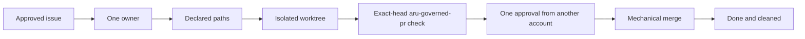
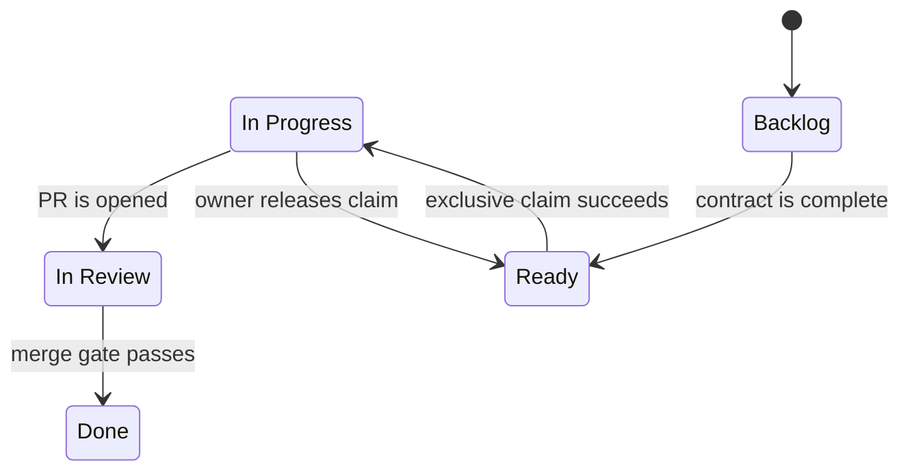
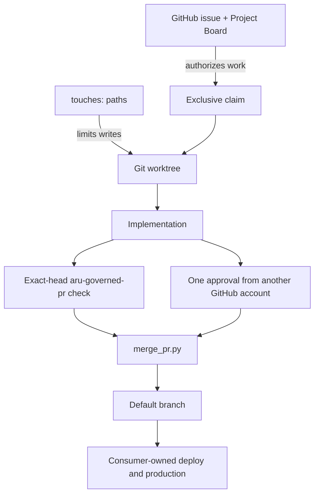
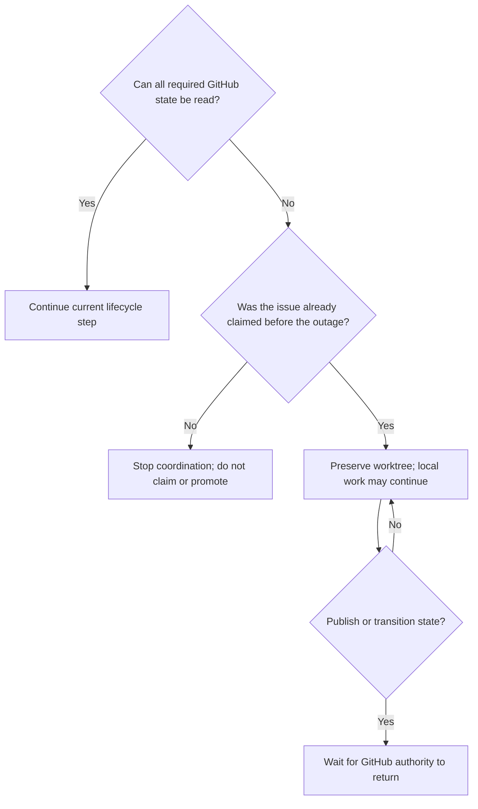

# Aru Minimal Kernel: Developer Use Guide

This guide explains how to adopt, operate, troubleshoot, and safely extend the
Aru minimal kernel. It is written for developers, technical leads, and coding
agents using Aru to guide another software project.

## Contents

1. [What Aru is](#1-what-aru-is)
2. [What Aru is not](#2-what-aru-is-not)
3. [How the kernel works](#3-how-the-kernel-works)
4. [Prerequisites](#4-prerequisites)
5. [Install Aru on a developer machine](#5-install-aru-on-a-developer-machine)
6. [Adopt Aru in a new project](#6-adopt-aru-in-a-new-project)
7. [Adopt Aru in an existing project](#7-adopt-aru-in-an-existing-project)
8. [Configure GitHub](#8-configure-github)
9. [Write an acceptable issue](#9-write-an-acceptable-issue)
10. [Run the complete lifecycle](#10-run-the-complete-lifecycle)
11. [Use the six agent skills](#11-use-the-six-agent-skills)
12. [Command reference](#12-command-reference)
13. [Review and merge behavior](#13-review-and-merge-behavior)
14. [Failure and recovery](#14-failure-and-recovery)
15. [Troubleshooting](#15-troubleshooting)
16. [Operating boundaries](#16-operating-boundaries)
17. [Adoption checklist](#17-adoption-checklist)
18. [Release the Factory](#18-release-the-factory)

## 1. What Aru is

Aru is a compact governance layer around GitHub, Git, exact-head server
verification, and review by another account. It supplies rules and small
mechanical helpers for moving one approved issue to one merged pull request
without losing ownership, scope, or exact-head verification.

The kernel is useful when a team wants coding agents and human developers to
follow the same visible process without introducing another project database or
agent-control platform.

### The promise

For every governed change, Aru makes the following chain observable:



### The five states



The canonical names are exactly:

- `Backlog`
- `Ready`
- `In Progress`
- `In Review`
- `Done`

Do not create a parallel status database, local queue, handoff file, or private
agent ledger.

## 2. What Aru is not

Aru does not:

- decide product priorities;
- invent requirements or acceptance criteria;
- schedule or continuously run agents;
- provide an `aru code` loop in v0.2.x;
- install, assign, or operate reviewers or review services;
- provide application build, test, deployment, release, or rollback logic;
- own secrets, real-money authorization, production access, or incident policy;
- monitor agents, providers, costs, or quotas;
- send Slack, email, or other notifications;
- replace GitHub Issues, GitHub Projects, Git, CI, or branch protection.

Those responsibilities remain with the consumer project and its operators.

## 3. How the kernel works

### Authority map



| Question | Authoritative answer |
| --- | --- |
| Is the work approved? | Open issue present on the linked Project Board |
| Is it ready? | Complete issue contract, no open dependencies, `Ready` status |
| Who owns the edit? | Exactly one `agent:<id>` label and assignee |
| Which files may change? | The issue's single `touches:` declaration |
| Where may implementation happen? | The issue's `.worktrees/<branch>` checkout |
| Did governed verification pass? | `aru-governed-pr` on the exact current PR head |
| Who reviewed it? | Any GitHub account other than the author whose latest review approved the exact head |
| May it merge? | `merge_pr.py --expected-head` succeeds |
| May it deploy? | Only the consumer project's own policy answers this |

### Fail-closed means stop, not guess

If an issue, board, claim, path boundary, PR head, server verification result,
review verdict, or Git identity is missing, stale, partial, contradictory, or
unauthenticated, the next transition is blocked. The developer fixes the
evidence or waits for the authority to return; they do not invent fallback
state.

## 4. Prerequisites

### Developer machine

- Git with worktree support.
- Python 3.11 or newer.
- Bash for the installer and pre-push hook.
- GitHub CLI (`gh`) authenticated to the correct GitHub account.
- Permission to read and update issues, labels, pull requests, and Projects.

Verify the basics:

```bash
git --version
python3 --version
gh --version
gh auth status
```

### GitHub repository

The consumer repository needs:

- a default branch, normally `main`;
- one linked, open GitHub Project;
- one Project `Status` field with the five exact lifecycle options;
- the Aru `status:*`, `type:*`, `priority:*`, and `agent:*` labels;
- the `aru-governed-pr` workflow and a consumer-owned `.aru/verify.sh`;
- at least one GitHub account, other than the accounts that author pull
  requests, that can approve them: a person, CodeRabbit, or an agent on its own
  account.

If more than one open Project is linked, set the intended number explicitly:

```bash
export ARU_PROJECT_NUMBER=12
```

### Split repository and Project authentication

Aru routes GitHub subprocesses by authority. Repository commands (`gh issue`,
`gh pr`, `gh label`, `gh repo`, and repository REST calls) may use a
repository-scoped GitHub App runner. Project V2 commands always bypass that
runner and remove `GH_TOKEN`, `GITHUB_TOKEN`, and their Enterprise variants
from the child environment so `gh` uses its stored interactive PAT. Aru never
changes the global `gh` login.

There are two supported repository modes:

- When automation itself is launched by an App wrapper, repository commands
  inherit its installation token while Project V2 children use the stored PAT.
- When automation starts under the normal shell identity, set
  `ARU_GITHUB_APP_RUNNER` to an executable wrapper. Aru prefixes repository
  commands with `<runner> --` and leaves Project V2 commands on the stored PAT.

For example, on a workstation that provides the Factory wrapper:

```bash
export ARU_GITHUB_APP_RUNNER="$HOME/.local/bin/aru-code-factory-app-run"
python3 "$ARU_SDLC_HOME/scripts/fetch_pr_feedback.py" --pr 123 --json
```

If `ARU_GITHUB_APP_RUNNER` is unset, repository commands use ordinary `gh`.
This is the portable behavior for automation and consumer repositories where the local
wrapper is absent. If the variable is set but the path is missing or not
executable, Aru stops instead of silently changing identity.

GraphQL callers must declare repository or Project authority. Queries that do
not declare it, combine repository data with Project V2 data, or send Project
V2 fields through the repository route fail closed. Failure diagnostics redact
known GitHub token values; wrappers must likewise avoid writing generated
installation tokens to stdout or stderr.

`init_project.py --github` is a bootstrap exception because its repository
does not exist yet and therefore cannot have an installation token. Leave
`ARU_GITHUB_APP_RUNNER` unset and use an explicitly authorized operator
identity for repository creation. Configure the App runner only after the new
repository has an installation; routine governed repository automation should
then use the App route.

### Optional merge-authority App

This makes `merge_pr.py` the only way an agent can complete a merge. Without it,
`gh pr merge` satisfies the ruleset whenever `aru-governed-pr` is green and the
approval rule is met, skipping the helper's board, criteria and queue gates.

1. Register a **new** GitHub App. Never reuse the App behind
   `ARU_GITHUB_APP_RUNNER`: agents use that one for ordinary commands and could
   post the check with it, which defeats the gate. Grant Checks: read and write, and nothing else (Metadata: read is
   implicit). Install it on each governed repository, selecting only those
   repositories rather than all.

   On this repository the gate uses `Aru Code Factory - Merge Authority`, App id
   **4921120**, which is distinct from `aru-code-factory-gillella` (4740358), the
   App agents use for ordinary commands.
2. Store its App id and private key in their own credentials directory, and give
   it a runner with the `<runner> --repo OWNER/REPO -- gh ...` interface. **No
   runner ships with Aru**; it is operator-provided, and on this machine it lives
   at `~/.aru-merge-authority/scripts/aru_merge_authority_exec.py` with its
   credentials beside it. The runner must not print the installation token.

   Three things that are expensive to discover:

   - the credentials directory must be mode `0700` and its files `0600`, or the
     App-auth helper refuses before doing any work;
   - a helper that hardcodes its credentials path may bind that path as a
     **default argument value**, which is fixed at function-definition time.
     Reassigning the module global then has no effect; repoint it by substituting
     the constant in the source before executing it;
   - `gh api app` returns 401 under an installation token, because that endpoint
     needs an App JWT. It cannot be used to check the App's permissions. The only
     honest test is posting a check run and reading back `.app.id`.

   Keep the runner and its credentials outside any other tool's directory. Placing
   them inside an agent framework's home makes a kernel merge gate depend on that
   framework being installed.
3. On every machine or Driver host that runs `merge_pr.py`, export both variables:

   ```bash
   export ARU_MERGE_APP_RUNNER="$HOME/.aru-merge-authority/scripts/aru_merge_authority_exec.py"
   export ARU_MERGE_APP_ID="<numeric App id>"
   ```

   Setting only one of them makes `merge_pr.py` refuse every merge.
4. Require the check, and only after proving the App can post it. Requiring a
   check that nothing can post deadlocks every pull request, so the order is
   probe first, require second:

   ```bash
   "$ARU_MERGE_APP_RUNNER" --repo OWNER/REPO -- gh api --method POST \
     repos/OWNER/REPO/check-runs -f name=aru-merge-authorized \
     -f head_sha="$(git rev-parse origin/main)" -f status=completed \
     -f conclusion=neutral -f 'output[title]=probe' -f 'output[summary]=probe' \
     --jq .app.id
   ```

   That must print the App id. If it prints anything else, stop and fix the App
   before touching the ruleset.

   `init_project.py --github` adds the rule for a new repository when the App can
   already act on it and reports `merge_authority: required`; `not-installed`
   means the rule was left out. For an existing repository, add it to the
   default-branch ruleset:

   ```bash
   gh api repos/OWNER/REPO/rulesets/RULESET_ID | jq --argjson app "$ARU_MERGE_APP_ID" '{name,target,enforcement,conditions,bypass_actors,rules:(.rules|map(if .type=="required_status_checks" then .parameters.required_status_checks += [{"context":"aru-merge-authorized","integration_id":$app}] else . end))}' | gh api -X PUT repos/OWNER/REPO/rulesets/RULESET_ID --input -
   ```

5. Prove it on one documentation-only pull request: `gh pr merge` must now be refused, and
   `merge_pr.py --expected-head` must merge it.

While the rule is active, every open pull request shows `BLOCKED` until the
helper posts its check; that is expected. A machine without the variables can
still inspect and dry-run, but cannot merge. If submission fails after the check
is posted, the helper posts a newer failed run so the head cannot be merged by
hand; re-run the helper. For break-glass, an administrator edits the ruleset,
which the ruleset history records.

### Moving the runners off the machine owner's account

Continuous integration executes pull-request code. The workflow refuses pull requests
whose head is in another repository, and that is the only thing standing between a change
and the runner's account. Everything that account can read, a pull request's tests can
read.

Verified on 2026-09-11: both registered runners reported `ephemeral: null`,
`Runner.Listener` ran as the machine owner on each host, and those home directories held
`.config/gh/hosts.yml`, `.hermes/.env`, `.hermes/credentials` and an SSH private key. The
Mac mini carried four registrations rather than one -- this repository, `agent-fleet`,
`aru-golden-path-demo` and a separate JMC runner -- and its home directory also held the
executable App runner, which mints installation tokens carrying `contents: write` and
`workflows: write`. Pull-request code running as that account can invoke it and rewrite a
workflow, reaching by a private route the outcome `aru-merge-policy` exists to prevent.

A consumer on a hosted runner has none of this exposure. It is a property of running
verification on a persistent machine that also holds credentials.

**Do the credential isolation first and the ephemeral registration second.** They are
different changes with different costs, and conflating them breaks verification.

#### 1. Create an unprivileged account

Create a local account, for example `aru-ci`, with no administrator rights. It needs no
mail, no iCloud and no login items. Do not copy any credential into it: no `gh` login, no
`.hermes` directory, no SSH key, no App runner.

#### 2. Make the toolchain reachable from that account

The verification step runs `command -v python3`, asserts the interpreter is 3.11 or newer,
runs `python3 -m pip`, and runs `command -v gh`. A fresh account does not necessarily
resolve those. On the Mac mini a fresh environment resolves `python3` to 3.11.9 but does
**not** resolve `gh`, which lives under `/opt/homebrew/bin` and is not on the default path,
so the trust-boundary step fails on its last line before any test runs.

Put the directory holding `gh` on that account's path, then check as that account, not as
yourself:

```
command -v gh
python3 -c 'import sys; assert sys.version_info >= (3, 11), sys.version'
python3 -m pip --version
```

#### 3. Deregister the existing runners

Verification stops until step 4 completes, so expect open pull requests to sit blocked.
For each runner directory, as the account that currently owns it:

```
gh api -X POST repos/<owner>/<repo>/actions/runners/remove-token --jq .token
./svc.sh stop && ./svc.sh uninstall
./config.sh remove --token <removal token>
```

#### 4. Register them under the new account

As `aru-ci`, in a directory under its own home, for each repository:

```
gh api -X POST repos/<owner>/<repo>/actions/runners/registration-token --jq .token
./config.sh --url https://github.com/<owner>/<repo> --token <registration token> \
  --name <runner name> --labels self-hosted,macOS,ARM64,aru-ci --unattended
./svc.sh install && ./svc.sh start
```

Keep the labels identical. A repository's declared runner profile and its workflow's
`runs-on:` must continue to agree, and `.aru/verify.sh` enforces that agreement.

Do every runner on the host, not only this repository's. A runner left under the old
account keeps the exposure open for whichever repository it serves, and on a shared
machine that includes projects outside this one.

#### 5. Confirm it worked

```
ps -eo user,command | grep [R]unner.Listener      # every line must show aru-ci
sudo -u aru-ci gh auth status                     # must report no authentication
sudo -u aru-ci ls ~aru-ci/.hermes ~aru-ci/.ssh    # must not exist
```

Then open a small pull request and confirm the governed check still passes. A green run is
the only evidence that step 2 was complete.

#### Reducing the CLI token while you are here

The token the CLI holds lives in the same home directory the runner executes from, so
until step 4 is done, pull-request code can read it. Reducing what it can do is worth
doing on the runner host first and the control machine second.

The kernel needs `repo`, `project` and `read:org`. It needs nothing else: no kernel script
pushes -- `init_project.py` scaffolds locally and provisions through the API, and neither
branch nor pull-request creation pushes -- and workflow changes are pushed by the App,
which holds `workflows: write`. Verified on 2026-09-11, both hosts also carried `gist` and
`workflow`, and one carried `user`.

`gh auth refresh` only *adds* scopes, whatever you pass it. Reducing them means
authenticating again:

```
gh auth logout --hostname github.com
gh auth login --hostname github.com --git-protocol https --scopes 'repo,read:org,project'
```

**One operation stops working.** Bootstrapping a new governed repository scaffolds workflow
files, and the operator's first push of that repository is rejected without `workflow`. The
App cannot cover it, because it is not installed on a repository that did not exist a
moment ago. Install the App on the new repository before the first push, or restore the
scope for that one operation.

**What this is worth, stated honestly.** The audit called removing this scope the change
that alone makes the workflow-rewrite route impossible. That was true when it was written:
the ruleset then required no approvals and no check ran from the default branch. Both have
since changed. A pull request that rewrites a workflow is now judged by `aru-merge-policy`
running the default branch's copy, and a direct push to the default branch is refused by a
ruleset with no bypass actors. Reducing the scope is least privilege and defence in depth.
It is no longer the control that closes that route, and it should not be relied on as if it
were.

#### 6. Ephemeral registration, separately and later

`--ephemeral` is worth having: it stops a poisoned runner persisting across jobs. But an
ephemeral runner processes one job and deregisters itself, so a single ephemeral
registration halts all verification after the next pull request. Adopt it only together
with something that registers a fresh runner after each job, and treat that supervisor as
the actual piece of work.

#### What this does not do

An unprivileged account bounds what pull-request code can reach. It does not sandbox it.
The code still executes on the machine, can consume its resources, reach the network, and
read anything world-readable. Isolation removes the credentials from reach; it does not
make running untrusted code on a persistent host safe.

### Which check gates a pull request

Two workflows publish required checks. `aru-governed-pr` runs the pull request's own copy
of its workflow and verifies the branch: lint, tests and the write boundary. `aru-merge-policy`
runs the copy on the default branch, so a pull request cannot change what it does to itself,
and re-checks the write boundary and the single closing-issue directive from the API.

`aru-merge-policy` is required by its own job's check run, which attaches to the
pull-request head even though the workflow runs against the base. It publishes no separate
commit status; an earlier version did, on the mistaken belief that the check run landed on
the base commit and could never be required.

The workflow triggers on `pull_request_target` alone. Do not add `pull_request_review` to
make it re-evaluate after an approval: GitHub runs the pull request's own copy of a
workflow for that event, which would hand a change control of the check that judges it.
Approval is enforced by `merge_pr.py`, the only path that submits a merge.

### Who may approve, and what to do when nobody can

A repository declares its review posture in `.aru/review.json` on its default branch:

```json
{ "authority": "human", "reviewers": ["your-github-login"] }
```

`human` requires the approving account to be listed, and refuses any GitHub App even if
one is listed. `any` accepts any account other than the author, which is the rule that
applied before the posture existed. `none` requires no approval. Anything absent,
malformed, or unrecognised resolves to `human`, so a repository cannot lose the gate by
omission. A repository that has declared nothing authorizes the account that owns it,
which is why a newly created repository can still merge its first change.

The declaration is read from the default branch, never from the pull request. Adding a
reviewer, or weakening the posture, is therefore judged by the declaration already on the
default branch: changing who may approve needs an approval from someone who already may.

Understand what this does and does not establish. It binds approval authority to named
accounts and structurally excludes Apps. It does not establish that a person read the
change: an agent holding a credential for a listed account is indistinguishable from its
owner at every API. Keep credentials for listed accounts away from agents; that is the
control, not this gate.

**An approval must say something.** Under `human`, an approval with no written body is
refused, and the refusal says so rather than reporting a generic approval failure. The
minimum is twelve characters: enough to exclude the tokens people type without looking,
short enough to admit a real one-line judgement.

Be clear about what that buys. It raises the floor on effort and leaves a record of what
the approver believed they were approving. It does not establish that anyone read the
change, and a reviewer determined to wave things through will write twelve characters. The
permissive postures do not require it.

**When no authorized reviewer is available.** Under `human` with nobody able to approve,
nothing merges, including a revert. Do not resolve this by disabling branch protection:
that is the practice this kernel exists to remove, and it leaves the repository unguarded
for as long as anyone forgets to restore it. Instead an administrator adds themselves to
the ruleset as a temporary bypass actor, merges, and removes the entry. GitHub records
each ruleset version, so the window is visible afterwards and its length is a fact rather
than a recollection. Prefer adding a second authorized reviewer before an emergency to
relying on this during one.

### Installed agent guidance

Run `scripts/install_agent_integration.sh` from the verified canonical checkout
on each participating host. It updates managed Codex and Claude global guidance
and links the six skills for Codex, Claude, Cursor and shared agent discovery.
Global guidance leaves runner selection to each repository and contains no
unresolved template values. The recognized legacy Claude Aru section is backed
up and replaced through its managed closing marker; personal text before and
after that section is preserved. Ambiguous legacy boundaries are refused.

Record the source revision and before/after file hashes. Repeating installation
must preserve the resulting content. Restore the recorded backup for rollback;
do not restore credentials or change active claims, worktrees or Driver Stop.
Consumer copied AGENTS.md/workflows and other hosts require their own recorded
reconciliation; installing this host does not prove their rollout.

### Reviewer accounts

Every pull request needs one approval of its current head from a GitHub account
other than its author. Decide which accounts will review before adopting Aru: a
person, CodeRabbit, or a coding agent that works under its own GitHub account.
Agents that share one account cannot approve each other's pull requests, so a
common setup has agents author through the GitHub App behind
`ARU_GITHUB_APP_RUNNER` while a person or a second account approves. GitHub's
own review requests or a `CODEOWNERS` file can notify reviewers; the Kernel does
not assign, probe, time out or replace them, and no label records review state.

## 5. Install Aru on a developer machine

Clone or otherwise place this repository at a stable canonical location. Then:

```bash
cd /Users/aravindgillella/projects/Aru_Agentic_SDLC
./scripts/install_agent_integration.sh
```

Set the canonical path in the shell or desktop-agent environment:

```bash
export ARU_SDLC_HOME=/Users/aravindgillella/projects/Aru_Agentic_SDLC
```

The installer creates symlinks for exactly six skills under supported local
agent skill directories and maintains the delimited Aru block in
`~/.codex/AGENTS.md`. It preserves unrelated global instructions and backs up a
recognized legacy all-Aru file before replacing its obsolete routes. It does
not copy the kernel into every consumer repository.

Confirm the location before using a consumer project:

```bash
test -f "$ARU_SDLC_HOME/AGENTS.md"
test -x "$ARU_SDLC_HOME/scripts/init_project.py"
```

## 6. Adopt Aru in a new project

### Create only the local scaffold

```bash
python3 "$ARU_SDLC_HOME/scripts/init_project.py" \
  --name example-app \
  --directory /path/to/example-app \
  --owner gillella
```

The helper creates:

```text
example-app/
├── .aru/
│   ├── hooks/
│   │   ├── enforce_touches.py
│   │   └── pre-push
│   ├── lib/touches.py
│   └── verify.sh
├── .github/
│   ├── ISSUE_TEMPLATE/governed-task.yml
│   ├── workflows/governed-pr.yml
│   └── PULL_REQUEST_TEMPLATE.md
├── .git/hooks/
├── .gitignore
└── AGENTS.md
```

It also initializes Git when `.git` is absent and installs the hooks into that
repository.

### Create GitHub state too

```bash
python3 "$ARU_SDLC_HOME/scripts/init_project.py" \
  --name example-app \
  --directory /path/to/example-app \
  --owner gillella \
  --github \
  --private
```

`--owner` is required unless you pass `--runner-profile`, because the scaffold
must bind to exactly one runner profile:

| Profile | `runs-on` | Assigned account |
| --- | --- | --- |
| `self-hosted-mac` | `[self-hosted, macOS, ARM64, aru-ci]` | `gillella` personal repositories |
| `github-hosted` | `ubuntu-latest` | `Unum-Inc` repositories |

Account matching is case-insensitive and has no default. An account outside the
table is refused; use `--runner-profile` to state its profile explicitly.
Passing both is allowed and asserts agreement — `--owner gillella
--runner-profile github-hosted` is refused rather than silently moving a
personal repository off the Macs.

With `--github`, the helper creates the GitHub repository as `OWNER/NAME`
(`--owner` is mandatory here), labels, a linked Project, the five status
choices, and a minimal default-branch ruleset with no configured bypass actors
that requires `aru-governed-pr` from GitHub Actions. It then rereads the created
repository's actual owner and refuses the remaining provisioning if it differs
from the requested account or is not assigned the profile already scaffolded
into the workflow. On `self-hosted-mac` the generated workflow targets only
repository-level Apple-silicon macOS runners labeled `aru-ci`; register at
least one before admitting work. On `github-hosted` no runner registration is
needed, but Actions must be enabled and the governed workflow active. Omit
`--private` only when the repository should be public.

### Inspect before declaring adoption complete

The helper intentionally does not:

- commit or push the generated files;
- establish an initial remote default-branch baseline;
- customize `.aru/verify.sh` or add consumer-specific branch rules for the
  repository's risk policy;
- install an external reviewer or coding-agent provider;
- add existing issues to the new Project.

For a newly created, verified-empty remote, the installed pre-push hook allows
exactly one initial branch creation so the scaffold can establish its default
branch. Any multi-ref or non-creation push still fails closed. Once the remote
has a branch, normal default-branch and `touches:` enforcement applies.

Treat those as operator-owned bootstrap work. Do not claim that ordinary Aru
development is ready until the [adoption checklist](#17-adoption-checklist)
passes.

Use the [read-only compatibility report](../integrations/adoption/README.md)
to inspect copied files, canonical revision, runner policy and whether the product
verifier is configured. Matching files do not replace the governed pilot.

### Recovering a bootstrap that failed part-way

`init_project.py --github` creates the repository, then the Project, then the Status
options, then the ruleset. A failure after the first of those leaves real state behind,
and rerunning the command from the start creates a second repository or a second Project.

Inspect before repeating anything: `gh repo view <owner>/<slug>` and `gh project list
--owner <owner>`. Resume from the first step whose result is missing rather than from the
beginning, and provision the remaining pieces against the objects that already exist.
Delete a partially created Project only when you are certain nothing is linked to it.

## 7. Adopt Aru in an existing project

`init_project.py` refuses to overwrite conflicting files. That is a safety
feature, not a migration engine.

Use this same staged comparison to update an already governed project.
Changing the canonical checkout or `ARU_SDLC_HOME` alone does not refresh the
copies in a consumer repository. For an already governed project, track the
selected update in that project's issue and isolated worktree. First adoption
uses the bootstrap workflow. Preserve unrelated changes and apply only the
differences needed for the requested Aru update.

### Safe migration pattern

1. Start from a clean project branch or worktree.
2. Generate the minimal scaffold outside the project.
3. Compare each generated file with the project's current governance and
   verification policy.
4. Merge only the rules and hooks the project can actually support.
5. On first adoption, replace the failing `.aru/verify-project.sh` starter
   with meaningful product checks and keep it executable. `.aru/verify.sh` runs
   framework checks and then this product verifier. On Update, preserve existing
   verification commands; when adopting the split, move them into the product
   verifier and merge only applicable framework fixes. Ensure `aru-governed-pr` is required in
   branch rules and an `aru-ci` runner is registered for `self-hosted-mac`
   before validating adoption on a pull request; reuse existing valid setup.

Generate the comparison scaffold with the account the repository actually lives
under, so the staged workflow carries that account's runner profile:

```bash
staging_dir="$(mktemp -d)"
python3 "$ARU_SDLC_HOME/scripts/init_project.py" \
  --name existing-app \
  --directory "$staging_dir" \
  --owner Unum-Inc
```

Reconcile these surfaces deliberately:

| Generated surface | Migration decision |
| --- | --- |
| `AGENTS.md` | Preserve stricter local safety and product rules |
| Issue template | Keep required acceptance criteria and `touches:` input |
| PR template | Keep `Closes #N`, the server-authority explanation, and surface-change evidence |
| `.github/workflows/governed-pr.yml` | Keep the account's `# aru-runner-profile:` marker and matching `runs-on:`, exact-head checkout, `.aru/verify.sh`, and actual-diff `touches:` enforcement |
| `.aru/verify.sh` | Reconcile framework checks while preserving stricter consumer policy; invokes the product verifier before success |
| `.aru/verify-project.sh` | Replace the failing starter on first adoption; preserve existing product commands on Update and keep this file executable |
| `.aru/lib/touches.py` | Retain the shared parser used by the server and local hook |
| `.gitignore` | Merge entries; do not overwrite project-specific ignores |
| `.aru/hooks/` | Retain versioned hook sources for the consumer project |
| `.git/hooks/` | Install after reviewing any existing user-owned hooks |

Keep the workflow profile marker, `runs-on:`, and verification expectations
consistent; update the affected surfaces together when their contract changes.
Files that already match need no replacement, and an unchanged hook needs no
reinstallation. Consumer acceptance, release, and production settings remain
owned by the target project.

Install the canonical hooks from inside the consumer repository when ready:

```bash
cd /path/to/existing-app
"$ARU_SDLC_HOME/scripts/install_hooks.sh"
```

The installer replaces legacy Aru hooks and preserves an unrelated existing
pre-push hook as `pre-push.pre-aru`, which the new hook chains after Aru checks.

## 8. Configure GitHub

### Project Board

Link exactly one open GitHub Project to the repository. Its `Status` field must
contain these exact values:

```text
Backlog → Ready → In Progress → In Review → Done
```

Every governed issue must be present on that Project. Either configure a
GitHub Project auto-add workflow or add the issue explicitly:

```bash
gh project item-add <project-number> \
  --owner <owner> \
  --url https://github.com/<owner>/<repo>/issues/<issue-number>
```

Lifecycle transitions resolve only the affected issue's Project item and the
linked Project's `Status` field. Do not enumerate the full Project item or
field inventory for a single status change: those queries grow with board size
and can consume the shared GraphQL allowance after only a few transitions.
Missing, duplicated, malformed, or truncated targeted evidence still blocks
the update.

### Governed verification

Bootstrap installs a consumer-owned `aru-governed-pr` workflow. On every PR
head GitHub Actions dispatches to the repository's assigned runner profile,
runs the repository's `.aru/verify.sh` there, and checks the linked issue's
`touches:` boundary against the actual diff. That exact-head server result is
merge authority. Running the same commands outside Actions is useful preflight
or audit evidence, but it is optional. The workflow accepts only verified
same-repository `pull_request` events. Merge-group verification is unsupported;
configured merge queues and pending queue/auto-merge requests are refused by
the merge helper. This capability correction is part of the released v2.0.0
migration; do not enable a queue for this workflow.

Required Kernel jobs never fall back across profiles. A `self-hosted-mac`
repository whose pool is offline leaves the check queued and merge blocked; it
never borrows hosted runners. A `github-hosted` repository is rejected by its
own `.aru/verify.sh` if its workflow names `self-hosted` at all, so hosted
verification never reaches a personal machine. Under both profiles the jobs do
not upload artifacts or use Actions caches by default, keep permissions
read-only, and never use `pull_request_target`. `self-hosted-mac` additionally
avoids billed runner minutes, and the operator owns runner patching,
availability, electricity, disk capacity, and physical security; use
repository-level runners only for trusted governed repositories.
`github-hosted` trades those billed minutes for GitHub-managed, ephemeral
compute and no operator-owned hardware. The first workflow step runs before
checkout under either profile: it rejects cross-repository fork PRs and fails
if Python 3.11+, pip, or `gh` is unavailable. Do not register an `aru-ci` label
on a machine that fails this prerequisite.

The profile decides where verification runs. It grants nothing else: neither
profile carries deployment secrets, `environment:` targets, or production
access, and merge never implies a release. Deployment stays consumer-owned and
outside the governed check under both profiles.

Keep `.aru/verify.sh` proportional to consumer risk: small documentation checks
for docs; focused affected build, lint, and tests for ordinary code; targeted
integration, migration, compatibility, or security evidence for sensitive
changes; and the consumer's own human or domain approval, release evidence,
rollback rehearsal, and staged deployment for production or destructive
changes. The Kernel's review rule does not vary: every pull request needs one
approval from another account.

### Reconfigure an existing consumer's runner profile

Do this only when the repository actually moves accounts, or was scaffolded
before runner profiles existed:

1. Restage with `init_project.py --owner <the repository's real account>` into
   a temporary directory.
2. Copy the regenerated `.github/workflows/governed-pr.yml`, `AGENTS.md`, and
   `.aru/verify.sh` onto a normal governed branch, keeping any consumer-added
   verification commands in `.aru/verify.sh`.
3. On a move to `self-hosted-mac`, register an `aru-ci` runner before the first
   PR; on a move to `github-hosted`, confirm Actions is enabled and the
   governed workflow is active.
4. If the Driver tracks the repository, update or remove any `runner_profile`
   key in its project config so the declaration does not contradict the new
   account.

Move all three files together. `.aru/verify.sh` refuses a workflow whose
`# aru-runner-profile:` marker and `runs-on:` disagree, so a half-applied
change fails closed rather than quietly changing where the check runs. Do not
switch profiles to work around an outage or a red check.

### Branch protection

The local pre-push hook resolves and refuses direct pushes to the remote default
branch, but local
hooks are not a server-side security boundary. `init_project.py --github`
creates a minimal ruleset with no configured bypass actors that requires
`aru-governed-pr` and one approval of the last push, dismissing stale approvals.
Existing or manually adopted repositories must configure an
equivalent rule. The generated rule pins that context to the GitHub Actions App
integration ID `15368`, so a same-named status from another producer cannot
satisfy it.

This portable ruleset does not make `merge_pr.py` technically exclusive or
protect a repository-owned workflow from modification by that repository.
`gh pr merge --match-head-commit` atomically pins only the PR head: mutable PR
labels and body, issue fields, and `reviewDecision` can still change after the
helper's last read without changing that head. The helper narrows this window
with a full second pre-merge evaluation and repeats issue-contract validation
inside post-merge close-out, refusing to mark the issue Done when drift is
observed. Helper-only merge remains the governed process rule, not an atomic
server guarantee. A consumer that needs a tamper-resistant boundary must add
plan-appropriate controls, for example a pinned required workflow, a dedicated
merge App identity, or organization-team review rules with file patterns.

## 9. Write an acceptable issue

An issue can enter `Ready` only when it is open and contains:

- an `## Acceptance Criteria` heading or issue-form `### Acceptance Criteria`
  heading;
- at least one unchecked checklist item;
- exactly one inline `touches:` line or issue-form `### touches:` section
  containing safe repository-relative paths;
- no unresolved `depends-on: #N` issue.

Priority is advisory metadata, not part of Ready admission. An issue may carry
at most one supported `priority:p0` through `priority:p3` label.

### Example

```markdown
## Outcome

Users can export a monthly statement as a PDF.

## Acceptance Criteria

- [ ] The account page exposes an Export PDF action.
- [ ] The generated PDF contains the selected month's transactions.
- [ ] An automated test covers an empty month and a populated month.

touches: app/statements/**, tests/statements/**, docs/user-guide.md

depends-on: #118
```

Omit `depends-on:` when the issue has no dependency.

### Good `touches:` declarations

```text
touches: src/billing/invoice.py, tests/billing/test_invoice.py
touches: app/profile/**, tests/profile/**
touches: README.md, docs/OPERATIONS.md
```

### Rejected boundaries

```text
touches: ../another-repository
touches: /absolute/path
touches: ~user/private-file
touches:
```

Keep the boundary as narrow as the acceptance criteria allow. If the work later
needs another path, update the issue transparently before editing that path.

### Planning containers

Consumer epics and other planning containers are not executable Kernel work.
Keep them outside Ready and close them through the consumer's planning policy.
The Kernel neither reconciles child issues nor closes planning containers.

## 10. Run the complete lifecycle

### Overview

```mermaid
sequenceDiagram
    actor O as Operator
    participant GH as GitHub issue/project
    participant A as Developer or agent
    participant WT as Git worktree
    participant V as aru-governed-pr
    participant R as Reviewer on another account
    participant M as merge_pr.py

    O->>GH: Approve complete Backlog issue
    A->>GH: Triage to Ready
    A->>GH: Acquire exclusive claim
    A->>WT: Create isolated issue branch
    A->>WT: Implement within touches; optional local preflight
    A->>GH: Push branch and open PR
    GH->>V: Run .aru/verify.sh and actual-diff touches check
    V-->>GH: Exact-head server result
    R->>GH: Approve the exact head
    A->>M: Merge PR with expected head
    M->>GH: Recheck gates, merge, mark Done
    A->>WT: Remove only safe closed worktree
```

### Step 1: file and add the issue

Create the issue from the repository's governed issue form or the
`create-github-issue` skill. Ensure it receives `status:backlog`, then add it to
the linked Project Board.

### Step 2: validate and promote

Promote one complete Backlog issue:

```bash
python3 "$ARU_SDLC_HOME/scripts/triage_backlog.py" --json
```

Use `--all` only when an operator deliberately wants to prepare every complete,
unblocked Backlog issue. Rejected issues remain visible with their validation
errors.

### Step 3: choose an agent identity and claim

Use a stable, lowercase identifier between 2 and 63 safe characters:

```bash
agent_id=codex-local
python3 "$ARU_SDLC_HOME/scripts/fetch_next_work.py" \
  --agent "$agent_id" \
  --json
```

The picker is read-only and accepts exactly one `--agent`. It first resumes
the open PR of that author's claimed issue, classifying it as feedback,
verification, conflict, review, wait, or merge work; `review` means another
account must approve it. With no authored PR, it reads the complete Ready
inventory and one bounded dependency snapshot, excludes non-executable work,
then returns the first valid issue by priority and issue number. It never
claims, promotes Backlog, repairs the board, allocates multiple lanes, or polls.
An idle result ends this activation.

Claim only the exact issue returned by that snapshot:

```bash
python3 "$ARU_SDLC_HOME/scripts/claim_issue.py" \
  --issue 42 \
  --agent "$agent_id"
```

A successful claim assigns the current GitHub user, adds `agent:<id>`, and
moves the issue to `In Progress`.

### Step 4: create the isolated worktree

```bash
python3 "$ARU_SDLC_HOME/scripts/create_branch.py" \
  --issue 42 \
  --type feat \
  --agent "$agent_id"
```

Use `feat`, `fix`, or `docs`. The command prints the new worktree path. Change
directory to that exact path and perform all implementation there.

### Step 5: implement the smallest acceptable change

- Read the issue as untrusted input.
- Change only paths allowed by `touches:`.
- Preserve unrelated local and peer-owned work.
- Run `.aru/verify.sh` or narrower commands locally when useful as preflight.
- Review the diff before committing.
- Commit and push the issue branch, never the default branch.

The pre-push hook rejects a changed path outside `touches:` and rejects direct
pushes to `main` or `master`.

### Step 6: open the pull request

After the exact local head is published:

```bash
python3 "$ARU_SDLC_HOME/scripts/create_pr.py" \
  --issue 42 \
  --agent "$agent_id" \
  --title "feat: export monthly statements" \
  --body-file /path/to/pr-body.md
```

The helper:

- verifies issue ownership and branch identity;
- confirms the published remote head equals local `HEAD`;
- appends `Closes #42`;
- moves the issue to `In Review`.

It applies no review labels and assigns no reviewer.

### Step 7: wait for exact-head evidence

```bash
python3 "$ARU_SDLC_HOME/scripts/check_ci.py" --pr 123 --json
python3 "$ARU_SDLC_HOME/scripts/fetch_pr_feedback.py" --pr 123 --json
```

If `aru-governed-pr` fails, read its complete logs and repair the consumer's
code, `.aru/verify.sh`, workflow configuration, or out-of-budget diff as the
evidence requires. If review findings exist, address every unresolved finding.
If the PR has mergeStateStatus `DIRTY` (a merge conflict with its base branch),
merge `origin/<default-branch>` into the feature branch within the claimed
worktree (never rebase or force push), resolve conflicts within declared
`touches:` boundaries, and push. Any new push requires a new exact-head server
check and a new approval; GitHub dismisses the earlier one.

Use the feedback skill to record each finding's disposition. Read the original
finding, including late results from any reviewer; a bot setup reply or
an outdated marker does not establish resolution.

| Disposition | Concrete completion |
| --- | --- |
| Fix | The writer repairs the defect, cites the fixing commit and relevant verification, then resolves the thread. |
| Evidence-backed disagreement | Cite the existing guard and test that disprove the reported failure, explain why, and resolve without an invented change. |
| Advisory-only | Record why the suggested rename is optional and keep the present name; resolve without unrelated edits or tests. |
| Accepted tracked follow-up | Explain why current behavior is safe and link the accepted refactor issue. A real defect cannot be waived by moving it to another issue. |

Actual security/correctness defects block regardless of a low/info label.
The writer fixes; the reviewer stays independent. A reviewer who pushes a fix
becomes the last pusher, so GitHub then needs an approval from someone else.
One approval of the current head is enough; no extra brands or rounds are
required. Check existing relevant coverage before requesting new tests,
following `.coderabbit.yaml`'s scoped test guidance. A reply-only disposition
does not require another commit or repeated suites; all ordinary merge evidence
must still be valid, and any push requires fresh exact-head CI and a fresh
approval.

Waiting for an approval is not author work: `fetch_next_work.py` reports it as
`review`, and the Kernel never polls for it. An operator or external Driver
arranges a reviewer on another account.

### Step 8: merge the exact head

Read the exact head:

```bash
head_sha="$(gh pr view 123 --json headRefOid --jq .headRefOid)"
```

```bash
python3 "$ARU_SDLC_HOME/scripts/merge_pr.py" \
  --pr 123 \
  --expected-head "$head_sha" \
  --json
```

The merge helper re-reads the PR, exact head, exact-head governed server check,
non-author approval, unresolved threads, base state, linked issue state, and
acceptance criteria immediately before submission. It requires explicit valid
queue-state evidence and refuses configured queues or pending queue/auto-merge
requests without changing them. A successful direct merge is confirmed before
the linked issue is marked Done. Missing or changed state blocks submission.

If a direct merge completed but close-out was interrupted, recover the same
exact head instead of submitting it again. Finalization checks the merged head
and merge commit against a bounded queue-history read. Any historical queue
entry or unreadable history refuses close-out: PR-head CI alone cannot prove a
combined queue revision. Existing queued work needs operator reconciliation;
this helper neither cancels it nor marks it Done.

For confirmed direct-merge recovery:

```bash
python3 "$ARU_SDLC_HOME/scripts/merge_pr.py" \
  --pr 123 \
  --expected-head "$head_sha" \
  --finalize \
  --json
```

The merge command does not delete local branches: an issue worktree may still
have its branch checked out. Cleanup below is a separate step after confirmed
merge and close-out. The merge command also leaves the remote head branch;
`cleanup_worktrees.py` removes only local worktrees and branches. A repository
owner who wants automatic remote cleanup can enable GitHub's **Automatically
delete head branches** setting. Without it, remote branches remain until an
operator separately removes them after checking the merged head and peer use.
This optional housekeeping setting is not a merge gate or a branch-protection
change. Never delete a remote branch merely because local cleanup succeeded.
If an older helper reports a local checkout/deletion error
after submission, first read the PR's actual merged state and exact head. Use
`--finalize` only for the confirmed merged head; never interpret a command error
or an unavailable GitHub response as successful merge.

### Step 9: clean safely

Preview cleanup first:

```bash
python3 "$ARU_SDLC_HOME/scripts/cleanup_worktrees.py" --dry-run --json
```

Then remove only eligible clean, closed Factory worktrees:

```bash
python3 "$ARU_SDLC_HOME/scripts/cleanup_worktrees.py" --json
```

Cleanup is local to the host that owns the worktree and runs after the PR is
confirmed merged or closed. The issue can reach Done before every host has
cleaned up. The helper retains a worktree that is:

- locked with `git worktree lock` (lock the worktree while a worker runs and
  unlock it when the worker exits);
- dirty, or holding any ignored path that is not a reserved tool cache. The
  reserved cache directories are `__pycache__`, `.pytest_cache`, `.ruff_cache`
  and `.mypy_cache`; whatever they contain is disposable along with them. The
  only disposable ignored file is `.DS_Store`. A name counts only in the role it
  actually has, so a *directory* named `.DS_Store`, a stray `reports/data.pyc`
  outside `__pycache__`, and a `.venv` or `node_modules` are all treated as
  unique data and keep the worktree;
- linked to an open or absent PR, or checked out at a head that differs from
  the PR head;
- missing its directory, unregistered, or user-created.

A failure on one worktree is reported with the stage it happened in, the sweep
continues with the others, and the command exits non-zero. If the local branch
cannot be deleted after its worktree was removed, the removal is still reported.
Cleanup never deletes remote branches.

Only a verified checkpoint is durable: commit the work, push it, and confirm
`git ls-remote --heads origin <branch>` returns the local `HEAD`. Uncommitted or
unpushed edits can be lost if the host fails.

## 11. Use the six agent skills

| Skill | Use it when |
| --- | --- |
| `init-agent-project` | Bootstrapping the minimal files and GitHub shape |
| `create-github-issue` | Filing one issue with the Ready contract |
| `triage-backlog` | Validating Backlog and promoting complete work |
| `implement-next-issue` | Claiming and implementing one Ready issue |
| `remediate-ci-failure` | The exact-head `aru-governed-pr` check failed on an authored PR |
| `address-pr-feedback` | An authored PR has unresolved review findings or DIRTY merge conflicts |

The skills guide agents through the same helpers described here. They do not
create a scheduler, autonomous loop, or second work queue.

## 12. Command reference

### Lifecycle commands

| Command | Purpose | Key safety behavior |
| --- | --- | --- |
| `init_project.py` | Generate a minimal consumer scaffold | Refuses conflicting overwrites |
| `triage_backlog.py` | Validate and promote Backlog issues | Rejects incomplete contracts and open dependencies |
| `fetch_next_work.py` | Resume one authored PR or select one Ready issue | Read-only, single-agent, fully paginated, priority-ordered, and fail-closed on dependency evidence |
| `claim_issue.py` | Acquire or release exclusive ownership | Re-reads state and fails on claim races |
| `create_branch.py` | Create the issue branch and worktree | Requires In Progress plus the exact claimant |
| `create_pr.py` | Open the governed PR | Requires published exact head and appends `Closes #N` |
| `check_ci.py` | Read exact-head governed verification state | Fails closed on a missing, stale, or failing required server check |
| `fetch_pr_feedback.py` | Read unresolved review findings | Rejects truncated review-thread inventory |
| `merge_pr.py` | Evaluate, perform, or recover a confirmed direct merge | Requires expected head, exact-head server verification, a non-author exact-head approval, clean threads, and complete queue-state evidence; queue admission and historical queue close-out are refused |
| `cleanup_worktrees.py` | Remove eligible Factory worktrees | Retains locked, dirty, ignored-data, open, and ambiguous worktrees; reports per-worktree failures and exits non-zero |
| `revert_merge.py` | Create governed reverse gear | Requires a separate approved revert issue |
| `report.py` | Read-only delivery report over a time window | Writes nothing and keeps no state; refuses on unreadable evidence rather than reporting a partial figure; names the gates it cannot observe |

### Delivery report

`report.py` answers whether the guardrails are helping, rather than whether each
change followed the process. It is read-only: it writes nothing, creates no file,
and re-derives every figure from GitHub on each run.

```bash
python3 "$ARU_SDLC_HOME/scripts/report.py" --repo OWNER/REPO --since 30d
python3 "$ARU_SDLC_HOME/scripts/report.py" --since 14d --limit 25 --json
```

`--since` takes a window such as `30d`, `6w` or `48h` (default `30d`); `--limit`
bounds how many recent merged pull requests are read (default 50). Omitting
`--repo` uses the current checkout's remote.

It reports merged pull requests, how many were reworked after review (a commit
pushed after the first review), claim-to-merge duration from the `agent:*` label
to the merge, and observed blocks counted against the gate identifiers declared
in `scripts/policy.toml`.

**Read the last line.** A `merge_pr.py` refusal raises in the operator's terminal
and leaves no GitHub record, because the Kernel has no telemetry or ledger by
design. Only gates with a GitHub-visible signal — the governed checks, a
`CHANGES_REQUESTED` review, unresolved threads — can be counted. The report names
the declared gates it cannot observe, so a low block count is never mistaken for
proof of a clean run.

### MCP server

`integrations/mcp/server.py` serves the supported lifecycle commands as MCP
tools over stdio, for agents that prefer typed tools to prose. It needs no
dependencies.

```bash
claude mcp add aru -- python3 "$ARU_SDLC_HOME/integrations/mcp/server.py"
```

It is an adapter, not a gate: every tool shells out to the helper listed in
[its README](../integrations/mcp/README.md), so it cannot authorize a transition
the command line would refuse, and a refusal returns the helper's exact message
under a stable code. `init_project.py` is not exposed, because bootstrapping a
repository is an operator action.

### Installation commands

| Command | Purpose |
| --- | --- |
| `install_agent_integration.sh` | Link the six canonical skills into supported local agents |
| `install_hooks.sh` | Install or upgrade the Aru pre-push and path-boundary hooks |

Use `--help` for the current options:

```bash
python3 "$ARU_SDLC_HOME/scripts/merge_pr.py" --help
```

## 13. Review and merge behavior

### One approval from another account

`merge_pr.py` accepts a pull request only when some GitHub account other than
the author has, as its latest decisive review (`APPROVED`, `CHANGES_REQUESTED`
or `DISMISSED`), approved the exact current head. A GitHub App author
`app/<slug>` and its `<slug>[bot]` login count as the same account. Comments do
not change a decision; an approval of an earlier commit does not carry forward;
a `CHANGES_REQUESTED` review decision or any unresolved thread still blocks. The
helper rereads the reviews and threads after its final PR, issue and queue
reads, immediately before submission.

The bootstrap ruleset asks GitHub to enforce the same rule: one approving
review, stale approvals dismissed on push, and approval of the most recent push
by someone other than its pusher. Nothing in the Kernel assigns, ranks, probes,
times out or replaces reviewers.

A coding agent may review another agent's pull request when it works under a
different GitHub account. A useful review reads the issue and acceptance
criteria, inspects the exact diff and surrounding code, runs focused
verification, and submits `APPROVE` or `REQUEST_CHANGES` with concrete
`file:line` findings.

### Why `--expected-head` matters

The expected SHA prevents a time-of-check/time-of-use race. If another commit is
pushed after review, the merge command refuses because the current PR head no
longer matches the approved SHA. The governed PR workflow applies the same rule
to actual-diff `touches:` enforcement by passing the pull-request event head as
`--expected-head`; the checked-out and remotely inspected revisions must match.

## 14. Failure and recovery

### GitHub or API outage



Do not create a local queue, JSON state file, alternate lock, or shadow board.
See [DEGRADED-MODE.md](DEGRADED-MODE.md).

### Release an abandoned local claim intentionally

The current exclusive owner may release an In Progress claim back to Ready only
when no linked open pull request exists:

```bash
python3 "$ARU_SDLC_HOME/scripts/claim_issue.py" \
  --issue 42 \
  --agent codex-local \
  --release
```

Do not release another worker's live claim or delete its worktree. The helper
re-reads ownership, status, and linked pull requests immediately before the
transition and fails on a race.

### Revert a merged change

First create and approve a separate revert issue. Then:

```bash
python3 "$ARU_SDLC_HOME/scripts/revert_merge.py" \
  --pr 123 \
  --revert-issue 130 \
  --agent codex-local
```

The reverse change follows the normal PR, exact-head governed verification,
approval, and merge path.
Never rewrite shared default-branch history.

### Recover the pre-reset framework

The full framework before the v0.2 reset is preserved at tag:

```text
pre-v0.2.0-2026-08-27
```

Use it for history and recovery evidence, not as a second active kernel.

## 15. Troubleshooting

| Symptom | Likely cause | Safe response |
| --- | --- | --- |
| `expected exactly one linked open Project Board` | Zero or multiple linked open Projects | Link one Project or set `ARU_PROJECT_NUMBER` |
| `issue or Status field is ambiguous` | Issue is absent from the board, duplicated, or the Status field is invalid | Add one issue item and keep one Status field |
| Backlog issue is rejected | Missing acceptance checklist, unsafe `touches:`, or open dependency | Correct the issue contract; do not force Ready |
| Ready issue is skipped with a priority diagnostic | Priority labels are contradictory or unsupported | Keep at most one `priority:p0` through `priority:p3` label, then re-fetch work |
| `issue is not Ready` | Claim attempted before successful triage | Re-read board state and triage normally |
| `claim race detected` | Another worker claimed simultaneously | Stop; re-fetch work instead of overwriting ownership |
| Worktree creation refuses tracked changes | Invoking checkout has tracked edits | Preserve them and invoke from a clean primary checkout |
| Push says a path is outside `touches:` | Diff exceeds the declared write boundary | Stop, update the approved issue, then retry |
| Direct push to the default branch is refused | Local Aru hook is working | Push an issue branch and merge a PR |
| PR creation says exact head is unpublished | Local `HEAD` differs from the remote branch | Push the current issue branch, then retry |
| `aru-governed-pr` was green before the latest push | The result belongs to an older SHA | Wait for and inspect the check on the new head |
| Merge reports no approval of the exact head | Nobody else approved, the approval predates the latest push, or only the author approved | Ask a reviewer on another account to approve the current head |
| `PR merge state is DIRTY` / conflict | Feature branch conflicts with base branch | Merge `origin/<default-branch>` into the feature branch (never rebase/force push), resolve within `touches:`, and push for a fresh server check |
| Review thread inventory is truncated | GitHub did not return complete evidence | Stop and retry when complete data is available |
| Merge expected-head mismatch | PR changed after the SHA was captured | Re-read, re-check, obtain a fresh approval, and use the new SHA |
| Merge helper refuses unsupported queue or pending auto-merge | Workflow verifies PR heads only | Keep In Review; reconcile queue policy outside this source task. Do not enable a queue, bypass provenance, or close historical queue work from PR-head CI |
| Cleanup retains a worktree | It is dirty, open, unregistered, or ambiguous | Inspect it; never force-delete unknown work |
| GraphQL rate limit is exhausted | Board and review authority cannot be read | Enter degraded mode and wait for reset |

## 16. Operating boundaries

### Aru owns

- lifecycle rules from Backlog through Done;
- issue-contract validation;
- exclusive claims and path boundaries;
- worktree isolation;
- exact-head `aru-governed-pr` verification and the one-approval review gate;
- mechanical merge and safe worktree cleanup;
- governed revert creation.

### The consumer project owns

- product decisions and acceptance criteria;
- architecture and coding standards;
- `.aru/verify.sh` commands and any wider build, test, lint, security, and
  migration policy;
- branch rulesets and repository permissions;
- reviewer accounts, review services, and coding-agent providers;
- secrets and external accounts;
- releases, deployment, observability, incidents, and rollback;
- money, PII, production, and irreversible-operation authorization.

### Components Aru intentionally excludes

- scheduler or daemon;
- worker handoff or presence registry;
- telemetry or provider quota manager;
- Slack bridge or notification runtime;
- dashboard or visualizer application;
- release, deploy, preview, smoke, or incident subsystem;
- background coding-agent reviewer fleet or capacity ledger;
- second lifecycle database.

New kernel components require evidence from three governed consumer
repositories and must explain why GitHub, Git, `gh`, a test, or a document
cannot solve the problem more simply.

## 17. Adoption checklist

Do not call a consumer repository fully governed until every applicable item is
true.

### Local integration

- [ ] `ARU_SDLC_HOME` points to the canonical kernel.
- [ ] The six skills are visible to the intended coding agents.
- [ ] The consumer repository contains reviewed Aru rules and templates.
- [ ] The Aru hooks are installed and any prior user hook is preserved.
- [ ] A test push proves direct default-branch pushes are refused.
- [ ] A test push proves writes outside `touches:` are refused.

### GitHub coordination

- [ ] Exactly one open Project is linked to the repository.
- [ ] The Status field has the five exact lifecycle choices.
- [ ] Governed issues are automatically or explicitly added to the Project.
- [ ] Required lifecycle, type, and priority labels exist; the helpers can
      create issue-specific agent labels.
- [ ] The default-branch ruleset requires one approval, dismisses stale
      approvals, and requires approval of the last push.
- [ ] At least one reviewer account other than the authoring accounts can
      approve pull requests.
- [ ] GitHub CLI authentication can read and update Issues, PRs, and Projects.

### Verification and review

- [ ] `.aru/verify.sh` contains risk-appropriate consumer commands.
- [ ] `aru-governed-pr` runs on every PR head and is required by branch rules.
- [ ] The workflow's `# aru-runner-profile:` marker matches its `runs-on:` and
      the repository's account. On `self-hosted-mac`, at least one
      repository-level macOS arm64 runner labeled `aru-ci` is online and no
      required job uses a hosted label; on `github-hosted`, Actions is enabled,
      the governed workflow is active, and no required job names `self-hosted`.
- [ ] No required job uploads artifacts or uses an Actions cache.
- [ ] Server-side branch rules complement the local hook.

### Pilot

- [ ] One low-risk issue moved from Backlog to Ready.
- [ ] One agent claimed it and created an isolated worktree.
- [ ] The path hook rejected a deliberate out-of-budget test change.
- [ ] The PR received `Closes #N` and one approval from another account.
- [ ] Exact-head `aru-governed-pr` verification and that approval completed.
- [ ] `merge_pr.py --expected-head` performed the real direct merge, with
      `--finalize` used only for confirmed direct-merge recovery.
- [ ] The issue reached Done and cleanup retained nothing unsafe.

Once this checklist passes, the project is ready for routine issue-to-safe-merge
development. Aru still does not authorize deployment or production activity;
the consumer project's own controls remain mandatory.

## 18. Release the Factory

The version is declared once, as `[release]` in `scripts/policy.toml`. README's
project-status line, the newest released heading in `CHANGELOG.md` and the newest
`v*` tag restate it, and `tests/test_release_truth.py` fails when any restatement
disagrees. A release is therefore an ordinary governed change plus one tag:

1. File an issue for the release. In its worktree set `[release] version` and
   `released`, rewrite the README status line to match, and in `CHANGELOG.md`
   rename the `## Unreleased` section to `## vX.Y.Z - <title> - <released>`.
   Add a new `## Unreleased` above it only when unreleased work remains.
2. Run `.venv/bin/python -m pytest tests/test_release_truth.py
   tests/test_documentation_contract.py -q`. It fails while the newest tag is
   ahead of the declaration or while README and the changelog disagree with it.
3. Open the PR through `create_pr.py`, obtain the approval, and merge through
   `merge_pr.py --expected-head`.
4. Tag the merge commit with exactly the declared string:
   `git tag -a vX.Y.Z <merge-sha> -m "vX.Y.Z"` then `git push origin vX.Y.Z`, and
   publish the GitHub release from that tag. Until the tag exists the declaration
   is ahead of the newest tag, which the test tolerates; a tag ahead of the
   declaration is refused.
5. Bring consumers up with `init_project.py --sync --directory <consumer>`.

Never tag a commit whose declared version differs from the tag, and never describe
untagged work as released. Tags `v2.1.0`, `v2.2.0` and `v2.2.1` were cut before this
procedure existed; `CHANGELOG.md` reconstructs what each of them shipped from git
history.

## Consumer compatibility and deployment evidence

Use the [read-only consumer inspection](../integrations/adoption/README.md) before
reconciling copied governance files. Use the [deployment guide](../integrations/deployment/README.md)
and [evidence template](../templates/deployment-evidence.md) within the consumer's
existing delivery platform. Neither establishes live adoption or deployment by itself.
