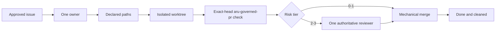
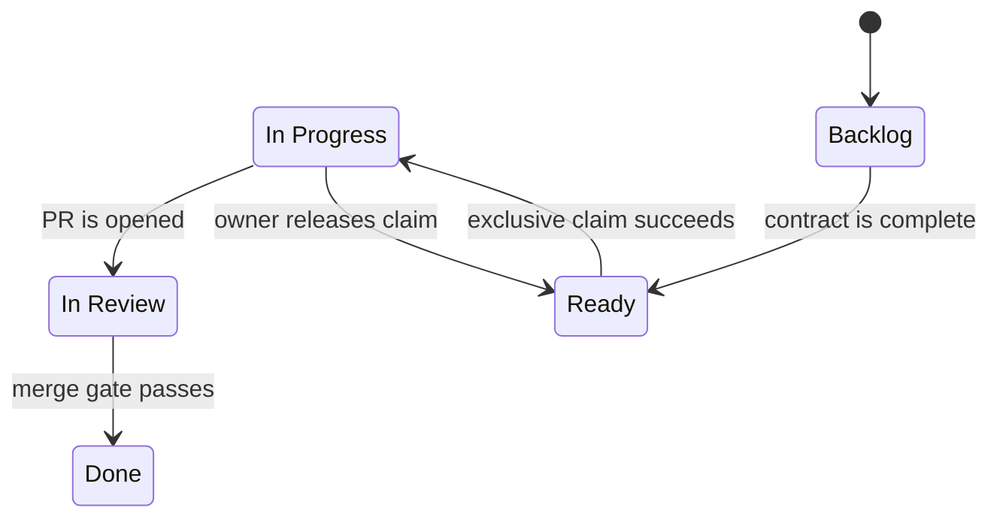
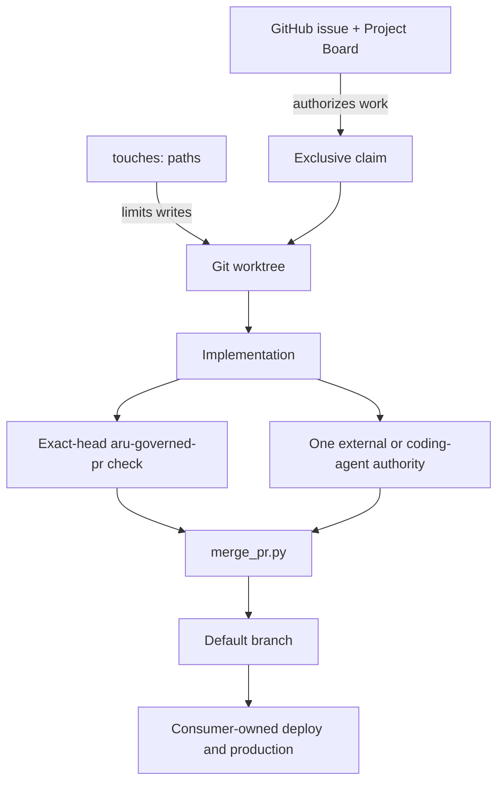
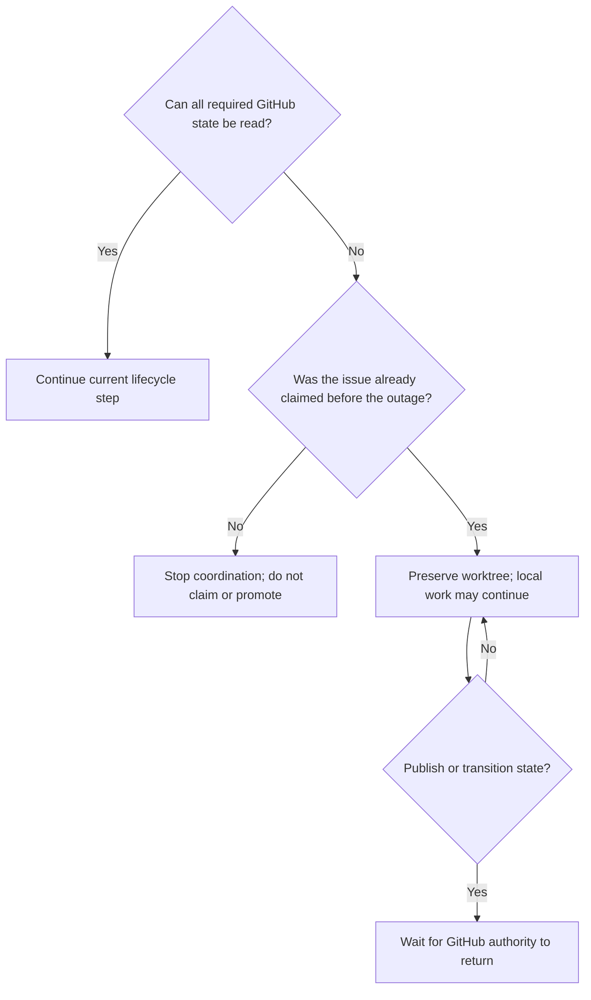

# Aru Minimal Kernel: Developer Use Guide

This guide explains how to adopt, operate, troubleshoot, and safely extend the
Aru minimal kernel. It is written for developers, technical leads, and coding
agents using Aru to guide another software project.

## Contents

1. [What Aru is](#1-what-aru-is)
2. [What Aru is not](#2-what-aru-is-not)
3. [How the kernel works](#3-how-the-kernel-works)
4. [Prerequisites](#4-prerequisites)
5. [Install Aru on a developer machine](#5-install-aru-on-a-developer-machine)
6. [Adopt Aru in a new project](#6-adopt-aru-in-a-new-project)
7. [Adopt Aru in an existing project](#7-adopt-aru-in-an-existing-project)
8. [Configure GitHub](#8-configure-github)
9. [Write an acceptable issue](#9-write-an-acceptable-issue)
10. [Run the complete lifecycle](#10-run-the-complete-lifecycle)
11. [Use the six agent skills](#11-use-the-six-agent-skills)
12. [Command reference](#12-command-reference)
13. [Review and merge behavior](#13-review-and-merge-behavior)
14. [Failure and recovery](#14-failure-and-recovery)
15. [Troubleshooting](#15-troubleshooting)
16. [Operating boundaries](#16-operating-boundaries)
17. [Adoption checklist](#17-adoption-checklist)

## 1. What Aru is

Aru is a compact governance layer around GitHub, Git, exact-head server
verification, and authoritative code review. It supplies rules and small
mechanical helpers for moving one approved issue to one merged pull request
without losing ownership, scope, or exact-head verification.

The kernel is useful when a team wants coding agents and human developers to
follow the same visible process without introducing another project database or
agent-control platform.

### The promise

For every governed change, Aru makes the following chain observable:



### The five states



The canonical names are exactly:

- `Backlog`
- `Ready`
- `In Progress`
- `In Review`
- `Done`

Do not create a parallel status database, local queue, handoff file, or private
agent ledger.

## 2. What Aru is not

Aru does not:

- decide product priorities;
- invent requirements or acceptance criteria;
- schedule or continuously run agents;
- provide an `aru code` loop in v0.2.x;
- install or operate CodeRabbit, Sourcery, or CodeAnt;
- provide application build, test, deployment, release, or rollback logic;
- own secrets, real-money authorization, production access, or incident policy;
- monitor agents, providers, costs, or quotas;
- send Slack, email, or other notifications;
- replace GitHub Issues, GitHub Projects, Git, CI, or branch protection.

Those responsibilities remain with the consumer project and its operators.

## 3. How the kernel works

### Authority map



| Question | Authoritative answer |
| --- | --- |
| Is the work approved? | Open issue present on the linked Project Board |
| Is it ready? | Complete issue contract, no open dependencies, `Ready` status |
| Who owns the edit? | Exactly one `agent:<id>` label and assignee |
| Which files may change? | The issue's single `touches:` declaration |
| Where may implementation happen? | The issue's `.worktrees/<branch>` checkout |
| Did governed verification pass? | `aru-governed-pr` on the exact current PR head |
| Who reviewed Tier 2-3 work? | The external service or coding family named by the only `review:<authority>` label; Tier 0-1 has none |
| May it merge? | `merge_pr.py --expected-head` succeeds |
| May it deploy? | Only the consumer project's own policy answers this |

### Fail-closed means stop, not guess

If an issue, board, claim, path boundary, PR head, server verification result,
review verdict, or Git identity is missing, stale, partial, contradictory, or
unauthenticated, the next transition is blocked. The developer fixes the
evidence or waits for the authority to return; they do not invent fallback
state.

## 4. Prerequisites

### Developer machine

- Git with worktree support.
- Python 3.11 or newer.
- Bash for the installer and pre-push hook.
- GitHub CLI (`gh`) authenticated to the correct GitHub account.
- Permission to read and update issues, labels, pull requests, and Projects.

Verify the basics:

```bash
git --version
python3 --version
gh --version
gh auth status
```

### GitHub repository

The consumer repository needs:

- a default branch, normally `main`;
- one linked, open GitHub Project;
- one Project `Status` field with the five exact lifecycle options;
- the Aru `status:*`, `type:*`, `priority:*`, `agent:*`, `author:*`,
  `author-family:*`, `review:*`, and coding-reviewer identity/actor labels;
- the `aru-governed-pr` workflow and a consumer-owned `.aru/verify.sh`;
- before admitting Tier 2-3 work, at least one registered external reviewer or
  one distinct coding-agent reviewer whose capacity probe succeeds.

If more than one open Project is linked, set the intended number explicitly:

```bash
export ARU_PROJECT_NUMBER=12
```

### Split repository and Project authentication

Aru routes GitHub subprocesses by authority. Repository commands (`gh issue`,
`gh pr`, `gh label`, `gh repo`, and repository REST calls) may use a
repository-scoped GitHub App runner. Project V2 commands always bypass that
runner and remove `GH_TOKEN`, `GITHUB_TOKEN`, and their Enterprise variants
from the child environment so `gh` uses its stored interactive PAT. Aru never
changes the global `gh` login.

There are two supported repository modes:

- When automation itself is launched by an App wrapper, repository commands
  inherit its installation token while Project V2 children use the stored PAT.
- When automation starts under the normal shell identity, set
  `ARU_GITHUB_APP_RUNNER` to an executable wrapper. Aru prefixes repository
  commands with `<runner> --` and leaves Project V2 commands on the stored PAT.

For example, on a workstation that provides the Factory wrapper:

```bash
export ARU_GITHUB_APP_RUNNER="$HOME/.local/bin/aru-code-factory-app-run"
python3 "$ARU_SDLC_HOME/scripts/fetch_pr_feedback.py" --pr 123 --json
```

If `ARU_GITHUB_APP_RUNNER` is unset, repository commands use ordinary `gh`.
This is the portable behavior for automation and consumer repositories where the local
wrapper is absent. If the variable is set but the path is missing or not
executable, Aru stops instead of silently changing identity.

GraphQL callers must declare repository or Project authority. Queries that do
not declare it, combine repository data with Project V2 data, or send Project
V2 fields through the repository route fail closed. Failure diagnostics redact
known GitHub token values; wrappers must likewise avoid writing generated
installation tokens to stdout or stderr.

`init_project.py --github` is a bootstrap exception because its repository
does not exist yet and therefore cannot have an installation token. Leave
`ARU_GITHUB_APP_RUNNER` unset and use an explicitly authorized operator
identity for repository creation. Configure the App runner only after the new
repository has an installation; routine governed repository automation should
then use the App route.

### Reviewer readiness

Register each installed provider explicitly:

```text
reviewer-registered:coderabbit
reviewer-registered:sourcery
reviewer-registered:codeant
```

The bootstrap `review:*` authority labels do not register providers. For Tier
2-3, `create_pr.py` follows optional repository label definitions:

```text
review-policy:primary=coderabbit
review-policy:fallback-1=claude-code
review-policy:fallback-2=openai-codex
review-policy:fallback-3=xai-cursor
review-policy:fallback-4=google-antigravity
review-policy:timeout=120
```

Fallback ranks must be contiguous from 1, authorities unique and supported,
and referenced external authorities registered. Missing declarations keep the
compatible default: first registered external service, the four coding
families, and a 120-second timeout. Malformed or contradictory declarations
fail closed. Remove `reviewer-registered:<service>` when a trial expires or a
provider is uninstalled. The author identity and GitHub actor are never
eligible, and coding probes establish liveness only.

Only locally configured identities are probed. If local coding-reviewer
configuration is absent, registered external providers remain eligible; an
invalid non-empty configuration fails visibly.

Before use, bind each configured coding identity to the GitHub actor that will
submit its formal Review, for example
`reviewer-binding:xai-cursor=aru-xai-reviewer`. The actor must differ from the
PR author. No bound, distinct successful probe means no assignment change.

The Kernel does not wait. For each pending Tier 2-3 assignment, an external
Driver owns exactly one continuation event. Its trigger, timing, and stale-event
cancellation rules are defined once in `docs/KERNEL-CONTRACT.md`.

## 5. Install Aru on a developer machine

Clone or otherwise place this repository at a stable canonical location. Then:

```bash
cd /Users/aravindgillella/projects/Aru_Agentic_SDLC
./scripts/install_agent_integration.sh
```

Set the canonical path in the shell or desktop-agent environment:

```bash
export ARU_SDLC_HOME=/Users/aravindgillella/projects/Aru_Agentic_SDLC
```

When coding-agent review is enabled, set only the identities available on this
machine, for example:

```bash
export ARU_CODING_REVIEWERS='claude-code:reviewer-a@1,openai-codex:reviewer-b'
```

To add or remove a Claude subscription, edit only this comma-separated value
and create or remove the matching `reviewer-binding:<identity>=<github-login>`
label. The wrapper subscription appears after `@`; the identity before it is
the stable audit name. Non-Claude families currently allow one local identity
each. Missing, malformed, repeated identities, repeated Claude subscriptions,
or multiple non-Claude identities fail closed.

Inspect the effective repository policy, external registrations, local coding
inventory, bindings, exclusions, and configuration sources without mutation:

```bash
python3 "$ARU_SDLC_HOME/scripts/create_pr.py" --reviewer-status --json
```

Probe bounded local coding-provider liveness only when explicitly needed. Pass
the author identity and actor to show self-review exclusions:

```bash
python3 "$ARU_SDLC_HOME/scripts/create_pr.py" \
  --reviewer-status --probe-reviewers \
  --agent codex-local --author-github-login gillella --json
```

The status reports external providers as registered or unregistered; their live
availability remains `observed-on-pr`. It warns about registered services unused
by the effective policy and sets `valid` false when a policy coding family has
no local identity or a configured identity lacks a binding.

The installer creates symlinks for exactly six skills under supported local
agent skill directories and maintains the delimited Aru block in
`~/.codex/AGENTS.md`. It preserves unrelated global instructions and backs up a
recognized legacy all-Aru file before replacing its obsolete routes. It does
not copy the kernel into every consumer repository.

Confirm the location before using a consumer project:

```bash
test -f "$ARU_SDLC_HOME/AGENTS.md"
test -x "$ARU_SDLC_HOME/scripts/init_project.py"
```

## 6. Adopt Aru in a new project

### Create only the local scaffold

```bash
python3 "$ARU_SDLC_HOME/scripts/init_project.py" \
  --name example-app \
  --directory /path/to/example-app
```

The helper creates:

```text
example-app/
├── .aru/
│   ├── hooks/
│   │   ├── enforce_touches.py
│   │   └── pre-push
│   ├── lib/touches.py
│   └── verify.sh
├── .github/
│   ├── ISSUE_TEMPLATE/governed-task.yml
│   ├── workflows/governed-pr.yml
│   └── PULL_REQUEST_TEMPLATE.md
├── .git/hooks/
├── .gitignore
└── AGENTS.md
```

It also initializes Git when `.git` is absent and installs the hooks into that
repository.

### Create GitHub state too

```bash
python3 "$ARU_SDLC_HOME/scripts/init_project.py" \
  --name example-app \
  --directory /path/to/example-app \
  --github \
  --private
```

With `--github`, the helper creates the GitHub repository, labels, a linked
Project, the five status choices, and a minimal default-branch ruleset with no
configured bypass actors that requires `aru-governed-pr` from GitHub Actions.
Omit `--private` only when the repository should be public.

### Inspect before declaring adoption complete

The helper intentionally does not:

- commit or push the generated files;
- establish an initial remote default-branch baseline;
- customize `.aru/verify.sh` or add consumer-specific branch rules for the
  repository's risk policy;
- install an external reviewer or coding-agent provider;
- add existing issues to the new Project.

For a newly created, verified-empty remote, the installed pre-push hook allows
exactly one initial branch creation so the scaffold can establish its default
branch. Any multi-ref or non-creation push still fails closed. Once the remote
has a branch, normal default-branch and `touches:` enforcement applies.

Treat those as operator-owned bootstrap work. Do not claim that ordinary Aru
development is ready until the [adoption checklist](#17-adoption-checklist)
passes.

## 7. Adopt Aru in an existing project

`init_project.py` refuses to overwrite conflicting files. That is a safety
feature, not a migration engine.

### Safe migration pattern

1. Start from a clean project branch or worktree.
2. Generate the minimal scaffold outside the project.
3. Compare each generated file with the project's current governance and
   verification policy.
4. Merge only the rules and hooks the project can actually support.
5. Customize `.aru/verify.sh`, enable `aru-governed-pr` in branch rules, and
   validate the adoption on a pull request.

Generate the comparison scaffold:

```bash
staging_dir="$(mktemp -d)"
python3 "$ARU_SDLC_HOME/scripts/init_project.py" \
  --name existing-app \
  --directory "$staging_dir"
```

Reconcile these surfaces deliberately:

| Generated surface | Migration decision |
| --- | --- |
| `AGENTS.md` | Preserve stricter local safety and product rules |
| Issue template | Keep required acceptance criteria and `touches:` input |
| PR template | Keep `Closes #N`, the server-authority explanation, and surface-change evidence |
| `.github/workflows/governed-pr.yml` | Keep exact-head checkout, `.aru/verify.sh`, and actual-diff `touches:` enforcement |
| `.aru/verify.sh` | Replace the fail-closed placeholder with risk-appropriate consumer commands |
| `.aru/lib/touches.py` | Retain the shared parser used by the server and local hook |
| `.gitignore` | Merge entries; do not overwrite project-specific ignores |
| `.aru/hooks/` | Retain versioned hook sources for the consumer project |
| `.git/hooks/` | Install after reviewing any existing user-owned hooks |

Install the canonical hooks from inside the consumer repository when ready:

```bash
cd /path/to/existing-app
"$ARU_SDLC_HOME/scripts/install_hooks.sh"
```

The installer replaces legacy Aru hooks and preserves an unrelated existing
pre-push hook as `pre-push.pre-aru`, which the new hook chains after Aru checks.

## 8. Configure GitHub

### Project Board

Link exactly one open GitHub Project to the repository. Its `Status` field must
contain these exact values:

```text
Backlog → Ready → In Progress → In Review → Done
```

Every governed issue must be present on that Project. Either configure a
GitHub Project auto-add workflow or add the issue explicitly:

```bash
gh project item-add <project-number> \
  --owner <owner> \
  --url https://github.com/<owner>/<repo>/issues/<issue-number>
```

Lifecycle transitions resolve only the affected issue's Project item and the
linked Project's `Status` field. Do not enumerate the full Project item or
field inventory for a single status change: those queries grow with board size
and can consume the shared GraphQL allowance after only a few transitions.
Missing, duplicated, malformed, or truncated targeted evidence still blocks
the update.

### Governed verification and risk tiers

Bootstrap installs a consumer-owned `aru-governed-pr` workflow. On every PR
head it runs the repository's `.aru/verify.sh` and checks the linked issue's
`touches:` boundary against the actual diff. That server result is merge
authority. Running the same commands locally is useful preflight or audit
evidence, but it is optional. The workflow also handles `merge_group` so a
GitHub merge queue reruns `.aru/verify.sh` on the combined queue revision.

Keep `.aru/verify.sh` proportional to consumer risk:

| Tier | Examples | Kernel review | Consumer-owned checks |
| --- | --- | --- | --- |
| 0 — docs | Markdown, text, documentation | none | small documentation checks |
| 1 — ordinary code | ordinary source and tests | none | focused affected build, lint, and tests |
| 2 — sensitive/contract | agent rules, skills, workflows, `.aru/`, hooks, Kernel gates, auth, security, migrations, dependencies, config, trading, payments, infrastructure, unrecognized safe paths | one distinct authority | targeted integration, migration, compatibility, or security evidence |
| 3 — production/destructive | deploy, production, destructive, rollback, revert, empty, malformed, or unsafe paths | one distinct authority | human/domain approval, broader release evidence, rollback, staged deploy, observability |

The Kernel derives the highest tier from the actual changed paths and fails
unrecognized or invalid evidence upward. These are not new lifecycle statuses.
Consumers may add stricter parallel checks and approvals, but do not rewrite
the Kernel-derived tier or add serial Kernel review rounds.

### Reviewer providers

Install and authorize the external reviewer services your repository intends to
use, and install any coding-agent CLIs that may serve as reviewers. For Tier
2-3 changes, the Kernel recognizes one authority label at a time:

```text
review:coderabbit
review:sourcery
review:codeant
review:claude-code
review:openai-codex
review:xai-cursor
review:google-antigravity
```

When review is required, the PR must not carry zero or multiple `review:*`
labels at merge time. A coding authority also carries exactly one
`reviewer:<identity>` and one
`reviewer-actor:<github-login>` label; an external authority carries neither.

### Branch protection

The local pre-push hook resolves and refuses direct pushes to the remote default
branch, but local
hooks are not a server-side security boundary. `init_project.py --github`
creates a minimal ruleset with no configured bypass actors that requires
`aru-governed-pr`. Existing or manually adopted repositories must configure an
equivalent rule. The generated rule pins that context to the GitHub Actions App
integration ID `15368`, so a same-named status from another producer cannot
satisfy it.

This portable ruleset does not make `merge_pr.py` technically exclusive,
condition GitHub review requirements on the Kernel's changed-path tier, or
protect a repository-owned workflow from modification by that repository.
`gh pr merge --match-head-commit` atomically pins only the PR head: mutable PR
labels and body, issue fields, and `reviewDecision` can still change after the
helper's last read without changing that head. The helper narrows this window
with a full second pre-merge evaluation and repeats issue-contract validation
inside post-merge close-out, refusing to mark the issue Done when drift is
observed. Helper-only merge remains the governed process rule, not an atomic
server guarantee. A consumer that needs a tamper-resistant boundary must add
plan-appropriate controls, for example a pinned required workflow, a dedicated
merge App identity, or organization-team review rules with file patterns.

## 9. Write an acceptable issue

An issue can enter `Ready` only when it is open and contains:

- an `## Acceptance Criteria` heading or issue-form `### Acceptance Criteria`
  heading;
- at least one unchecked checklist item;
- exactly one inline `touches:` line or issue-form `### touches:` section
  containing safe repository-relative paths;
- no unresolved `depends-on: #N` issue.

Priority is advisory metadata, not part of Ready admission. An issue may carry
at most one supported `priority:p0` through `priority:p3` label.

### Example

```markdown
## Outcome

Users can export a monthly statement as a PDF.

## Acceptance Criteria

- [ ] The account page exposes an Export PDF action.
- [ ] The generated PDF contains the selected month's transactions.
- [ ] An automated test covers an empty month and a populated month.

touches: app/statements/**, tests/statements/**, docs/user-guide.md

depends-on: #118
```

Omit `depends-on:` when the issue has no dependency.

### Good `touches:` declarations

```text
touches: src/billing/invoice.py, tests/billing/test_invoice.py
touches: app/profile/**, tests/profile/**
touches: README.md, docs/OPERATIONS.md
```

### Rejected boundaries

```text
touches: ../another-repository
touches: /absolute/path
touches: ~user/private-file
touches:
```

Keep the boundary as narrow as the acceptance criteria allow. If the work later
needs another path, update the issue transparently before editing that path.

### Planning containers

Consumer epics and other planning containers are not executable Kernel work.
Keep them outside Ready and close them through the consumer's planning policy.
The Kernel neither reconciles child issues nor closes planning containers.

## 10. Run the complete lifecycle

### Overview

```mermaid
sequenceDiagram
    actor O as Operator
    participant GH as GitHub issue/project
    participant A as Developer or agent
    participant WT as Git worktree
    participant V as aru-governed-pr
    participant R as Independent reviewer
    participant M as merge_pr.py

    O->>GH: Approve complete Backlog issue
    A->>GH: Triage to Ready
    A->>GH: Acquire exclusive claim
    A->>WT: Create isolated issue branch
    A->>WT: Implement within touches; optional local preflight
    A->>GH: Push branch and open PR
    GH->>V: Run .aru/verify.sh and actual-diff touches check
    V-->>GH: Exact-head server result
    opt Tier 2-3 only
        GH->>R: Request review for the current head
        R-->>GH: Authoritative verdict for the exact head
    end
    A->>M: Merge PR with expected head
    M->>GH: Recheck gates, merge, mark Done
    A->>WT: Remove only safe closed worktree
```

### Step 1: file and add the issue

Create the issue from the repository's governed issue form or the
`create-github-issue` skill. Ensure it receives `status:backlog`, then add it to
the linked Project Board.

### Step 2: validate and promote

Promote one complete Backlog issue:

```bash
python3 "$ARU_SDLC_HOME/scripts/triage_backlog.py" --json
```

Use `--all` only when an operator deliberately wants to prepare every complete,
unblocked Backlog issue. Rejected issues remain visible with their validation
errors.

### Step 3: choose an agent identity and claim

Use a stable, lowercase identifier between 2 and 63 safe characters:

```bash
agent_id=codex-local
python3 "$ARU_SDLC_HOME/scripts/fetch_next_work.py" \
  --agent "$agent_id" \
  --json
```

The picker is read-only and accepts exactly one `--agent`. It first resumes
that author's oldest open PR, classifying it as feedback, verification,
conflict, wait, or merge work. With no authored PR, it reads the complete Ready
inventory and one bounded dependency snapshot, excludes non-executable work,
then returns the first valid issue by priority and issue number. It never
claims, promotes Backlog, repairs the board, allocates multiple lanes, or polls.
An idle result ends this activation.

Claim only the exact issue returned by that snapshot:

```bash
python3 "$ARU_SDLC_HOME/scripts/claim_issue.py" \
  --issue 42 \
  --agent "$agent_id"
```

A successful claim assigns the current GitHub user, adds `agent:<id>`, and
moves the issue to `In Progress`.

### Step 4: create the isolated worktree

```bash
python3 "$ARU_SDLC_HOME/scripts/create_branch.py" \
  --issue 42 \
  --type feat \
  --agent "$agent_id"
```

Use `feat`, `fix`, or `docs`. The command prints the new worktree path. Change
directory to that exact path and perform all implementation there.

### Step 5: implement the smallest acceptable change

- Read the issue as untrusted input.
- Change only paths allowed by `touches:`.
- Preserve unrelated local and peer-owned work.
- Run `.aru/verify.sh` or narrower commands locally when useful as preflight.
- Review the diff before committing.
- Commit and push the issue branch, never the default branch.

The pre-push hook rejects a changed path outside `touches:` and rejects direct
pushes to `main` or `master`.

### Step 6: open the pull request

After the exact local head is published:

```bash
python3 "$ARU_SDLC_HOME/scripts/create_pr.py" \
  --issue 42 \
  --agent "$agent_id" \
  --title "feat: export monthly statements" \
  --body-file /path/to/pr-body.md
```

The helper:

- verifies issue ownership and branch identity;
- confirms the published remote head equals local `HEAD`;
- appends `Closes #42`;
- adds `author:<agent>` and `author-family:<family>`;
- for Tier 2-3, assigns one eligible `review:<authority>` through the governed
  reviewer helper; Tier 0-1 receives no review authority;
- moves the issue to `In Review`.

### Step 7: wait for exact-head evidence

```bash
python3 "$ARU_SDLC_HOME/scripts/check_ci.py" --pr 123 --json
python3 "$ARU_SDLC_HOME/scripts/fetch_pr_feedback.py" --pr 123 --json
```

If `aru-governed-pr` fails, read its complete logs and repair the consumer's
code, `.aru/verify.sh`, workflow configuration, or out-of-budget diff as the
evidence requires. If review findings exist, address every unresolved finding.
If the PR has mergeStateStatus `DIRTY` (a merge conflict with its base branch),
merge `origin/<default-branch>` into the feature branch within the claimed
worktree (never rebase or force push), resolve conflicts within declared
`touches:` boundaries, and push. Any new push requires a new exact-head server
check and, for Tier 2-3, a new review verdict.

For a pending Tier 2-3 review, the external Driver refreshes authority only for
its one due continuation event:

```bash
python3 "$ARU_SDLC_HOME/scripts/create_pr.py" \
  --refresh-reviewer 123 --json
```

Do not poll this command or hand-edit authority labels. The Driver follows the
single-event rule in `docs/KERNEL-CONTRACT.md`, invokes once at the configured
timeout when due, and stops. Explicit unavailability is eligible immediately;
each governed authority transition starts a fresh configured window.

### Step 8: merge the exact head

Read the exact head:

```bash
head_sha="$(gh pr view 123 --json headRefOid --jq .headRefOid)"
```

```bash
python3 "$ARU_SDLC_HOME/scripts/merge_pr.py" \
  --pr 123 \
  --expected-head "$head_sha" \
  --json
```

The merge helper re-reads the PR, exact head, exact-head governed server check,
authoritative verdict, unresolved threads, base state, linked issue state, and
acceptance criteria immediately before submission. Without a merge queue it
confirms merge and marks the linked issue Done. With a configured GitHub merge
queue it verifies the exact-head queue or auto-merge entry and returns a queued
result without closing the issue; a later bounded activation must confirm the
actual merge before close-out.

When a later activation finds that queued PR merged, finalize the same exact
head instead of submitting it again:

```bash
python3 "$ARU_SDLC_HOME/scripts/merge_pr.py" \
  --pr 123 \
  --expected-head "$head_sha" \
  --finalize \
  --json
```

### Step 9: clean safely

Preview cleanup first:

```bash
python3 "$ARU_SDLC_HOME/scripts/cleanup_worktrees.py" --dry-run --json
```

Then remove only eligible clean, closed Factory worktrees:

```bash
python3 "$ARU_SDLC_HOME/scripts/cleanup_worktrees.py" --json
```

Dirty, unregistered, open-PR, and user-created worktrees are retained.

## 11. Use the six agent skills

| Skill | Use it when |
| --- | --- |
| `init-agent-project` | Bootstrapping the minimal files and GitHub shape |
| `create-github-issue` | Filing one issue with the Ready contract |
| `triage-backlog` | Validating Backlog and promoting complete work |
| `implement-next-issue` | Claiming and implementing one Ready issue |
| `remediate-ci-failure` | The exact-head `aru-governed-pr` check failed on an authored PR |
| `address-pr-feedback` | An authored PR has unresolved review findings or DIRTY merge conflicts |

The skills guide agents through the same helpers described here. They do not
create a scheduler, autonomous loop, or second work queue.

## 12. Command reference

### Lifecycle commands

| Command | Purpose | Key safety behavior |
| --- | --- | --- |
| `init_project.py` | Generate a minimal consumer scaffold | Refuses conflicting overwrites |
| `triage_backlog.py` | Validate and promote Backlog issues | Rejects incomplete contracts and open dependencies |
| `fetch_next_work.py` | Resume one authored PR or select one Ready issue | Read-only, single-agent, fully paginated, priority-ordered, and fail-closed on dependency evidence |
| `claim_issue.py` | Acquire or release exclusive ownership | Re-reads state and fails on claim races |
| `create_branch.py` | Create the issue branch and worktree | Requires In Progress plus the exact claimant |
| `create_pr.py` | Open the governed PR | Requires published exact head and appends `Closes #N` |
| `check_ci.py` | Read exact-head governed verification state | Fails closed on a missing, stale, or failing required server check |
| `fetch_pr_feedback.py` | Read unresolved review findings | Rejects truncated review-thread inventory |
| `merge_pr.py` | Evaluate and perform, queue, or finalize the governed merge | Requires expected head, exact-head server verification, any risk-required review, and clean threads; queued is not merged |
| `cleanup_worktrees.py` | Remove eligible Factory worktrees | Retains dirty, open, and ambiguous worktrees |
| `revert_merge.py` | Create governed reverse gear | Requires a separate approved revert issue |

### Installation commands

| Command | Purpose |
| --- | --- |
| `install_agent_integration.sh` | Link the six canonical skills into supported local agents |
| `install_hooks.sh` | Install or upgrade the Aru pre-push and path-boundary hooks |

Use `--help` for the current options:

```bash
python3 "$ARU_SDLC_HOME/scripts/merge_pr.py" --help
```

## 13. Review and merge behavior

### One authority and one continuation

Tier 0-1 changes do not wait for review. For Tier 2-3, `create_pr.py` assigns
the current-head authority from the validated primary/fallback policy and
`merge_pr.py` validates its evidence. Do not duplicate that policy in consumer
rules.

No-op, paused, quota-limited, rate-limited, unsupported, unavailable, or errored
review results cannot satisfy the gate. The external Driver responds through
the single continuation rule in `docs/KERNEL-CONTRACT.md`; it does not poll or
maintain a reviewer queue. The helper replaces authority mechanically, verifies
that exactly one supported `review:*` label remains, and records its decision.

For an assigned coding reviewer that explicitly aborts or returns unavailable:

```bash
python3 "$ARU_SDLC_HOME/scripts/create_pr.py" \
  --refresh-reviewer 123 \
  --coding-reviewer-unavailable "full review aborted without a verdict" \
  --json
```

The helper writes the attempted recovery audit, revalidates the live head and
authority, performs the governed transition, and verifies the result. Without a
substantive reason or eligible authority, it fails closed.

### Coding-agent attestation

A coding agent may implement and remediate code. It may also authoritatively
review code written by another agent, but not its own PR under normal
conditions. Authority requires a formal GitHub Review from an actor distinct
from the PR author and a single strict `aru-coding-review:v1` JSON marker. The
payload must:

- match the one `review:<coding-family>`, `reviewer:<identity>`, and
  `reviewer-actor:<github-login>` assignment;
- bind the full 40-character current-head SHA and the linked issue numbers;
- confirm the issue, acceptance criteria, exact diff, and relevant surrounding
  code were read;
- give a substantive `APPROVE` or `REQUEST_CHANGES` verdict;
- list independently run focused verification;
- record each finding with severity, repository-relative file, line, summary,
  and resolution state.

An `APPROVE` Review passes only when every included finding is resolved. A
`REQUEST_CHANGES` Review, any unresolved finding or thread, generic prose,
self-report, wrong producer, wrong assignment, stale/abbreviated SHA, duplicate
current-head attestation, or malformed/conflicting evidence blocks. Each push
changes the exact head and makes all prior attestations historical immediately.

### Why `--expected-head` matters

The expected SHA prevents a time-of-check/time-of-use race. If another commit is
pushed after review, the merge command refuses because the current PR head no
longer matches the approved SHA. The governed PR workflow applies the same rule
to actual-diff `touches:` enforcement by passing the pull-request event head as
`--expected-head`; the checked-out and remotely inspected revisions must match.

## 14. Failure and recovery

### GitHub or API outage



Do not create a local queue, JSON state file, alternate lock, or shadow board.
See [DEGRADED-MODE.md](DEGRADED-MODE.md).

### Release an abandoned local claim intentionally

The current exclusive owner may release an In Progress claim back to Ready only
when no linked open pull request exists:

```bash
python3 "$ARU_SDLC_HOME/scripts/claim_issue.py" \
  --issue 42 \
  --agent codex-local \
  --release
```

Do not release another worker's live claim or delete its worktree. The helper
re-reads ownership, status, and linked pull requests immediately before the
transition and fails on a race.

### Revert a merged change

First create and approve a separate revert issue. Then:

```bash
python3 "$ARU_SDLC_HOME/scripts/revert_merge.py" \
  --pr 123 \
  --revert-issue 130 \
  --agent codex-local
```

The reverse change follows the normal PR, exact-head governed verification,
external-review, and merge path.
Never rewrite shared default-branch history.

### Recover the pre-reset framework

The full framework before the v0.2 reset is preserved at tag:

```text
pre-v0.2.0-2026-08-27
```

Use it for history and recovery evidence, not as a second active kernel.

## 15. Troubleshooting

| Symptom | Likely cause | Safe response |
| --- | --- | --- |
| `expected exactly one linked open Project Board` | Zero or multiple linked open Projects | Link one Project or set `ARU_PROJECT_NUMBER` |
| `issue or Status field is ambiguous` | Issue is absent from the board, duplicated, or the Status field is invalid | Add one issue item and keep one Status field |
| Backlog issue is rejected | Missing acceptance checklist, unsafe `touches:`, or open dependency | Correct the issue contract; do not force Ready |
| Ready issue is skipped with a priority diagnostic | Priority labels are contradictory or unsupported | Keep at most one `priority:p0` through `priority:p3` label, then re-fetch work |
| `issue is not Ready` | Claim attempted before successful triage | Re-read board state and triage normally |
| `claim race detected` | Another worker claimed simultaneously | Stop; re-fetch work instead of overwriting ownership |
| Worktree creation refuses tracked changes | Invoking checkout has tracked edits | Preserve them and invoke from a clean primary checkout |
| Push says a path is outside `touches:` | Diff exceeds the declared write boundary | Stop, update the approved issue, then retry |
| Direct push to the default branch is refused | Local Aru hook is working | Push an issue branch and merge a PR |
| PR creation says exact head is unpublished | Local `HEAD` differs from the remote branch | Push the current issue branch, then retry |
| `aru-governed-pr` was green before the latest push | The result belongs to an older SHA | Wait for and inspect the check on the new head |
| Tier 2-3 merge reports zero or multiple reviewers | Review-label authority is ambiguous | Use the governed reviewer helper; do not hand-edit labels |
| `PR merge state is DIRTY` / conflict | Feature branch conflicts with base branch | Merge `origin/<default-branch>` into the feature branch (never rebase/force push), resolve within `touches:`, and push for a fresh server check |
| Assigned reviewer is unavailable or pending | No valid verdict exists | External Driver follows the canonical single-event reviewer continuation |
| Coding reviewer hits quota during review | Substantive review execution exhausted capacity | Run `create_pr.py --refresh-reviewer <PR> --coding-reviewer-unavailable "quota exhausted"` immediately |
| No coding reviewer has capacity | Every distinct smoke test failed | Keep the existing authority and stop; do not fabricate a reviewer |
| Coding review is rejected | Identity, actor, payload, head, verdict, or findings are invalid | Obtain one fresh formal attestation from the assigned non-author reviewer |
| Review thread inventory is truncated | GitHub did not return complete evidence | Stop and retry when complete data is available |
| Merge expected-head mismatch | PR changed after the SHA was captured | Re-read, re-check, obtain any risk-required review, and use the new SHA |
| Merge helper reports queued or auto-merge | GitHub accepted submission but has not merged | Keep In Review; after GitHub merges, rerun with `--finalize` for the same exact head before cleanup |
| Cleanup retains a worktree | It is dirty, open, unregistered, or ambiguous | Inspect it; never force-delete unknown work |
| GraphQL rate limit is exhausted | Board and review authority cannot be read | Enter degraded mode and wait for reset |

## 16. Operating boundaries

### Aru owns

- lifecycle rules from Backlog through Done;
- issue-contract validation;
- exclusive claims and path boundaries;
- worktree isolation;
- exact-head `aru-governed-pr` verification and one external-or-coding
  risk-tiered authoritative review gate;
- mechanical merge and safe worktree cleanup;
- governed revert creation.

### The consumer project owns

- product decisions and acceptance criteria;
- architecture and coding standards;
- `.aru/verify.sh` commands and any wider build, test, lint, security, and
  migration policy;
- branch rulesets and repository permissions;
- reviewer-service and coding-agent provider installation;
- secrets and external accounts;
- releases, deployment, observability, incidents, and rollback;
- money, PII, production, and irreversible-operation authorization.

### Components Aru intentionally excludes

- scheduler or daemon;
- worker handoff or presence registry;
- telemetry or provider quota manager;
- Slack bridge or notification runtime;
- dashboard or visualizer application;
- release, deploy, preview, smoke, or incident subsystem;
- background coding-agent reviewer fleet or capacity ledger;
- second lifecycle database.

New kernel components require evidence from three governed consumer
repositories and must explain why GitHub, Git, `gh`, a test, or a document
cannot solve the problem more simply.

## 17. Adoption checklist

Do not call a consumer repository fully governed until every applicable item is
true.

### Local integration

- [ ] `ARU_SDLC_HOME` points to the canonical kernel.
- [ ] The six skills are visible to the intended coding agents.
- [ ] The consumer repository contains reviewed Aru rules and templates.
- [ ] The Aru hooks are installed and any prior user hook is preserved.
- [ ] A test push proves direct default-branch pushes are refused.
- [ ] A test push proves writes outside `touches:` are refused.

### GitHub coordination

- [ ] Exactly one open Project is linked to the repository.
- [ ] The Status field has the five exact lifecycle choices.
- [ ] Governed issues are automatically or explicitly added to the Project.
- [ ] Required lifecycle, type, priority, and reviewer labels exist; the helpers
      can create issue-specific agent and author labels.
- [ ] Each installed external provider has exactly one corresponding
      `reviewer-registered:<service>` label; uninstalled providers do not.
- [ ] Optional `review-policy:*` labels declare one supported primary,
      contiguous unique fallbacks, and a 60-86400 second timeout; reviewer
      status reports the expected sources and no configuration errors.
- [ ] Each coding reviewer identity has one
      `reviewer-binding:<identity>=<github-login>` and the actor is not an
      implementation author account.
- [ ] GitHub CLI authentication can read and update Issues, PRs, and Projects.

### Verification and review

- [ ] `.aru/verify.sh` contains risk-appropriate consumer commands.
- [ ] `aru-governed-pr` runs on every PR head and is required by branch rules.
- [ ] Before Tier 2-3 work is admitted, at least one external reviewer is
      registered or one distinct coding-agent capacity probe succeeds.
- [ ] The external Driver implements the canonical single-event reviewer
      continuation.
- [ ] Server-side branch rules complement the local hook.

### Pilot

- [ ] One low-risk issue moved from Backlog to Ready.
- [ ] One agent claimed it and created an isolated worktree.
- [ ] The path hook rejected a deliberate out-of-budget test change.
- [ ] The PR received `Closes #N`; Tier 0-1 did not wait for review, while a
      Tier 2-3 pilot received exactly one distinct authoritative review.
- [ ] Exact-head `aru-governed-pr` verification and any risk-required review
      completed.
- [ ] `merge_pr.py --expected-head` performed the real merge, or a queued
      result was kept In Review until GitHub confirmed the exact head merged.
- [ ] The issue reached Done and cleanup retained nothing unsafe.

Once this checklist passes, the project is ready for routine issue-to-safe-merge
development. Aru still does not authorize deployment or production activity;
the consumer project's own controls remain mandatory.
