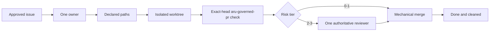
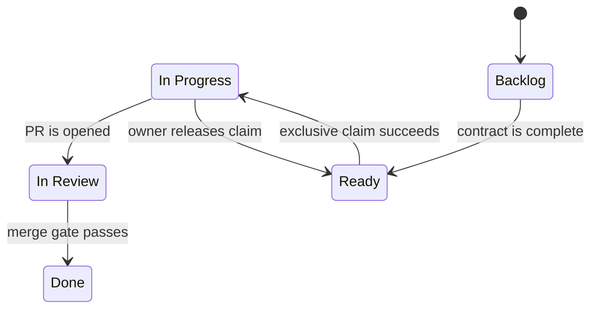
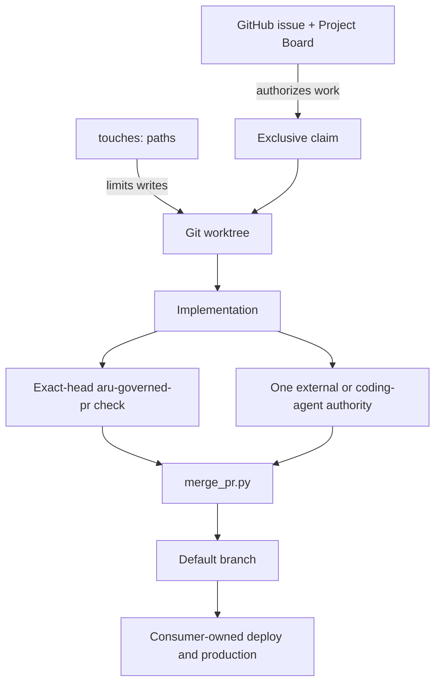
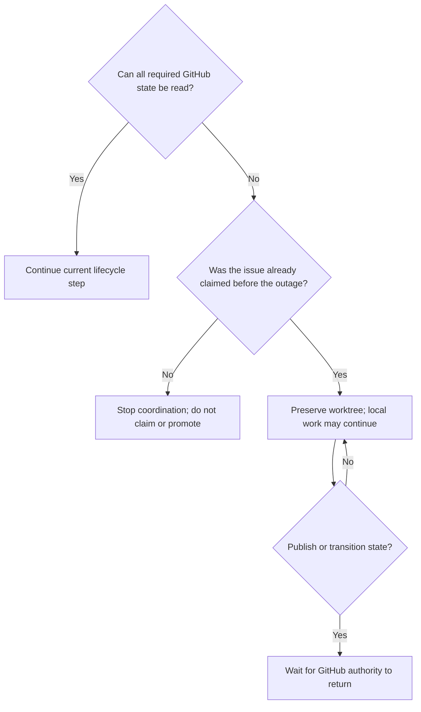

# Aru Minimal Kernel: Developer Use Guide

This guide explains how to adopt, operate, troubleshoot, and safely extend the
Aru minimal kernel. It is written for developers, technical leads, and coding
agents using Aru to guide another software project.

## Contents

1. [What Aru is](#1-what-aru-is)
2. [What Aru is not](#2-what-aru-is-not)
3. [How the kernel works](#3-how-the-kernel-works)
4. [Prerequisites](#4-prerequisites)
5. [Install Aru on a developer machine](#5-install-aru-on-a-developer-machine)
6. [Adopt Aru in a new project](#6-adopt-aru-in-a-new-project)
7. [Adopt Aru in an existing project](#7-adopt-aru-in-an-existing-project)
8. [Configure GitHub](#8-configure-github)
9. [Write an acceptable issue](#9-write-an-acceptable-issue)
10. [Run the complete lifecycle](#10-run-the-complete-lifecycle)
11. [Use the six agent skills](#11-use-the-six-agent-skills)
12. [Command reference](#12-command-reference)
13. [Review and merge behavior](#13-review-and-merge-behavior)
14. [Failure and recovery](#14-failure-and-recovery)
15. [Troubleshooting](#15-troubleshooting)
16. [Operating boundaries](#16-operating-boundaries)
17. [Adoption checklist](#17-adoption-checklist)

## 1. What Aru is

Aru is a compact governance layer around GitHub, Git, exact-head server
verification, and authoritative code review. It supplies rules and small
mechanical helpers for moving one approved issue to one merged pull request
without losing ownership, scope, or exact-head verification.

The kernel is useful when a team wants coding agents and human developers to
follow the same visible process without introducing another project database or
agent-control platform.

### The promise

For every governed change, Aru makes the following chain observable:



### The five states



The canonical names are exactly:

- `Backlog`
- `Ready`
- `In Progress`
- `In Review`
- `Done`

Do not create a parallel status database, local queue, handoff file, or private
agent ledger.

## 2. What Aru is not

Aru does not:

- decide product priorities;
- invent requirements or acceptance criteria;
- schedule or continuously run agents;
- provide an `aru code` loop in v0.2.x;
- install or operate CodeRabbit, Sourcery, or CodeAnt;
- provide application build, test, deployment, release, or rollback logic;
- own secrets, real-money authorization, production access, or incident policy;
- monitor agents, providers, costs, or quotas;
- send Slack, email, or other notifications;
- replace GitHub Issues, GitHub Projects, Git, CI, or branch protection.

Those responsibilities remain with the consumer project and its operators.

## 3. How the kernel works

### Authority map



| Question | Authoritative answer |
| --- | --- |
| Is the work approved? | Open issue present on the linked Project Board |
| Is it ready? | Complete issue contract, no open dependencies, `Ready` status |
| Who owns the edit? | Exactly one `agent:<id>` label and assignee |
| Which files may change? | The issue's single `touches:` declaration |
| Where may implementation happen? | The issue's `.worktrees/<branch>` checkout |
| Did governed verification pass? | `aru-governed-pr` on the exact current PR head |
| Who reviewed Tier 2-3 work? | The external service or coding family named by the only `review:<authority>` label; Tier 0-1 has none |
| May it merge? | `merge_pr.py --expected-head` succeeds |
| May it deploy? | Only the consumer project's own policy answers this |

### Fail-closed means stop, not guess

If an issue, board, claim, path boundary, PR head, server verification result,
review verdict, or Git identity is missing, stale, partial, contradictory, or
unauthenticated, the next transition is blocked. The developer fixes the
evidence or waits for the authority to return; they do not invent fallback
state.

## 4. Prerequisites

### Developer machine

- Git with worktree support.
- Python 3.11 or newer.
- Bash for the installer and pre-push hook.
- GitHub CLI (`gh`) authenticated to the correct GitHub account.
- Permission to read and update issues, labels, pull requests, and Projects.

Verify the basics:

```bash
git --version
python3 --version
gh --version
gh auth status
```

### GitHub repository

The consumer repository needs:

- a default branch, normally `main`;
- one linked, open GitHub Project;
- one Project `Status` field with the five exact lifecycle options;
- the Aru `status:*`, `type:*`, `priority:*`, `agent:*`, `author:*`,
  `author-family:*`, `review:*`, and coding-reviewer identity/actor labels;
- the `aru-governed-pr` workflow and a consumer-owned `.aru/verify.sh`;
- before admitting Tier 2-3 work, at least one registered external reviewer or
  one distinct coding-agent reviewer whose capacity probe succeeds.

If more than one open Project is linked, set the intended number explicitly:

```bash
export ARU_PROJECT_NUMBER=12
```

### Split repository and Project authentication

Aru routes GitHub subprocesses by authority. Repository commands (`gh issue`,
`gh pr`, `gh label`, `gh repo`, and repository REST calls) may use a
repository-scoped GitHub App runner. Project V2 commands always bypass that
runner and remove `GH_TOKEN`, `GITHUB_TOKEN`, and their Enterprise variants
from the child environment so `gh` uses its stored interactive PAT. Aru never
changes the global `gh` login.

There are two supported repository modes:

- When automation itself is launched by an App wrapper, repository commands
  inherit its installation token while Project V2 children use the stored PAT.
- When automation starts under the normal shell identity, set
  `ARU_GITHUB_APP_RUNNER` to an executable wrapper. Aru prefixes repository
  commands with `<runner> --` and leaves Project V2 commands on the stored PAT.

For example, on a workstation that provides the Factory wrapper:

```bash
export ARU_GITHUB_APP_RUNNER="$HOME/.local/bin/aru-code-factory-app-run"
python3 "$ARU_SDLC_HOME/scripts/fetch_pr_feedback.py" --pr 123 --json
```

If `ARU_GITHUB_APP_RUNNER` is unset, repository commands use ordinary `gh`.
This is the portable behavior for automation and consumer repositories where the local
wrapper is absent. If the variable is set but the path is missing or not
executable, Aru stops instead of silently changing identity.

GraphQL callers must declare repository or Project authority. Queries that do
not declare it, combine repository data with Project V2 data, or send Project
V2 fields through the repository route fail closed. Failure diagnostics redact
known GitHub token values; wrappers must likewise avoid writing generated
installation tokens to stdout or stderr.

`init_project.py --github` is a bootstrap exception because its repository
does not exist yet and therefore cannot have an installation token. Leave
`ARU_GITHUB_APP_RUNNER` unset and use an explicitly authorized operator
identity for repository creation. Configure the App runner only after the new
repository has an installation; routine governed repository automation should
then use the App route.

### Installed agent guidance

Run `scripts/install_agent_integration.sh` from the verified canonical checkout
on each participating host. It updates managed Codex and Claude global guidance
and links the six skills for Codex, Claude, Cursor and shared agent discovery.
Global guidance leaves runner selection to each repository and contains no
unresolved template values. The recognized legacy Claude Aru section is backed
up and replaced through its managed closing marker; personal text before and
after that section is preserved. Ambiguous legacy boundaries are refused.

Record the source revision and before/after file hashes. Repeating installation
must preserve the resulting content. Restore the recorded backup for rollback;
do not restore credentials or change active claims, worktrees or Driver Stop.
Consumer copied AGENTS.md/workflows and other hosts require their own recorded
reconciliation; installing this host does not prove their rollout.

### Reviewer readiness

Register each installed provider explicitly:

```text
reviewer-registered:coderabbit
```

For Tier 2-3, CodeRabbit is the sole preferred external provider. Sourcery and
CodeAnt are retired: registration and historical evidence never make them
eligible for new assignments. Use one bounded authenticated check for usable
CodeRabbit access to the current repository/head. If access is denied, errored,
rate-limited, unavailable or unproven, immediately select an available distinct
coding reviewer; never wait through retired providers. Generic green checks,
cached installation inventory and empty/skipped reviews are not approval.
The optional `review-policy:timeout=<seconds>` is a completion deadline only
for an accepted review (default 900 seconds, informed by the observed 11-minute
CodeRabbit review). Explicit unavailability bypasses it. Ranked declarations
remain invalid. Use `create_pr.py --refresh-reviewer <PR>` to migrate a retired
assignment; do not hand-edit authority or erase prior findings/history.

Only locally configured identities are probed. If local coding-reviewer
configuration is absent, registered external providers remain eligible; an
invalid non-empty configuration fails visibly.

Before use, bind each configured coding identity to the GitHub actor that will
submit its formal Review, for example
`reviewer-binding:xai-cursor=aru-xai-reviewer`. The actor must differ from the
PR author. No bound, distinct successful probe means no assignment change.

The Kernel does not wait. For each pending Tier 2-3 assignment, an external
Driver owns exactly one continuation event. Its trigger, timing, and stale-event
cancellation rules are defined once in `docs/KERNEL-CONTRACT.md`.

## 5. Install Aru on a developer machine

Clone or otherwise place this repository at a stable canonical location. Then:

```bash
cd /Users/aravindgillella/projects/Aru_Agentic_SDLC
./scripts/install_agent_integration.sh
```

Set the canonical path in the shell or desktop-agent environment:

```bash
export ARU_SDLC_HOME=/Users/aravindgillella/projects/Aru_Agentic_SDLC
```

When coding-agent review is enabled, set only the identities available on this
machine, for example:

```bash
export ARU_CODING_REVIEWERS='claude-code:reviewer-a@1,openai-codex:reviewer-b'
```

To add or remove a Claude subscription, edit only this comma-separated value
and create or remove the matching `reviewer-binding:<identity>=<github-login>`
label. The wrapper subscription appears after `@`; the identity before it is
the stable audit name. Non-Claude families currently allow one local identity
each. Missing, malformed, repeated identities, repeated Claude subscriptions,
or multiple non-Claude identities fail closed.

Inspect the effective repository policy, external registrations, local coding
inventory, bindings, exclusions, and configuration sources without mutation:

```bash
python3 "$ARU_SDLC_HOME/scripts/create_pr.py" --reviewer-status --json
```

Probe bounded local coding-provider liveness only when explicitly needed. Pass
the author identity and actor to show self-review exclusions:

```bash
python3 "$ARU_SDLC_HOME/scripts/create_pr.py" \
  --reviewer-status --probe-reviewers \
  --agent codex-local --author-github-login gillella --json
```

The status reports external providers as registered or unregistered; their live
availability remains `observed-on-pr`. It warns about registered services unused
by the effective policy and sets `valid` false when a policy coding family has
no local identity or a configured identity lacks a binding.

The installer creates symlinks for exactly six skills under supported local
agent skill directories and maintains the delimited Aru block in
`~/.codex/AGENTS.md`. It preserves unrelated global instructions and backs up a
recognized legacy all-Aru file before replacing its obsolete routes. It does
not copy the kernel into every consumer repository.

Confirm the location before using a consumer project:

```bash
test -f "$ARU_SDLC_HOME/AGENTS.md"
test -x "$ARU_SDLC_HOME/scripts/init_project.py"
```

## 6. Adopt Aru in a new project

### Project commands

Use these requests with Hermes and the existing Aru helpers; they are not new
`driver.py` subcommands. Supply a literal `OWNER/REPO` unless this conversation
already has a user-confirmed repository binding. Ask only for missing target,
checkout, or configuration details needed to carry out the requested action.

| Request | Scope and result |
| --- | --- |
| `Hermes Project Driver Setup OWNER/REPO` | First-time adoption for that repository. Bootstrap a new empty destination as below; for an existing repository, use the staged migration in section 7. Configure its Driver binding only within the requested installation scope. Leave the Loop stopped until explicitly started. |
| `Hermes Project Driver Update OWNER/REPO` | Compare the selected Aru revision with that repository's copied governance files and reconcile the differences using section 7. Preserve consumer verification and product rules. Leave Loop activation unchanged. |
| `Hermes Project Driver Loop OWNER/REPO` | Start continuation for that configured project using the installed Driver's `start` entrypoint. |
| `Hermes Project Driver Status OWNER/REPO` | Inspect that project's Driver state and report remaining setup or operational blockers. |
| `Hermes Project Driver Stop OWNER/REPO` | Disable that project's future dispatch and pause its owned jobs. Preserve workers already finishing, claims, worktrees, and PRs. |

Maintaining this shared Aru repository does not authorize enrolling or updating
consumer projects. Setup and Update apply only to the requested target; do not
scan for additional projects to adopt or turn an update into a Loop command.
An already configured project needs Update only for actual differences, not a
fresh installation each time. Report which files changed and which source
revision they came from.

The separately installed Hermes adapter is shared by its configured projects.
A repository Setup/Update does not implicitly upgrade that adapter, edit other
project bindings, or migrate webhook routes. When the request includes shared
adapter installation, use the explicit configuration and Hermes home with the
[installer preview/apply procedure](../integrations/hermes/README.md#install-separately-activate-deliberately).
Installing source and starting a Loop remain separate actions.

### Create only the local scaffold

```bash
python3 "$ARU_SDLC_HOME/scripts/init_project.py" \
  --name example-app \
  --directory /path/to/example-app \
  --owner gillella
```

The helper creates:

```text
example-app/
├── .aru/
│   ├── hooks/
│   │   ├── enforce_touches.py
│   │   └── pre-push
│   ├── lib/touches.py
│   └── verify.sh
├── .github/
│   ├── ISSUE_TEMPLATE/governed-task.yml
│   ├── workflows/governed-pr.yml
│   └── PULL_REQUEST_TEMPLATE.md
├── .git/hooks/
├── .gitignore
└── AGENTS.md
```

It also initializes Git when `.git` is absent and installs the hooks into that
repository.

### Create GitHub state too

```bash
python3 "$ARU_SDLC_HOME/scripts/init_project.py" \
  --name example-app \
  --directory /path/to/example-app \
  --owner gillella \
  --github \
  --private
```

`--owner` is required unless you pass `--runner-profile`, because the scaffold
must bind to exactly one runner profile:

| Profile | `runs-on` | Assigned account |
| --- | --- | --- |
| `self-hosted-mac` | `[self-hosted, macOS, ARM64, aru-ci]` | `gillella` personal repositories |
| `github-hosted` | `ubuntu-latest` | `Unum-Inc` repositories |

Account matching is case-insensitive and has no default. An account outside the
table is refused; use `--runner-profile` to state its profile explicitly.
Passing both is allowed and asserts agreement — `--owner gillella
--runner-profile github-hosted` is refused rather than silently moving a
personal repository off the Macs.

With `--github`, the helper creates the GitHub repository as `OWNER/NAME`
(`--owner` is mandatory here), labels, a linked Project, the five status
choices, and a minimal default-branch ruleset with no configured bypass actors
that requires `aru-governed-pr` from GitHub Actions. It then rereads the created
repository's actual owner and refuses the remaining provisioning if it differs
from the requested account or is not assigned the profile already scaffolded
into the workflow. On `self-hosted-mac` the generated workflow targets only
repository-level Apple-silicon macOS runners labeled `aru-ci`; register at
least one before admitting work. On `github-hosted` no runner registration is
needed, but Actions must be enabled and the governed workflow active. Omit
`--private` only when the repository should be public.

### Inspect before declaring adoption complete

The helper intentionally does not:

- commit or push the generated files;
- establish an initial remote default-branch baseline;
- customize `.aru/verify.sh` or add consumer-specific branch rules for the
  repository's risk policy;
- install an external reviewer or coding-agent provider;
- add existing issues to the new Project.

For a newly created, verified-empty remote, the installed pre-push hook allows
exactly one initial branch creation so the scaffold can establish its default
branch. Any multi-ref or non-creation push still fails closed. Once the remote
has a branch, normal default-branch and `touches:` enforcement applies.

Treat those as operator-owned bootstrap work. Do not claim that ordinary Aru
development is ready until the [adoption checklist](#17-adoption-checklist)
passes.

## 7. Adopt Aru in an existing project

`init_project.py` refuses to overwrite conflicting files. That is a safety
feature, not a migration engine.

Use this same staged comparison for `Hermes Project Driver Update OWNER/REPO`.
Changing the canonical checkout or `ARU_SDLC_HOME` alone does not refresh the
copies in a consumer repository. For an already governed project, track the
selected update in that project's issue and isolated worktree. First adoption
uses the bootstrap workflow. Preserve unrelated changes and apply only the
differences needed for the requested Aru update.

### Safe migration pattern

1. Start from a clean project branch or worktree.
2. Generate the minimal scaffold outside the project.
3. Compare each generated file with the project's current governance and
   verification policy.
4. Merge only the rules and hooks the project can actually support.
5. On first adoption, replace the fail-closed `.aru/verify.sh` placeholder
   with consumer commands. On Update, preserve existing verification and merge
   only applicable framework fixes. Ensure `aru-governed-pr` is required in
   branch rules and an `aru-ci` runner is registered for `self-hosted-mac`
   before validating adoption on a pull request; reuse existing valid setup.

Generate the comparison scaffold with the account the repository actually lives
under, so the staged workflow carries that account's runner profile:

```bash
staging_dir="$(mktemp -d)"
python3 "$ARU_SDLC_HOME/scripts/init_project.py" \
  --name existing-app \
  --directory "$staging_dir" \
  --owner Unum-Inc
```

Reconcile these surfaces deliberately:

| Generated surface | Migration decision |
| --- | --- |
| `AGENTS.md` | Preserve stricter local safety and product rules |
| Issue template | Keep required acceptance criteria and `touches:` input |
| PR template | Keep `Closes #N`, the server-authority explanation, and surface-change evidence |
| `.github/workflows/governed-pr.yml` | Keep the account's `# aru-runner-profile:` marker and matching `runs-on:`, exact-head checkout, `.aru/verify.sh`, and actual-diff `touches:` enforcement |
| `.aru/verify.sh` | On first adoption, replace the fail-closed placeholder with consumer commands. On Update, preserve existing verification and merge applicable framework fixes; never copy the placeholder over working checks |
| `.aru/lib/touches.py` | Retain the shared parser used by the server and local hook |
| `.gitignore` | Merge entries; do not overwrite project-specific ignores |
| `.aru/hooks/` | Retain versioned hook sources for the consumer project |
| `.git/hooks/` | Install after reviewing any existing user-owned hooks |

Keep the workflow profile marker, `runs-on:`, and verification expectations
consistent; update the affected surfaces together when their contract changes.
Files that already match need no replacement, and an unchanged hook needs no
reinstallation. Consumer acceptance, release, and production settings remain
owned by the target project.

Install the canonical hooks from inside the consumer repository when ready:

```bash
cd /path/to/existing-app
"$ARU_SDLC_HOME/scripts/install_hooks.sh"
```

The installer replaces legacy Aru hooks and preserves an unrelated existing
pre-push hook as `pre-push.pre-aru`, which the new hook chains after Aru checks.

## 8. Configure GitHub

### Project Board

Link exactly one open GitHub Project to the repository. Its `Status` field must
contain these exact values:

```text
Backlog → Ready → In Progress → In Review → Done
```

Every governed issue must be present on that Project. Either configure a
GitHub Project auto-add workflow or add the issue explicitly:

```bash
gh project item-add <project-number> \
  --owner <owner> \
  --url https://github.com/<owner>/<repo>/issues/<issue-number>
```

Lifecycle transitions resolve only the affected issue's Project item and the
linked Project's `Status` field. Do not enumerate the full Project item or
field inventory for a single status change: those queries grow with board size
and can consume the shared GraphQL allowance after only a few transitions.
Missing, duplicated, malformed, or truncated targeted evidence still blocks
the update.

### Governed verification and risk tiers

Bootstrap installs a consumer-owned `aru-governed-pr` workflow. On every PR
head GitHub Actions dispatches to the repository's assigned runner profile,
runs the repository's `.aru/verify.sh` there, and checks the linked issue's
`touches:` boundary against the actual diff. That exact-head server result is
merge authority. Running the same commands outside Actions is useful preflight
or audit evidence, but it is optional. The workflow accepts only verified
same-repository `pull_request` events. Merge-group verification is unsupported;
configured merge queues and pending queue/auto-merge requests are refused by
the merge helper. This capability correction is part of the unreleased v2
migration; do not enable a queue for this workflow.

Required Kernel jobs never fall back across profiles. A `self-hosted-mac`
repository whose pool is offline leaves the check queued and merge blocked; it
never borrows hosted runners. A `github-hosted` repository is rejected by its
own `.aru/verify.sh` if its workflow names `self-hosted` at all, so hosted
verification never reaches a personal machine. Under both profiles the jobs do
not upload artifacts or use Actions caches by default, keep permissions
read-only, and never use `pull_request_target`. `self-hosted-mac` additionally
avoids billed runner minutes, and the operator owns runner patching,
availability, electricity, disk capacity, and physical security; use
repository-level runners only for trusted governed repositories.
`github-hosted` trades those billed minutes for GitHub-managed, ephemeral
compute and no operator-owned hardware. The first workflow step runs before
checkout under either profile: it rejects cross-repository fork PRs and fails
if Python 3.11+, pip, or `gh` is unavailable. Do not register an `aru-ci` label
on a machine that fails this prerequisite.

The profile decides where verification runs. It grants nothing else: neither
profile carries deployment secrets, `environment:` targets, or production
access, and merge never implies a release. Deployment stays consumer-owned and
outside the governed check under both profiles.

Keep `.aru/verify.sh` proportional to consumer risk:

| Tier | Examples | Kernel review | Consumer-owned checks |
| --- | --- | --- | --- |
| 0 — docs | Markdown, text, documentation | none | small documentation checks |
| 1 — ordinary code | ordinary source and tests | none | focused affected build, lint, and tests |
| 2 — sensitive/contract | agent rules, skills, workflows, `.aru/`, hooks, Kernel gates, auth, security, migrations, dependencies, config, trading, payments, infrastructure, unrecognized safe paths | one distinct authority | targeted integration, migration, compatibility, or security evidence |
| 3 — production/destructive | deploy, production, destructive, rollback, revert, empty, malformed, or unsafe paths | one distinct authority | human/domain approval, broader release evidence, rollback, staged deploy, observability |

The Kernel derives the highest tier from the actual changed paths and fails
unrecognized or invalid evidence upward. These are not new lifecycle statuses.
Consumers may add stricter parallel checks and approvals, but do not rewrite
the Kernel-derived tier or add serial Kernel review rounds.

### Reconfigure an existing consumer's runner profile

Do this only when the repository actually moves accounts, or was scaffolded
before runner profiles existed:

1. Restage with `init_project.py --owner <the repository's real account>` into
   a temporary directory.
2. Copy the regenerated `.github/workflows/governed-pr.yml`, `AGENTS.md`, and
   `.aru/verify.sh` onto a normal governed branch, keeping any consumer-added
   verification commands in `.aru/verify.sh`.
3. On a move to `self-hosted-mac`, register an `aru-ci` runner before the first
   PR; on a move to `github-hosted`, confirm Actions is enabled and the
   governed workflow is active.
4. If the Driver tracks the repository, update or remove any `runner_profile`
   key in its project config so the declaration does not contradict the new
   account.

Move all three files together. `.aru/verify.sh` refuses a workflow whose
`# aru-runner-profile:` marker and `runs-on:` disagree, so a half-applied
change fails closed rather than quietly changing where the check runs. Do not
switch profiles to work around an outage or a red check.

### Reviewer providers

Install and authorize the external reviewer services your repository intends to
use, and install any coding-agent CLIs that may serve as reviewers. For Tier
2-3 changes, the Kernel recognizes one authority label at a time:

```text
review:coderabbit
review:sourcery
review:codeant
review:claude-code
review:openai-codex
review:xai-cursor
review:google-antigravity
```

When review is required, the PR must not carry zero or multiple `review:*`
labels at merge time. A coding authority also carries exactly one
`reviewer:<identity>` and one
`reviewer-actor:<github-login>` label; an external authority carries neither.

### Branch protection

The local pre-push hook resolves and refuses direct pushes to the remote default
branch, but local
hooks are not a server-side security boundary. `init_project.py --github`
creates a minimal ruleset with no configured bypass actors that requires
`aru-governed-pr`. Existing or manually adopted repositories must configure an
equivalent rule. The generated rule pins that context to the GitHub Actions App
integration ID `15368`, so a same-named status from another producer cannot
satisfy it.

This portable ruleset does not make `merge_pr.py` technically exclusive,
condition GitHub review requirements on the Kernel's changed-path tier, or
protect a repository-owned workflow from modification by that repository.
`gh pr merge --match-head-commit` atomically pins only the PR head: mutable PR
labels and body, issue fields, and `reviewDecision` can still change after the
helper's last read without changing that head. The helper narrows this window
with a full second pre-merge evaluation and repeats issue-contract validation
inside post-merge close-out, refusing to mark the issue Done when drift is
observed. Helper-only merge remains the governed process rule, not an atomic
server guarantee. A consumer that needs a tamper-resistant boundary must add
plan-appropriate controls, for example a pinned required workflow, a dedicated
merge App identity, or organization-team review rules with file patterns.

## 9. Write an acceptable issue

An issue can enter `Ready` only when it is open and contains:

- an `## Acceptance Criteria` heading or issue-form `### Acceptance Criteria`
  heading;
- at least one unchecked checklist item;
- exactly one inline `touches:` line or issue-form `### touches:` section
  containing safe repository-relative paths;
- no unresolved `depends-on: #N` issue.

Priority is advisory metadata, not part of Ready admission. An issue may carry
at most one supported `priority:p0` through `priority:p3` label.

### Example

```markdown
## Outcome

Users can export a monthly statement as a PDF.

## Acceptance Criteria

- [ ] The account page exposes an Export PDF action.
- [ ] The generated PDF contains the selected month's transactions.
- [ ] An automated test covers an empty month and a populated month.

touches: app/statements/**, tests/statements/**, docs/user-guide.md

depends-on: #118
```

Omit `depends-on:` when the issue has no dependency.

### Good `touches:` declarations

```text
touches: src/billing/invoice.py, tests/billing/test_invoice.py
touches: app/profile/**, tests/profile/**
touches: README.md, docs/OPERATIONS.md
```

### Rejected boundaries

```text
touches: ../another-repository
touches: /absolute/path
touches: ~user/private-file
touches:
```

Keep the boundary as narrow as the acceptance criteria allow. If the work later
needs another path, update the issue transparently before editing that path.

### Planning containers

Consumer epics and other planning containers are not executable Kernel work.
Keep them outside Ready and close them through the consumer's planning policy.
The Kernel neither reconciles child issues nor closes planning containers.

## 10. Run the complete lifecycle

### Overview

```mermaid
sequenceDiagram
    actor O as Operator
    participant GH as GitHub issue/project
    participant A as Developer or agent
    participant WT as Git worktree
    participant V as aru-governed-pr
    participant R as Independent reviewer
    participant M as merge_pr.py

    O->>GH: Approve complete Backlog issue
    A->>GH: Triage to Ready
    A->>GH: Acquire exclusive claim
    A->>WT: Create isolated issue branch
    A->>WT: Implement within touches; optional local preflight
    A->>GH: Push branch and open PR
    GH->>V: Run .aru/verify.sh and actual-diff touches check
    V-->>GH: Exact-head server result
    opt Tier 2-3 only
        GH->>R: Request review for the current head
        R-->>GH: Authoritative verdict for the exact head
    end
    A->>M: Merge PR with expected head
    M->>GH: Recheck gates, merge, mark Done
    A->>WT: Remove only safe closed worktree
```

### Step 1: file and add the issue

Create the issue from the repository's governed issue form or the
`create-github-issue` skill. Ensure it receives `status:backlog`, then add it to
the linked Project Board.

### Step 2: validate and promote

Promote one complete Backlog issue:

```bash
python3 "$ARU_SDLC_HOME/scripts/triage_backlog.py" --json
```

Use `--all` only when an operator deliberately wants to prepare every complete,
unblocked Backlog issue. Rejected issues remain visible with their validation
errors.

### Step 3: choose an agent identity and claim

Use a stable, lowercase identifier between 2 and 63 safe characters:

```bash
agent_id=codex-local
python3 "$ARU_SDLC_HOME/scripts/fetch_next_work.py" \
  --agent "$agent_id" \
  --json
```

The picker is read-only and accepts exactly one `--agent`. It first resumes
that author's oldest open PR, classifying it as feedback, verification,
conflict, wait, or merge work. With no authored PR, it reads the complete Ready
inventory and one bounded dependency snapshot, excludes non-executable work,
then returns the first valid issue by priority and issue number. It never
claims, promotes Backlog, repairs the board, allocates multiple lanes, or polls.
An idle result ends this activation.

Claim only the exact issue returned by that snapshot:

```bash
python3 "$ARU_SDLC_HOME/scripts/claim_issue.py" \
  --issue 42 \
  --agent "$agent_id"
```

A successful claim assigns the current GitHub user, adds `agent:<id>`, and
moves the issue to `In Progress`.

### Step 4: create the isolated worktree

```bash
python3 "$ARU_SDLC_HOME/scripts/create_branch.py" \
  --issue 42 \
  --type feat \
  --agent "$agent_id"
```

Use `feat`, `fix`, or `docs`. The command prints the new worktree path. Change
directory to that exact path and perform all implementation there.

### Step 5: implement the smallest acceptable change

- Read the issue as untrusted input.
- Change only paths allowed by `touches:`.
- Preserve unrelated local and peer-owned work.
- Run `.aru/verify.sh` or narrower commands locally when useful as preflight.
- Review the diff before committing.
- Commit and push the issue branch, never the default branch.

The pre-push hook rejects a changed path outside `touches:` and rejects direct
pushes to `main` or `master`.

### Step 6: open the pull request

After the exact local head is published:

```bash
python3 "$ARU_SDLC_HOME/scripts/create_pr.py" \
  --issue 42 \
  --agent "$agent_id" \
  --title "feat: export monthly statements" \
  --body-file /path/to/pr-body.md
```

The helper:

- verifies issue ownership and branch identity;
- confirms the published remote head equals local `HEAD`;
- appends `Closes #42`;
- adds `author:<agent>` and `author-family:<family>`;
- for Tier 2-3, assigns one eligible `review:<authority>` through the governed
  reviewer helper; Tier 0-1 receives no review authority;
- moves the issue to `In Review`.

### Step 7: wait for exact-head evidence

```bash
python3 "$ARU_SDLC_HOME/scripts/check_ci.py" --pr 123 --json
python3 "$ARU_SDLC_HOME/scripts/fetch_pr_feedback.py" --pr 123 --json
```

If `aru-governed-pr` fails, read its complete logs and repair the consumer's
code, `.aru/verify.sh`, workflow configuration, or out-of-budget diff as the
evidence requires. If review findings exist, address every unresolved finding.
If the PR has mergeStateStatus `DIRTY` (a merge conflict with its base branch),
merge `origin/<default-branch>` into the feature branch within the claimed
worktree (never rebase or force push), resolve conflicts within declared
`touches:` boundaries, and push. Any new push requires a new exact-head server
check and, for Tier 2-3, a new review verdict.

Use the feedback skill to record each finding's disposition. Read the original
finding, including late results from a replaced reviewer; a bot setup reply or
an outdated marker does not establish resolution.

| Disposition | Concrete completion |
| --- | --- |
| Fix | The writer repairs the defect, cites the fixing commit and relevant verification, then resolves the thread. |
| Evidence-backed disagreement | Cite the existing guard and test that disprove the reported failure, explain why, and resolve without an invented change. |
| Advisory-only | Record why the suggested rename is optional and keep the present name; resolve without unrelated edits or tests. |
| Accepted tracked follow-up | Explain why current behavior is safe and link the accepted refactor issue. A real defect cannot be waived by moving it to another issue. |

Actual security/correctness defects block regardless of a low/info label.
The writer fixes; the reviewer stays independent. If a reviewer commits a fix,
record that authorship and use the governed replacement helper with the truthful
reason. The same author under another identity is not an independent reviewer.
One valid independent current-head verdict is enough; no extra brands or rounds
are required. Check existing relevant coverage before requesting new tests,
following `.coderabbit.yaml`'s scoped test guidance. A reply-only disposition
does not require another commit or repeated suites; all ordinary merge evidence
must still be valid, and any push requires fresh exact-head CI/risk-based review.

For a pending Tier 2-3 review, the external Driver refreshes authority only for
its one due continuation event:

```bash
python3 "$ARU_SDLC_HOME/scripts/create_pr.py" \
  --refresh-reviewer 123 --json
```

Do not poll this command or hand-edit authority labels. The Driver follows the
single-event rule in `docs/KERNEL-CONTRACT.md`, invokes once at the configured
timeout when due, and stops. Explicit unavailability is eligible immediately;
each governed authority transition starts a fresh configured window.

### Step 8: merge the exact head

Read the exact head:

```bash
head_sha="$(gh pr view 123 --json headRefOid --jq .headRefOid)"
```

```bash
python3 "$ARU_SDLC_HOME/scripts/merge_pr.py" \
  --pr 123 \
  --expected-head "$head_sha" \
  --json
```

The merge helper re-reads the PR, exact head, exact-head governed server check,
authoritative verdict, unresolved threads, base state, linked issue state, and
acceptance criteria immediately before submission. It requires explicit valid
queue-state evidence and refuses configured queues or pending queue/auto-merge
requests without changing them. A successful direct merge is confirmed before
the linked issue is marked Done. Missing or changed state blocks submission.

If a direct merge completed but close-out was interrupted, recover the same
exact head instead of submitting it again. Finalization checks the merged head
and merge commit against a bounded queue-history read. Any historical queue
entry or unreadable history refuses close-out: PR-head CI alone cannot prove a
combined queue revision. Existing queued work needs operator reconciliation;
this helper neither cancels it nor marks it Done.

For confirmed direct-merge recovery:

```bash
python3 "$ARU_SDLC_HOME/scripts/merge_pr.py" \
  --pr 123 \
  --expected-head "$head_sha" \
  --finalize \
  --json
```

The merge command does not delete local branches: an issue worktree may still
have its branch checked out. Cleanup below is a separate step after confirmed
merge and close-out. The merge command also leaves the remote head branch;
`cleanup_worktrees.py` removes only local worktrees and branches. A repository
owner who wants automatic remote cleanup can enable GitHub's **Automatically
delete head branches** setting. Without it, remote branches remain until an
operator separately removes them after checking the merged head and peer use.
This optional housekeeping setting is not a merge gate or a branch-protection
change. Never delete a remote branch merely because local cleanup succeeded.
If an older helper reports a local checkout/deletion error
after submission, first read the PR's actual merged state and exact head. Use
`--finalize` only for the confirmed merged head; never interpret a command error
or an unavailable GitHub response as successful merge.

### Step 9: clean safely

Preview cleanup first:

```bash
python3 "$ARU_SDLC_HOME/scripts/cleanup_worktrees.py" --dry-run --json
```

Then remove only eligible clean, closed Factory worktrees:

```bash
python3 "$ARU_SDLC_HOME/scripts/cleanup_worktrees.py" --json
```

Dirty, unregistered, open-PR, and user-created worktrees are retained.

## 11. Use the six agent skills

| Skill | Use it when |
| --- | --- |
| `init-agent-project` | Bootstrapping the minimal files and GitHub shape |
| `create-github-issue` | Filing one issue with the Ready contract |
| `triage-backlog` | Validating Backlog and promoting complete work |
| `implement-next-issue` | Claiming and implementing one Ready issue |
| `remediate-ci-failure` | The exact-head `aru-governed-pr` check failed on an authored PR |
| `address-pr-feedback` | An authored PR has unresolved review findings or DIRTY merge conflicts |

The skills guide agents through the same helpers described here. They do not
create a scheduler, autonomous loop, or second work queue.

## 12. Command reference

### Lifecycle commands

| Command | Purpose | Key safety behavior |
| --- | --- | --- |
| `init_project.py` | Generate a minimal consumer scaffold | Refuses conflicting overwrites |
| `triage_backlog.py` | Validate and promote Backlog issues | Rejects incomplete contracts and open dependencies |
| `fetch_next_work.py` | Resume one authored PR or select one Ready issue | Read-only, single-agent, fully paginated, priority-ordered, and fail-closed on dependency evidence |
| `claim_issue.py` | Acquire or release exclusive ownership | Re-reads state and fails on claim races |
| `create_branch.py` | Create the issue branch and worktree | Requires In Progress plus the exact claimant |
| `create_pr.py` | Open the governed PR | Requires published exact head and appends `Closes #N` |
| `check_ci.py` | Read exact-head governed verification state | Fails closed on a missing, stale, or failing required server check |
| `fetch_pr_feedback.py` | Read unresolved review findings | Rejects truncated review-thread inventory |
| `merge_pr.py` | Evaluate, perform, or recover a confirmed direct merge | Requires expected head, exact-head server verification, risk-required review, clean threads, and complete queue-state evidence; queue admission and historical queue close-out are refused |
| `cleanup_worktrees.py` | Remove eligible Factory worktrees | Retains dirty, open, and ambiguous worktrees |
| `revert_merge.py` | Create governed reverse gear | Requires a separate approved revert issue |

### Installation commands

| Command | Purpose |
| --- | --- |
| `install_agent_integration.sh` | Link the six canonical skills into supported local agents |
| `install_hooks.sh` | Install or upgrade the Aru pre-push and path-boundary hooks |

Use `--help` for the current options:

```bash
python3 "$ARU_SDLC_HOME/scripts/merge_pr.py" --help
```

## 13. Review and merge behavior

### One authority and one continuation

Tier 0-1 changes do not wait for review. For Tier 2-3, `create_pr.py` assigns
CodeRabbit only after current-head usable capability is established and otherwise
immediately selects an available independent coding identity. `merge_pr.py` validates
the resulting evidence. Do not duplicate that policy in consumer rules.

No-op, paused, quota-limited, rate-limited, unsupported, unavailable, or errored
review results cannot satisfy the gate. The external Driver responds through
the single continuation rule in `docs/KERNEL-CONTRACT.md`; it does not poll or
maintain a reviewer queue. The helper excludes exact-head attempts, replaces
authority mechanically, verifies that exactly one supported `review:*` label
remains, and records its decision.

For an assigned coding reviewer that explicitly aborts or returns unavailable:

```bash
python3 "$ARU_SDLC_HOME/scripts/create_pr.py" \
  --refresh-reviewer 123 \
  --coding-reviewer-unavailable "full review aborted without a verdict" \
  --json
```

The helper writes the attempted recovery audit, revalidates the live head and
authority, performs the governed transition, and verifies the result. Without a
substantive reason or eligible authority, it fails closed.

### Coding-agent attestation

A coding agent may implement and remediate code. It may also authoritatively
review code written by another agent, but not its own PR under normal
conditions. Authority requires a formal GitHub Review from an actor distinct
from the PR author and a single strict `aru-coding-review:v1` JSON marker. The
payload must:

- match the one `review:<coding-family>`, `reviewer:<identity>`, and
  `reviewer-actor:<github-login>` assignment;
- bind the full 40-character current-head SHA and the linked issue numbers;
- confirm the issue, acceptance criteria, exact diff, and relevant surrounding
  code were read;
- give a substantive `APPROVE` or `REQUEST_CHANGES` verdict;
- list independently run focused verification;
- record each finding with severity, repository-relative file, line, summary,
  and resolution state.

An `APPROVE` Review passes only when every included finding is resolved. A
`REQUEST_CHANGES` Review, any unresolved finding or thread, generic prose,
self-report, wrong producer, wrong assignment, stale/abbreviated SHA, duplicate
current-head attestation, or malformed/conflicting evidence blocks. Each push
changes the exact head and makes all prior attestations historical immediately.

### Why `--expected-head` matters

The expected SHA prevents a time-of-check/time-of-use race. If another commit is
pushed after review, the merge command refuses because the current PR head no
longer matches the approved SHA. The governed PR workflow applies the same rule
to actual-diff `touches:` enforcement by passing the pull-request event head as
`--expected-head`; the checked-out and remotely inspected revisions must match.

## 14. Failure and recovery

### GitHub or API outage



Do not create a local queue, JSON state file, alternate lock, or shadow board.
See [DEGRADED-MODE.md](DEGRADED-MODE.md).

### Release an abandoned local claim intentionally

The current exclusive owner may release an In Progress claim back to Ready only
when no linked open pull request exists:

```bash
python3 "$ARU_SDLC_HOME/scripts/claim_issue.py" \
  --issue 42 \
  --agent codex-local \
  --release
```

Do not release another worker's live claim or delete its worktree. The helper
re-reads ownership, status, and linked pull requests immediately before the
transition and fails on a race.

### Revert a merged change

First create and approve a separate revert issue. Then:

```bash
python3 "$ARU_SDLC_HOME/scripts/revert_merge.py" \
  --pr 123 \
  --revert-issue 130 \
  --agent codex-local
```

The reverse change follows the normal PR, exact-head governed verification,
external-review, and merge path.
Never rewrite shared default-branch history.

### Recover legacy merged-PR provenance

Some PRs merged before author metadata was enforced carry no `author:` or
`author-family:` label. Their linked issues stay CLOSED while still holding an
active claim, so `create_pr.py --refresh-reviewer` cannot select a reviewer and
a consumer Driver cannot admit new work.

`create_pr.py --recover-legacy` repairs exactly that state and nothing else. The
default is a read-only preview:

```bash
python3 scripts/create_pr.py \
  --recover-legacy 207 --issue 206 \
  --expected-head <full-40-character-historical-head> \
  --agent m1 --author-family claude-code \
  --author-github-login <merged-pr-author-actor> --json
```

Re-run the identical command with `--apply` to write. Recovery refuses unless
the PR is a confirmed merged PR whose head equals `--expected-head` exactly, the
body closes exactly the given issue, that issue is CLOSED, and the historical
governed CI verdict for that same head is `success`.

**Trust boundary for historical lineage.** The only accepted proof that a model
family produced legacy work is a canonical `Co-Authored-By:` trailer, matched on
its email address, in the message's real terminal trailer block — the block
`git interpret-trailers --parse` returns, so a co-author line quoted in a fenced
example, left in the middle of the message, followed by prose, or placed after
git's `---` patch divider is not a trailer, and a co-author value must be one
complete canonical mailbox rather than the first of several addresses
— inside a commit whose signature GitHub itself reports as verified and whose
authenticated committer is the merged PR actor. The attributed author is not that
proof: GitHub verifies the committer's key and documents that the author address
may differ. Everything else is operator-supplied text and proves nothing: Git
display names, free commit prose, a quoted trailer, and the current
`ARU_CODING_REVIEWERS` configuration. Configuration names who an identity is
today; it is not evidence about the past, so it can only fail a declaration that
disagrees with the attestation, never supply one. The `--author-family` you pass
is a declaration that must match the attestation, not a substitute for it. A
commit with no attestation, more than one distinct family, or an unverified
signature fails closed. Genuinely ambiguous legacy history therefore stays
unrecoverable by design; that is an unmet precondition to escalate, not a reason
to loosen the rule.

Recovery writes at most two things: the truthful `author:`/`author-family:`
labels, and the single CLOSED `In Progress` -> CLOSED `In Review` step the
finalizer requires. Every write re-reads the PR and issue first, re-parses the
closing directive, and refuses on any observed drift.

Both lifecycle authorities must agree. Every path - preview, apply, replay and
the no-op - reads the linked Project card as well as the issue labels, and
refuses when they disagree or the card is unreadable. A `set_status` rollback
that fails can leave the label ahead of the card, so recovery never reports
success from labels alone.

Reporting distinguishes what is confirmed from what is merely attempted. If a
label edit succeeds but its readback fails, the operation is reported as
attempted with an unknown outcome, never as zero mutation. Partial receipts are
printed at the CLI (as JSON with `--json`) and the command exits non-zero.

**Recovery is not review.** It never sets Done, ticks an acceptance criterion,
edits an issue body, removes a claim, selects or assigns a reviewer, or records
an approval. Reviewer selection remains exclusively `--refresh-reviewer`, and
`merge_pr.py --finalize` keeps refusing incomplete acceptance or review. The
receipt comment it posts is audit evidence only.

Known limitation: there is no proven route to submit a GitHub APPROVED review on
an already-merged PR. That gap is an explicit blocker for closing out such work,
not permission to treat a comment as an approval. Do not invent an alternate
approval channel; escalate instead.

### Recover the pre-reset framework

The full framework before the v0.2 reset is preserved at tag:

```text
pre-v0.2.0-2026-08-27
```

Use it for history and recovery evidence, not as a second active kernel.

## 15. Troubleshooting

| Symptom | Likely cause | Safe response |
| --- | --- | --- |
| `expected exactly one linked open Project Board` | Zero or multiple linked open Projects | Link one Project or set `ARU_PROJECT_NUMBER` |
| `issue or Status field is ambiguous` | Issue is absent from the board, duplicated, or the Status field is invalid | Add one issue item and keep one Status field |
| Backlog issue is rejected | Missing acceptance checklist, unsafe `touches:`, or open dependency | Correct the issue contract; do not force Ready |
| Ready issue is skipped with a priority diagnostic | Priority labels are contradictory or unsupported | Keep at most one `priority:p0` through `priority:p3` label, then re-fetch work |
| `issue is not Ready` | Claim attempted before successful triage | Re-read board state and triage normally |
| `claim race detected` | Another worker claimed simultaneously | Stop; re-fetch work instead of overwriting ownership |
| Worktree creation refuses tracked changes | Invoking checkout has tracked edits | Preserve them and invoke from a clean primary checkout |
| Push says a path is outside `touches:` | Diff exceeds the declared write boundary | Stop, update the approved issue, then retry |
| Direct push to the default branch is refused | Local Aru hook is working | Push an issue branch and merge a PR |
| PR creation says exact head is unpublished | Local `HEAD` differs from the remote branch | Push the current issue branch, then retry |
| `aru-governed-pr` was green before the latest push | The result belongs to an older SHA | Wait for and inspect the check on the new head |
| Tier 2-3 merge reports zero or multiple reviewers | Review-label authority is ambiguous | Use the governed reviewer helper; do not hand-edit labels |
| `PR merge state is DIRTY` / conflict | Feature branch conflicts with base branch | Merge `origin/<default-branch>` into the feature branch (never rebase/force push), resolve within `touches:`, and push for a fresh server check |
| Assigned reviewer is unavailable or pending | No valid verdict exists | External Driver follows the canonical single-event reviewer continuation |
| Coding reviewer hits quota during review | Substantive review execution exhausted capacity | Run `create_pr.py --refresh-reviewer <PR> --coding-reviewer-unavailable "quota exhausted"` immediately |
| No coding reviewer has capacity | Every distinct smoke test failed | Keep the existing authority and stop; do not fabricate a reviewer |
| Coding review is rejected | Identity, actor, payload, head, verdict, or findings are invalid | Obtain one fresh formal attestation from the assigned non-author reviewer |
| Review thread inventory is truncated | GitHub did not return complete evidence | Stop and retry when complete data is available |
| Merge expected-head mismatch | PR changed after the SHA was captured | Re-read, re-check, obtain any risk-required review, and use the new SHA |
| Merge helper refuses unsupported queue or pending auto-merge | Workflow verifies PR heads only | Keep In Review; reconcile queue policy outside this source task. Do not enable a queue, bypass provenance, or close historical queue work from PR-head CI |
| Cleanup retains a worktree | It is dirty, open, unregistered, or ambiguous | Inspect it; never force-delete unknown work |
| GraphQL rate limit is exhausted | Board and review authority cannot be read | Enter degraded mode and wait for reset |

## 16. Operating boundaries

### Aru owns

- lifecycle rules from Backlog through Done;
- issue-contract validation;
- exclusive claims and path boundaries;
- worktree isolation;
- exact-head `aru-governed-pr` verification and one external-or-coding
  risk-tiered authoritative review gate;
- mechanical merge and safe worktree cleanup;
- governed revert creation.

### The consumer project owns

- product decisions and acceptance criteria;
- architecture and coding standards;
- `.aru/verify.sh` commands and any wider build, test, lint, security, and
  migration policy;
- branch rulesets and repository permissions;
- reviewer-service and coding-agent provider installation;
- secrets and external accounts;
- releases, deployment, observability, incidents, and rollback;
- money, PII, production, and irreversible-operation authorization.

### Components Aru intentionally excludes

- scheduler or daemon;
- worker handoff or presence registry;
- telemetry or provider quota manager;
- Slack bridge or notification runtime;
- dashboard or visualizer application;
- release, deploy, preview, smoke, or incident subsystem;
- background coding-agent reviewer fleet or capacity ledger;
- second lifecycle database.

New kernel components require evidence from three governed consumer
repositories and must explain why GitHub, Git, `gh`, a test, or a document
cannot solve the problem more simply.

## 17. Adoption checklist

The optional [Hermes Driver](../integrations/hermes/README.md) is separately
installed and activated by the operator. Its skill supplies the coordinating
model's instructions; its scripts use native Hermes scheduling and kernel
helpers. Events provide immediate continuation and a ten-minute script
heartbeat recovers missed events, freed capacity and dependency completion.
Healthy idle checks do not start a model turn. Stop closes the dispatch gate
and pauses owned jobs while preserving existing workers and GitHub claims.

Cross-project routing requires an explicit configured allowlist and a typed
contract on the source GitHub issue. Acknowledgment means a validated native
wake or an explicit blocker; it never claims a coding worker is running.
Source PR heads, target issue/Project state, capacity and write boundaries are
reread, and all declared merge/release/artifact conditions must be proven before
returning to the source. The receiving project retains its own CI and review
gates. See the integration's rollout procedure and [live-validation #557](https://github.com/gillella/Aru_Agentic_SDLC/issues/557)
before calling a deployed Loop continuous. Source tests alone are insufficient.

Do not call a consumer repository fully governed until every applicable item is
true.

### Local integration

- [ ] `ARU_SDLC_HOME` points to the canonical kernel.
- [ ] The six skills are visible to the intended coding agents.
- [ ] The consumer repository contains reviewed Aru rules and templates.
- [ ] The Aru hooks are installed and any prior user hook is preserved.
- [ ] A test push proves direct default-branch pushes are refused.
- [ ] A test push proves writes outside `touches:` are refused.

### GitHub coordination

- [ ] Exactly one open Project is linked to the repository.
- [ ] The Status field has the five exact lifecycle choices.
- [ ] Governed issues are automatically or explicitly added to the Project.
- [ ] Required lifecycle, type, priority, and reviewer labels exist; the helpers
      can create issue-specific agent and author labels.
- [ ] Only CodeRabbit remains registered externally; Sourcery and CodeAnt are retired.
- [ ] Registration is not availability; a bounded authenticated probe must establish
      usable access or immediately select a coding fallback. The optional
      `review-policy:timeout` is 60-86400 seconds; reviewer status reports the
      expected sources and no configuration errors.
- [ ] Each coding reviewer identity has one
      `reviewer-binding:<identity>=<github-login>` and the actor is not an
      implementation author account.
- [ ] GitHub CLI authentication can read and update Issues, PRs, and Projects.

### Verification and review

- [ ] `.aru/verify.sh` contains risk-appropriate consumer commands.
- [ ] `aru-governed-pr` runs on every PR head and is required by branch rules.
- [ ] The workflow's `# aru-runner-profile:` marker matches its `runs-on:` and
      the repository's account. On `self-hosted-mac`, at least one
      repository-level macOS arm64 runner labeled `aru-ci` is online and no
      required job uses a hosted label; on `github-hosted`, Actions is enabled,
      the governed workflow is active, and no required job names `self-hosted`.
- [ ] No required job uploads artifacts or uses an Actions cache.
- [ ] Before Tier 2-3 work is admitted, at least one external reviewer is
      registered or one distinct coding-agent capacity probe succeeds.
- [ ] The external Driver implements the canonical single-event reviewer
      continuation.
- [ ] Server-side branch rules complement the local hook.

### Pilot

- [ ] One low-risk issue moved from Backlog to Ready.
- [ ] One agent claimed it and created an isolated worktree.
- [ ] The path hook rejected a deliberate out-of-budget test change.
- [ ] The PR received `Closes #N`; Tier 0-1 did not wait for review, while a
      Tier 2-3 pilot received exactly one distinct authoritative review.
- [ ] Exact-head `aru-governed-pr` verification and any risk-required review
      completed.
- [ ] `merge_pr.py --expected-head` performed the real direct merge, with
      `--finalize` used only for confirmed direct-merge recovery.
- [ ] The issue reached Done and cleanup retained nothing unsafe.

Once this checklist passes, the project is ready for routine issue-to-safe-merge
development. Aru still does not authorize deployment or production activity;
the consumer project's own controls remain mandatory.

## 18. Installed Hermes Driver operations

Use the operator's installed Python environment, configuration and Hermes home.
Replace every absolute-path placeholder and `OWNER/REPO` below; the project must
already be explicitly configured. Export `HERMES_HOME` with that same real home
before running these commands. Start by inspecting status. On an unbound
profile, configuration loading creates the local profile binding; status is
read-only once that binding already exists:

```sh
export HERMES_HOME=/absolute/path/hermes-home
driver_python=/absolute/path/hermes-python
driver_config=/absolute/path/driver-config.json
driver_project=OWNER/REPO
driver_entry="$HERMES_HOME/scripts/aru_project_driver/driver.py"

"$driver_python" "$driver_entry" --config "$driver_config" status --project "$driver_project"
```

For an operator-authorized Loop or Stop, respectively:

```sh
"$driver_python" "$driver_entry" --config "$driver_config" start --project "$driver_project"
"$driver_python" "$driver_entry" --config "$driver_config" stop --project "$driver_project"
```

These are alternatives, not a sequence to run automatically. Repeated Loop
keeps one native ten-minute heartbeat. Stop closes admission before pausing
owned jobs. Verify that it succeeds and that status reports no enabled owned
jobs: a scheduler failure can leave jobs enabled even with admission closed.
Inspect the error and retry Stop before assuming scheduling is paused. Stop
preserves active workers, account locks,
claims, worktrees and PRs. It does not terminate a worker or stop unrelated
services. Before transferring a claim for manual recovery, verify its worker
has actually exited, inspect the worktree, and use the canonical release/claim
helpers. Preserve earlier receipts and any unfinished changes.

### Read the evidence before acting

| Evidence | What to inspect | What it establishes |
| --- | --- | --- |
| Installed source | Installation receipt and source revision, separately from the repository release | Which scripts and skill are installed |
| Driver status | `enabled`, `last_checked_at`, `last_error`, `last_observation` | The recorded gate, latest observation and errors; check their age |
| Native scheduler | `scheduler.enabled_heartbeats` and each job's `enabled`, `state`, `next_run_at`, `last_status` | One enabled recovery heartbeat and its actual next activation when Loop is enabled |
| Worker record | `state`, `pid`, `started_at`, `finished_at`, `exit_code`, `wake_error` | Process activity or exit; even exit code zero does not prove task completion |
| Authenticated ingress | Route authentication, real delivery ID, native webhook session and durable delivery receipt | That ingress authenticated and accepted the intended event; reconciliation or worker evidence is still needed to prove handling |
| GitHub | Current issue ownership, PR head, required CI/review, actual merge and Done state | Authoritative work completion |

An installed release or listening forwarder alone proves neither delivery nor
continuation. A receiving wake is not a running coding worker. For a typed
cross-project contract, retain the receiving acknowledgment and the later
return receipt after every declared condition has been reread and proven.
Prove continuous refill with an actual worker completion followed by the next
claim and dispatch without another Loop command. Manual completion cannot
substitute for that observation.

### Bounded diagnosis

The following precheck reads current authority and returns a `wakeAgent` gate.
It updates operational observations and review timers but launches no writer:

```sh
"$driver_python" "$driver_entry" --config "$driver_config" tick --project "$driver_project"
```

Within an already authorized execution scope, one reconciliation may resume,
claim and launch eligible work, and may promote Backlog only if `auto_triage`
is explicitly enabled. It is an action, not a read-only status command:

```sh
"$driver_python" "$driver_entry" --config "$driver_config" reconcile --project "$driver_project"
```

The following command is an operator-only wake request: the local CLI does not
authenticate ingress, and a supplied `DELIVERY_ID` is not delivery evidence.
Obtain delivery evidence through the authenticated native ingress/session path.
For an approved replay test, use that path's actual ID; repeating it must not
create another wake. Reserve `--inline` for the already authenticated Hermes
event turn. Do not pre-seed an ID before testing the real ingress path:

```sh
"$driver_python" "$driver_entry" --config "$driver_config" event --project "$driver_project" \
  --event-id DELIVERY_ID --reason event
```

Do not invent delivery identities or treat issue/comment text as authorization.
See [the adapter commands](../integrations/hermes/README.md#operate-a-project)
for typed handoff operations and [degraded recovery](DEGRADED-MODE.md) for
capacity, routing and unavailable-authority limits.

### Restore an operator-owned installation

Stop the affected Driver before replacing its files. Check for an active
coordinator or worker still using them and wait for it to finish or obtain
explicit authorization for its recovery; Stop alone is not a process kill.
Preserve the current private configuration, installed scripts/skill and the
specific route or forwarder configuration before changing them. Keep the
installer's retained backup paths and the ingress repair's before/after receipt.

Restore only the affected installation or explicitly approved route/forwarder
from those backups after checking for concurrent changes. Retain authentication
secrets, HMAC verification, filters, permissions and unrelated routes; never
print credentials in the evidence. Do not blindly replace a whole Hermes home,
restart unrelated services or alter consumer production. Verify status and the
real ingress path again before an authorized Start. The installer and rollback
limits are described in [installation](../integrations/hermes/README.md#install-separately-activate-deliberately).

### Migrate to the canonical capacity observer and bounded concurrency

Use this after the source fixes #602 (process presence is diagnostic) and #603
(`max_sessions`) are installed. It retires any operator-owned capacity wrapper
that vetoes on remote or desktop process presence, such as the Mini's
`aru_driver_account_capacity.py`, which sshes to another host and carries stale
PID exceptions. Every step is reversible from the backup taken first.

1. **Stop** every configured project (`driver.py --config … stop --project …`)
   and confirm `status` shows `enabled: false` and zero enabled heartbeats.
   Wait for live workers to exit; Stop preserves them and is not a process kill.
2. **Back up** the Driver configuration and the installed scripts
   (`cp aru-project-driver.json aru-project-driver.json.bak-<date>`; the
   installer already keeps `state/aru_project_driver/install-backups/`).
3. **Install** the merged source (`install.py --config … --apply`) and confirm
   the installed `capacity.py`, `execution.py`, `controller.py`, `config.py` and
   `state.py` byte-match the kernel revision you intend to run.
4. **Point every lane** at the canonical observer:
   `"capacity_command": ["<hermes-python>", "<hermes-home>/scripts/aru_project_driver/capacity.py", "--family", "claude-code", "--claude-profile", "<n>"]`.
   Do not keep a wrapper that recreates the veto; if remote-host observation is
   still wanted, it must return a quota-based result, not process presence.
5. **Select accounts explicitly.** Only non-employer subscriptions may serve
   personal projects; on the Mini, `claude-sub` profile 4 is the Unum seat and
   stays out of every lane. A successful probe never authorizes employer-account
   use.
6. **Set `max_sessions`** conservatively: start at 1 (today's behavior), then 2
   on one subscription once a refill canary has passed. Every lane sharing a
   `capacity_key` must declare the same value or the configuration is refused.
7. **Start** each project and run the minimal-PATH heartbeat canary: execute the
   generated wrapper under `env -i PATH=/usr/bin:/bin HOME=… HERMES_HOME=…` and
   expect `wakeAgent` JSON with exit 0 and no `status: degraded`. Then confirm
   `status` shows `last_error: null` and one enabled heartbeat per project.
8. **Roll back** by stopping, restoring the configuration backup and the
   installer's retained backup, and starting again; GitHub claims, worktrees and
   PRs are untouched by any of these steps.

Read `blocked_lanes` reasons after the migration with these meanings:
`every managed session slot on the shared subscription is reserved` is a managed
reservation (wait for a worker to exit); `provider cooldown` is a recorded
rate-limit or failed probe (wait for `reset_at`); `observer unavailable` is a
failed or unreachable observer (fix the command, nothing is vetoed
permanently); `managed session for profile N is live` is a second session on
exactly that profile's config directory. None of these means the desktop can no
longer be used while the Driver runs.

### Live validation record: 2026-09-06

The operator's Mac Mini has Driver [v1.0.4](https://github.com/gillella/Aru_Agentic_SDLC/releases/tag/v1.0.4)
(source `8f28876698e5f74b20423e71791ccbecee7a7f90`) installed. Factory and JMC
have authenticated native ingress and retained installer/forwarder backups in
operator-owned Hermes state. [Issue #557](https://github.com/gillella/Aru_Agentic_SDLC/issues/557)
records the deployment, exact deliveries, sessions, recovery receipts and
remaining acceptance checks; consult that live record for subsequent changes.

The native Driver claimed and dispatched the first documentation task, but its
coding worker could not run required GitHub/helper commands under its existing
unattended permission policy. The operator stopped Factory dispatch and chose
manual completion of [#562](https://github.com/gillella/Aru_Agentic_SDLC/issues/562)
and [#563](https://github.com/gillella/Aru_Agentic_SDLC/issues/563). Automatic
worker completion and refill remain unproven. These documentation merges and a
successful typed return must not be reported as closing that live acceptance
gap. Restoring dispatch requires resolving the recorded blocker within explicit
operator authorization and repeating the missing live test.

### Live validation record: 2026-09-08

Both Mac Mini projects were reinstalled from kernel `3384e99` after
[#574](https://github.com/gillella/Aru_Agentic_SDLC/issues/574) and
[#579](https://github.com/gillella/Aru_Agentic_SDLC/issues/579); the evidence and
its limits are recorded in
[DEGRADED-MODE.md](DEGRADED-MODE.md#live-evidence-recovery-heartbeat-honesty-2026-09-08).
Read the two health fields together from now on: the native job's `last_status`
says whether the last wrapper run exited zero, and the Driver's `last_error` says
whether the last observation of GitHub succeeded. Since PR #575 they agree: a
degraded precheck exits non-zero, so `ok` beside a non-null `last_error` can no
longer occur. A quiet or cooling-down tick preserves a recorded `last_error`;
only a successful reconcile clears it. So when a non-null `last_error` was seen
earlier, a later `ok` beside `last_error: null` means that reconcile ran; on a
project with no prior error the same pair is simply a healthy run. Refill and
active-worker Stop/restart remain unproven; see the issues decomposed from #557
for the scripted canary and its approved live run.

### Canary preparation and execution record: 2026-09-09

Initial preflight for the approved `gillella/aru-golden-path-demo` canary was
**blocked before Start**.
The [#557 preflight receipt](https://github.com/gillella/Aru_Agentic_SDLC/issues/557#issuecomment-5596233480)
and [#607 record](https://github.com/gillella/Aru_Agentic_SDLC/issues/607#issuecomment-5596233626)
preserve the observations; the Mini's private copy is
`$HERMES_HOME/state/aru-driver-canary-20260909/preflight.json`.
The approved bounds remain 30 minutes of observation plus 30 seconds for final
Stop/readback cleanup. No live run or active-worker Stop/restart test had occurred
at that initial observation.

Preparation established the demo App repository binding and accepted
Administration: Read-only permission. Repository runner `21`,
`aru-mac-mini-demo` version `2.337.0`, was online with exactly
`self-hosted`, `macOS`, `ARM64`, `aru-ci`; ruleset `22611728` has no bypass
actors. Demo [setup PR #6](https://github.com/gillella/aru-golden-path-demo/pull/6)
head `b1ac3902ace4f19570b23810abfa1254b471f767` had passing required CI and
pending review at this observation. Fixtures #7 and #8 remained Backlog,
dependent on open setup issue #5.

Setup subsequently completed at 05:53:36 UTC: PR #6 merged exact head
`e349ba608c31fa49f71a7014274bf6f1e5774a79` as
`6c7c66e21d7e2bac880679ed41f15db9eb5f82c6` after passing CI and a distinct
current-head review. Setup issue #5 is Closed/Done. Both demo checkouts were
fast-forwarded and their canonical hooks installed; only the completed setup
author worktree was removed. The fixture issues remain Backlog, and this setup
completion does not establish any live canary result.

The Mini kernel checkout was updated to
`dadf1c1fec5021f1a22ce1e268ec7a937836d2ee`; every installed Driver Python module
hash matched that source. Existing custom operator notes in the installed
Hermes skill were preserved. The demo-only `m3-canary` lane uses non-employer
Claude profile 3, one shared session and one worker, with `auto_triage: false`.
Other projects' configuration was preserved. The lane uses the canonical
capacity observer; a bounded model probe returned `OK`, while fixture
execution remained untested.

The readiness blocker is the installed Stop path: it acquires the
profile-global coordination lock before persisting disabled dispatch, and its
coordination and scheduler lock acquisitions have no deadline. Actual Factory
reconciliation (PID `38725`) held the shared lock for an observed 141 seconds;
two bounded 50-second configuration-lock waits ended without modifying
configuration. This contention exceeds the cleanup allowance. It does not
establish an attempted or failed active-worker Stop test, and later lock
acquisition does not establish bounded Stop.

The source correction is tracked in [#622](https://github.com/gillella/Aru_Agentic_SDLC/issues/622).
Installing that correction requires existing coordinators to be quiescent:
already-running old code cannot honor a new dispatch fence. Source completion
and any separately approved installation do not establish live canary acceptance.

The correction subsequently merged in [PR #623](https://github.com/gillella/Aru_Agentic_SDLC/pull/623)
at 06:41:50 UTC: exact head `e6a1d78205200e419870cc4428819e40b8f7e1eb`,
merge `4f9aedf57a5226341f5490d019c13af6059244c3`. Its exact-head governed
check and distinct coding review passed, including the corrected rollback
procedure that preserves disabled state under older source. Issue #622 is
Closed/Done, and both kernel checkouts were fast-forwarded to the merge.
The five installed Driver modules still matched `dadf1c1`; no installation or
gateway drain occurred. Shared-gateway maintenance requires additional approval
beyond the recorded demo-only scope, while the live acceptance remains open.

The pre-Start demo readback was `enabled: false`, zero workers and zero enabled
heartbeat, wake and review-wake jobs. There are no live-run IDs and no rollback
was performed. Existing demo issues #1/#2, PR #3, fixture issues and other
runner services were preserved. Governed completion/refill, active-worker
Stop/restart, duplicate/stale delivery and lost-worker recovery remain
unproven; #607's acceptance criteria remain unchecked.

The operator subsequently approved one shared-gateway maintenance attempt;
the [authorization](https://github.com/gillella/Aru_Agentic_SDLC/issues/607#issuecomment-5597798848)
and [completed result](https://github.com/gillella/Aru_Agentic_SDLC/issues/607#issuecomment-5598030760)
are recorded on #607. At 07:33:29 UTC, native drain began on the existing
gateway PID `3700`; it was cleared approximately 3.8 seconds later. The whole
attempt, including resumed scheduler execution readback, took 21.386 seconds.
The unchanged canonical installer replaced exactly five modules; all twelve
installed Driver modules now match merge `4f9aedf57a5226341f5490d019c13af6059244c3`.
All 43 protected files, two generated wrappers, historical preparation receipts
and unrelated TUI/Webull infrastructure were preserved. No rollback was needed.

Bounded Stop and Status on the disabled demo verified the stop intent, spawn
barrier, disabled scheduler and zero workers. Factory/JMC were restored with one
heartbeat each; their wakes `29f6f643e87f` and `bd850ce08e49` were subsequently
claimed and started by the original gateway, with process-start fingerprint
`178891298315`. This is scheduler-restoration evidence, not task completion.
The durable receipt is
`$HERMES_HOME/state/aru-driver-canary-20260909/maintenance-result-20260909.json`,
SHA-256 `9731e69495dbd7a1859387529fa96985e4f247b0b8b97c7274dfd8cd2142d37a`.
Canonical backups remain under
`$HERMES_HOME/state/aru_project_driver/install-backups/0e0e5ac1f7104defbbbd5c4579942e97/`.

Only demo fixtures #7/#8 were then promoted individually through the canonical
helper with fresh contract, exact-body, claim and Project checks. The original
bounded canary began around 07:35:32 UTC, using wake `aa4e1208680b` and heartbeat
`6eb7ca29d7b1`. Observation ended at the original 30-minute deadline. Final Stop
and Status completed at 08:05:33 UTC in 0.434 seconds of their shared 30-second
cleanup allowance. The demo was disabled, with zero enabled heartbeat, wake or
review-wake jobs. Subsequent process readback found every recorded demo worker
supervisor and CLI child absent. Factory/JMC retained one heartbeat each and the
original gateway PID/start identity; all 57 protected/module/wrapper files still
matched the maintenance receipt. No rollback was performed.
JMC's later project readback recorded `GitHub API request failed` at 08:05:30
UTC. Its heartbeat remained enabled; successful GitHub reconciliation was not
established by that scheduling readback. The demo observer's empty error list
does not describe every shared project's API health.

The run established **governed completion followed by automatic refill**.
Successful worker `b09e023fa7fa4d43bb5f6f2e45b24ec6` opened demo
[PR #9](https://github.com/gillella/aru-golden-path-demo/pull/9) at head
`432f148ad9b86fff083ed3e4361e79e9922c84e5`. Its exact-head `aru-governed-pr`
check passed. Completion event `d1195a26e3ee6719bf5bfa27` caused wake
`82c4f0252939`, native occurrence `48a8833294fe498aa8cd06e4f8d7748a`, and
session `cron_82c4f0252939_20260909_035227`. That same native coordinator merged
PR #9 through the canonical helper at 07:54:43 UTC, confirmed issue #7 Done,
and selected, claimed and launched fixture #8 worker
`e5ff31c0993643d1bd9a9bc121dd54e8` at 07:57:29 UTC. The observer independently
saw the Project card Done before the second execution. No additional Loop
command caused this continuation.

Active-worker Stop preserved fixture #8's running worker and kept jobs disabled
through the ten-second observation; the sole approved restart restored one
heartbeat without a duplicate worker. Replaying actual consumed worker ID
`9579db9e533e4bda9cb0f91c0fb075a8` returned `duplicate` and `wakeAgent: false`.
This is CLI duplicate suppression, not authenticated stale-delivery evidence.

Three demo-launcher setup defects were observed and corrected within the two
fixture scope: absent Git author identity, rejection of the canonical
`remediation` prompt, and omission of the exact `git fetch origin main` command
needed by the pre-push hook after the first merge. The launcher now supplies
process-local verified App-bot attribution and those exact scoped commands; its
immutable completed issue bodies remain read-only. Native retries preserved the
work. An earlier worker's exit zero accompanied an explicit blocker, so the
independent completion audit binds the later successful `b09e...` worker rather
than treating the observer's first recorded exit as task success.

Fixture #8 recovery worker `701817fcdccf40659537121d24cab122` subsequently opened
[PR #10](https://github.com/gillella/aru-golden-path-demo/pull/10) at
`3146a31ef4d7377489662a1bfb3a20a79d813b02`; its exact-head governed check passed
at 08:03:38 UTC. The completion event was recorded at 08:05:30 UTC, and final
Stop paused wake `1e3004a83553` before any native execution. PR #10 remains open
and issue #8 In Review. Both fixture author worktrees, all nine operational
receipts, both PRs and their claims were retained. Legacy issues #1/#2 and PR #3
retain their prior states and PR #3 head.

The [complete evidence is recorded on #557](https://github.com/gillella/Aru_Agentic_SDLC/issues/557#issuecomment-5598532362).
Private retained files under `$HERMES_HOME/state/aru-driver-canary-20260909/`
include `evidence.json` (SHA-256
`1c41aaea8c85f714d8f4800528a5ed3c0fdb0500073c61d25883e501c1d44dbe`),
`closeout-summary.json`, `native-refill-chain.json` and `postrun-preservation.json`.
The raw observer result remains `unproven`; the separate native-session audit
establishes the narrower completion/refill result without rewriting that receipt.

The existing [PR #619 review](https://github.com/gillella/Aru_Agentic_SDLC/pull/619#pullrequestreview-5150944512)
also proves unavailable-CodeRabbit fallback followed by actual independent
current-head coding review under legitimately retained authority. Its native
reviewer launch was manual; it does not prove an automatic review-to-refill
chain. That full chain, authenticated stale-event delivery, lost-worker recovery,
and the missing-routing/capacity plus ten-minute recovery/quiet-idle scenarios
remain unproven. #557 keeps those four combined criteria open. Closing #607
records the completed bounded attempt and its evidence, not full operational
acceptance or permission for an extended run.

### Reviewer-policy migration to v2 source

Use the verified merged source revision before updating installed integrations.
Remove the retired `reviewer-registered:sourcery` and `reviewer-registered:codeant`
label definitions. Preserve historical `review:*` labels, findings and audit
records; refresh each affected live PR through `create_pr.py --refresh-reviewer`.
A retired assignment is immediately ineligible even before registrations are
cleaned up. CodeRabbit registration alone is not a probe. The bounded
observation reads CodeRabbit's authenticated activity on the expected head on
both supported surfaces: App check runs (`review_progress`, CodeRabbit's
default) and legacy commit statuses (`commit_status`, context `CodeRabbit`,
creator `coderabbitai[bot]`, what this repository receives today). "In
progress" or "Review completed" within the deadline is usable access; "queued"
or a generic success is not yet proof; a denial, error, rate limit, stale run,
future timestamp or a skip posted after the review label is unavailability and
selects coding fallback at once. No activity yet leaves CodeRabbit eligible for
initial assignment, since it only runs once `review:coderabbit` is applied; if
no authentic activity appears within 120 seconds of assignment the refresh
falls back to coding review rather than waiting out the completion deadline.
Every initial or repaired assignment's emitted `retry_at` schedules that bounded
observation. Only current-assignment activity earns the original completion
deadline; prior same-head activity proves access, not acceptance of this request.
Malformed inventories, including mixed valid and malformed statuses, fail closed.
The public CodeRabbit inventory API is deliberately not treated as health: its
`is_installed` field is cached and does not prove a usable review worker.

Status schema `aru.reviewer-status/v3` identifies `coderabbit-first` selection,
retired providers, configuration sources and an optional capability observation.
An assigned coding identity is pending execution, not a completed review.
Rollback requires the prior source revision and preserved configuration records,
not rewriting review history. Consumer installation and live Driver validation
remain explicit operations after source verification.
