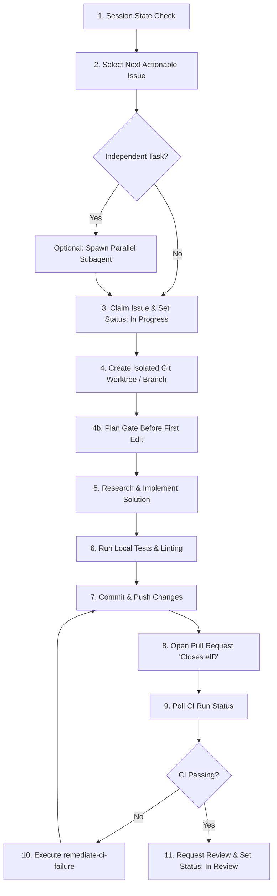

# Implement Next Issue Procedure

This skill dictates the step-by-step, tool-agnostic workflow for an AI coding agent to pick up and implement the next logical issue in a repository while maintaining session continuity, worktree isolation, strict git hygiene, and continuous integration standards.

---

## Workflow Overview

---

## Detailed Step-by-Step Instructions

### Step 1: Recover Session Context & State Memory
1. Inspect the recent repository commit history, active branches, open PRs, and project board columns.
2. Determine what work was completed in the previous session and identify any in-flight branches or PRs that need attention.
3. If an existing branch or PR assigned to you is still active, resume that issue first before claiming a new issue.

### Step 2: Select Next Actionable Issue

**Every agent MUST have an agent id.** All agents authenticate as the same
GitHub user, so assignment cannot tell them apart. The `agent:<id>` label is
the real identity, and `--agent` is required on every claim.

1. Retrieve candidates: `python3 "$ARU_SDLC_HOME/scripts/fetch_next_issue.py" --agent <AGENT_ID>`
2. The picker already excludes: epics, issues held by another agent, issues with
   unresolved `depends-on:`, and issues whose `touches:` paths collide with work
   currently in flight.
3. If the picker reports an in-flight issue for your agent id, **resume that
   first**. Do not claim new work while you hold an issue.

### Step 3: Claim Issue & Update Status

Claiming is optimistic, not locked — GitHub has no compare-and-swap on issue
state. The script writes your `agent:<id>` label, reads it back, and if two
agents raced, both compute the same winner (lowest-sorting agent id); the loser
releases automatically.

1. Execute: `python3 "$ARU_SDLC_HOME/scripts/claim_issue.py" --issue <ISSUE_ID> --agent <AGENT_ID>`
2. **Check the exit code.** `0` claimed, `2` conflict (another agent won — pick
   the next candidate, do NOT proceed), `1` error.
3. Or let the picker do both in one step:
   `python3 "$ARU_SDLC_HOME/scripts/fetch_next_issue.py" --agent <AGENT_ID> --claim`
   It walks candidates and takes the first claim that succeeds.
4. To hand work back: `python3 "$ARU_SDLC_HOME/scripts/claim_issue.py" --issue <ID> --agent <AGENT_ID> --release`

### Step 3b: Running Several Agents

1. Give each agent a distinct id (`agent-1`, `agent-2`, …).
2. Every issue MUST declare `touches:` in its body listing the paths it will
   modify. `parallel-eligible` only means "no unresolved `depends-on`" — it says
   nothing about two agents editing the same file. The picker rejects a Ready
   issue whose `touches:` declaration is empty, so triage must complete this
   metadata before an agent can claim it.
3. Release abandoned claims periodically:
   `python3 "$ARU_SDLC_HOME/scripts/fetch_next_issue.py" --agent <ID> --reap-after 4`
4. Beyond ~3 concurrent agents, give each its own clone rather than sharing one
   `.git`. Worktree creation retries on lock contention, but separate clones
   remove the contention entirely.

### Step 4: Create Isolated Git Worktree & Branch
1. Derive the branch name based on issue type and ID:
   - Feature: `feat/issue-<ISSUE_ID>-<short-description>`
   - Bug fix: `fix/issue-<ISSUE_ID>-<short-description>`
   - Chore: `chore/issue-<ISSUE_ID>-<short-description>`
2. **Worktree Isolation**: Create a dedicated git worktree for the branch in `.worktrees/<branch-name>` so the main working directory remains pristine.
3. Execute: `python3 "$ARU_SDLC_HOME/scripts/create_branch.py" --issue <ISSUE_ID> --worktree`

### Step 4b: Plan Gate Before the First Edit

The plan is durable issue state, not private scratch reasoning. Apply this gate
when either condition is true:

- the issue has the `type:feat` or `needs-design` label; or
- its acceptance criteria, declared `touches:`, or intended implementation
  changes money semantics, PII handling, schemas, migrations, or another
  irreversible contract; or
- the intended implementation introduces a new helper function, module, or
  script.

High-risk scope is an independent trigger. A `type:fix` or `type:chore` label,
or a missing `needs-design` label, never exempts money, PII, schema, migration,
or other irreversible work from the plan gate.

1. Inspect the issue and relevant source read-only. Before editing any file,
   post an issue comment headed `## Implementation Plan` containing:
   - the proposed approach and important boundaries;
   - the exact files expected to change, consistent with `touches:`;
   - schema, migration, public API, state-machine, or money-semantics deltas
     (write `None` when there are none);
   - an `### Existing Utility Reuse Audit` section that records the concrete
     name and exact search location for every shared function, module, script,
     or framework facility evaluated; states which will be reused; and, for
     every proposed new helper, explains why each relevant existing utility is
     insufficient. When no existing utility fits, record the concrete names
     and locations searched — a bare `None` is not an audit;
   - the local test and verification strategy; and
   - rejected alternatives and why they were rejected.
   Post the durable comment with
   `gh issue comment <ISSUE_ID> --body-file <PLAN_FILE>`. This direct command is
   explicitly sanctioned for implementation-plan comments because the
   framework has no issue-comment helper; every GitHub mutation covered by a
   framework helper must still use that helper.
2. The plan is **post-and-proceed**. Once the comment is visible on the issue,
   continue without waiting for a human response. Money, PII, security, schema,
   migration, irreversible behavior, large diffs, and review-round count change
   the plan, test, and review depth; none creates a human acknowledgement gate.
3. If the approach materially changes before implementation, post an amended
   plan before making the newly planned edits.
4. If a required product decision is absent from the issue, document the
   concrete options and leave the issue blocked for clarification. This is
   requirement discovery, not a mandatory human review of an otherwise
   complete implementation.

### Step 5: Implement Solution
1. Confirm the plan gate is satisfied when it applies.
2. Before any affected source edit, compare the planned reuse decisions and
   proposed helpers with the plan's reuse audit. If implementation adds an
   undisclosed helper, stops reusing a documented utility, selects a different
   utility, or changes from a helper to inline logic, post an amended plan
   before the first edit that follows the changed decision.
3. Inspect files inside the isolated worktree directory.
4. Perform source code modifications while preserving existing docstrings, formatting, and public API contracts.

### Step 6: Run Local Tests & Verification
1. Execute the project's test runner, build system, and syntax/lint checks inside the worktree directory.
2. Verify that all existing unit tests pass without regressions.
3. If tests fail, resolve failures locally before proceeding.

### Step 7: Commit & Push Changes
1. Create atomic, conventional git commits:
   - Example: `feat(auth): add JWT validation middleware`
2. Push the branch to the remote origin repository.

### Step 8: Open Linked Pull Request
1. Open a Pull Request from the feature branch targeting the default branch (`main`).
2. Populate the PR title and description using the project's PR template.
3. **CRITICAL REQUIREMENT**: Include `Closes #<ISSUE_ID>` in the PR description body.
4. Execute: `python3 "$ARU_SDLC_HOME/scripts/create_pr.py" --issue <ISSUE_ID> --agent <AGENT_ID> [--model-family <FAMILY>] --title "<TITLE>" --body "<body>"`
   - `--agent` is **required**. It stamps `author:<id>` on the PR, which is what lets the merge gate tell a peer review from a self-review. Omitting it exits non-zero and opens nothing.
   - `--model-family` is optional but recommended: it steers review routing toward an agent whose blind spots differ from yours.

### Step 9: Poll & Verify CI Status
1. Wait for automated CI pipeline checks (GitHub Actions / CI runner) to trigger and complete.
2. Execute: `python3 "$ARU_SDLC_HOME/scripts/check_ci.py" --pr <PR_NUMBER>`
3. If CI succeeds (Status: Green/Success), proceed to Step 11.

### Step 10: CI Failure Remediation Loop
1. If CI fails, invoke the [`remediate-ci-failure`](file:///Users/aravindgillella/projects/Aru_Agentic_SDLC/skills/remediate-ci-failure/SKILL.md) skill:
   a. Fetch the detailed build/test log output from the CI run.
   b. Classify failure type (lint, unit test failure, compiler error, environment).
   c. Apply fix edits in the worktree directory.
   d. Push updates and re-verify CI.

### Step 11: Request Code Review & Handoff
1. Transition the issue/PR Project Board status to `In Review`.
2. Assign relevant maintainers or peer agents for code review.
3. Execute: `python3 "$ARU_SDLC_HOME/scripts/update_issue_status.py" --issue <ISSUE_ID> --status "In Review"`
4. Clean up worktree directory if needed and summarize work completed.

### Step 12: Merge Authority and Completion

1. The implementation author cannot satisfy the independent-review gate with a
   self-review. Wait for the peer review and resolve every review thread.
2. After a distinct agent completes the independent review, any factory agent,
   including the implementation author, may perform the mechanical merge with
   `python3 "$ARU_SDLC_HOME/scripts/merge_pr.py" --pr <PR_ID>`. This is the sole
   merge authority; do not use a direct push or ad-hoc `gh pr merge`.
3. The merge helper must prove green CI, independent review, resolved threads,
   completed acceptance criteria, and an up-to-date branch, then close the
   issue, move it to Done, and clean up the issue branch/worktree.
4. Human intervention is exceptional: request it only when a severe merge
   conflict or merge/close-out failure remains unsafe or impossible for agents
   to resolve through governed remediation. Risk category, diff size, and
   review-round count alone never require it.
