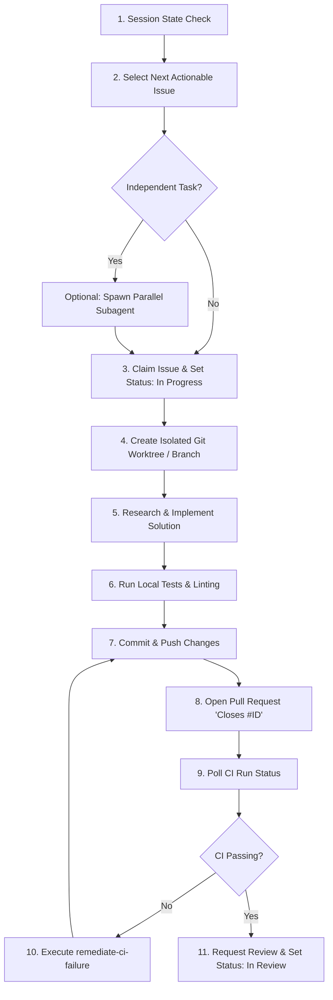

# Implement Next Issue Procedure

This skill dictates the step-by-step, tool-agnostic workflow for an AI coding agent to pick up and implement the next logical issue in a repository while maintaining session continuity, worktree isolation, strict git hygiene, and continuous integration standards.

---

## Workflow Overview

---

## Detailed Step-by-Step Instructions

### Step 1: Recover Session Context & State Memory
1. Inspect the recent repository commit history, active branches, open PRs, and project board columns.
2. Determine what work was completed in the previous session and identify any in-flight branches or PRs that need attention.
3. If an existing branch or PR assigned to you is still active, resume that issue first before claiming a new issue.

### Step 2: Select Next Actionable Issue
1. Retrieve open issues in the `Ready` or `Backlog` state using `python3 scripts/fetch_next_issue.py`.
2. Parse issue dependency tags (e.g. `depends-on: #X`).
3. Filter out issues whose dependencies are not yet merged into the main branch.
4. Select the highest priority unblocked issue in **progressive sequential order**.

### Step 3: Evaluate Parallel Execution
1. Identify whether there are multiple unblocked issues marked as independent (`parallel-eligible: true` or no shared file dependencies).
2. If working in a multi-agent environment and parallel tasks exist, launch subagents to claim separate independent issues concurrently.

### Step 4: Claim Issue & Update Status
1. Assign the target issue to yourself / your agent ID.
2. Transition the issue's Project Board status to `In Progress`.
3. Execute: `python3 scripts/claim_issue.py --issue <ISSUE_ID>`

### Step 5: Create Isolated Git Worktree & Branch
1. Derive the branch name based on issue type and ID:
   - Feature: `feat/issue-<ISSUE_ID>-<short-description>`
   - Bug fix: `fix/issue-<ISSUE_ID>-<short-description>`
   - Chore: `chore/issue-<ISSUE_ID>-<short-description>`
2. **Worktree Isolation**: Create a dedicated git worktree for the branch in `.worktrees/<branch-name>` so the main working directory remains pristine.
3. Execute: `python3 scripts/create_branch.py --issue <ISSUE_ID> --worktree`

### Step 6: Implement Solution
1. Inspect files inside the isolated worktree directory.
2. Formulate a minimal, targeted implementation plan.
3. Perform source code modifications while preserving existing docstrings, formatting, and public API contracts.

### Step 7: Run Local Tests & Verification
1. Execute the project's test runner, build system, and syntax/lint checks inside the worktree directory.
2. Verify that all existing unit tests pass without regressions.
3. If tests fail, resolve failures locally before proceeding.

### Step 8: Commit & Push Changes
1. Create atomic, conventional git commits:
   - Example: `feat(auth): add JWT validation middleware`
2. Push the branch to the remote origin repository.

### Step 9: Open Linked Pull Request
1. Open a Pull Request from the feature branch targeting the default branch (`main`).
2. Populate the PR title and description using the project's PR template.
3. **CRITICAL REQUIREMENT**: Include `Closes #<ISSUE_ID>` in the PR description body.
4. Execute: `python3 scripts/create_pr.py --issue <ISSUE_ID> --title "<TITLE>" --body "<body>"`

### Step 10: Poll & Verify CI Status
1. Wait for automated CI pipeline checks (GitHub Actions / CI runner) to trigger and complete.
2. Execute: `python3 scripts/check_ci.py --pr <PR_NUMBER>`
3. If CI succeeds (Status: Green/Success), proceed to Step 12.

### Step 11: CI Failure Remediation Loop
1. If CI fails, invoke the [`remediate-ci-failure`](file:///Users/aravindgillella/projects/Aru_Agentic_SDLC/skills/remediate-ci-failure/SKILL.md) skill:
   a. Fetch the detailed build/test log output from the CI run.
   b. Classify failure type (lint, unit test failure, compiler error, environment).
   c. Apply fix edits in the worktree directory.
   d. Push updates and re-verify CI.

### Step 12: Request Code Review & Handoff
1. Transition the issue/PR Project Board status to `In Review`.
2. Assign relevant maintainers or peer agents for code review.
3. Execute: `python3 scripts/update_issue_status.py --issue <ISSUE_ID> --status "In Review"`
4. Clean up worktree directory if needed and summarize work completed.
