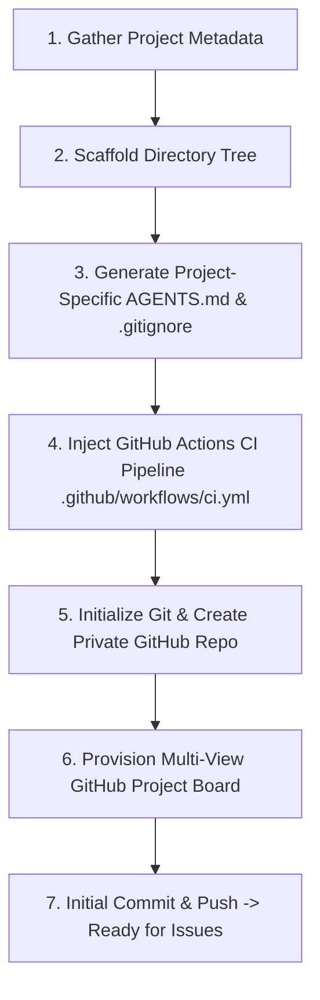

# Initialize Agent Project Procedure

This skill dictates the declarative workflow for bootstrapping a brand-new software project governed by **Aru_Agentic_SDLC**. It enforces the **Issue-First Law**, scaffolds project governance (`AGENTS.md`), injects continuous integration (`ci.yml`), sets up a private GitHub repository, and provisions a multi-view GitHub Project Board.

---

## Workflow Overview

---

## Detailed Step-by-Step Instructions

### Step 1: Gather Project Metadata
1. Determine the core parameters for the new project:
   - **Project Name** (e.g. `my-agent-platform`)
   - **Description** & Primary Purpose
   - **Technology Stack** (e.g. Python, Node.js / TypeScript, React, Go)
   - **Test Runner** (e.g. `pytest`, `npm test`, `go test`)
   - **Repository Visibility** (Default: Private)

### Step 2: Scaffold Standardized Directory Layout
1. Create the canonical directory tree:
   - `src/` or `app/`: Primary application source code.
   - `tests/`: Automated unit and integration test suites.
   - `.github/`: PR templates, issue templates, and workflow actions.
   - `.github/workflows/ci.yml`: GitHub Actions pipeline.
   - `skills/`: Project-local SkillsMP declarative skills.
   - `scripts/`: Python helper automation tools.
   - `docs/`: Architecture diagrams and coding standards.

### Step 3: Generate Project Governance (`AGENTS.md`)
1. Create a project-specific `AGENTS.md` file in the root directory.
2. Inscribe the **Issue-First Governance Law**:
   > *"No code change, refactor, or feature implementation may begin without first originating from a tracked issue on the GitHub Project Board."*
3. Include tech stack guidelines, test execution commands, commit conventions, and worktree isolation rules.

### Step 4: Inject GitHub Actions CI Pipeline
1. Create `.github/workflows/ci.yml` configured to trigger on all `push` and `pull_request` events targeting `main`.
2. Configure steps for automated dependency installation, linting/syntax checks, and test runner execution.

### Step 5: Initialize Git & Create Private GitHub Repository
1. Initialize git on default branch `main`: `git init -b main`.
2. Create `.gitignore` tailored to the chosen tech stack.
3. Create private GitHub repository via helper script:
   `python3 "$ARU_SDLC_HOME/scripts/init_project.py" --name <NAME> --private`

### Step 6: Provision Multi-View GitHub Project Board
1. Create a GitHub Project v2 linked to the repository:
   - **Kanban View**: Columns (`Backlog` $\rightarrow$ `Ready` $\rightarrow$ `In Progress` $\rightarrow$ `In Review` $\rightarrow$ `Done`).
   - **Jira-Style Backlog View**: Tabular list with fields (`Priority`, `Story Points`, `Assignee`, `depends-on`).
   - **Sprint View**: Tabular view with `Phase` available for grouping and filtering.
2. Link issue templates so filed issues automatically appear in the board's `Backlog`.

### Step 7: Initial Commit & Push
1. Create initial git commit: `feat: initialize project repository with Aru_Agentic_SDLC governance`.
2. Push commits to origin `main` and notify maintainers that the repo is ready to receive issues!
